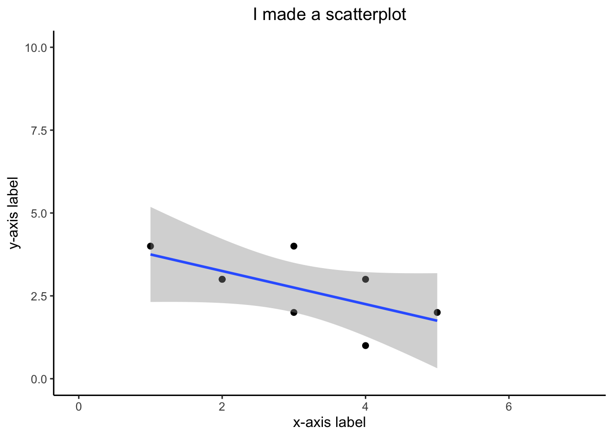
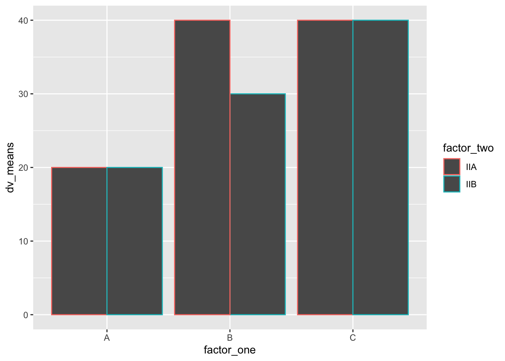
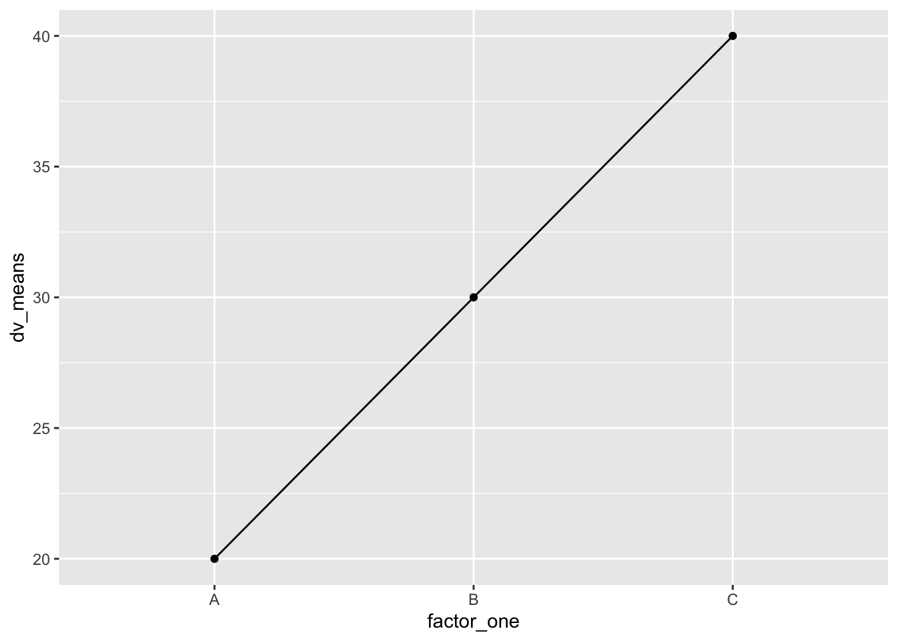
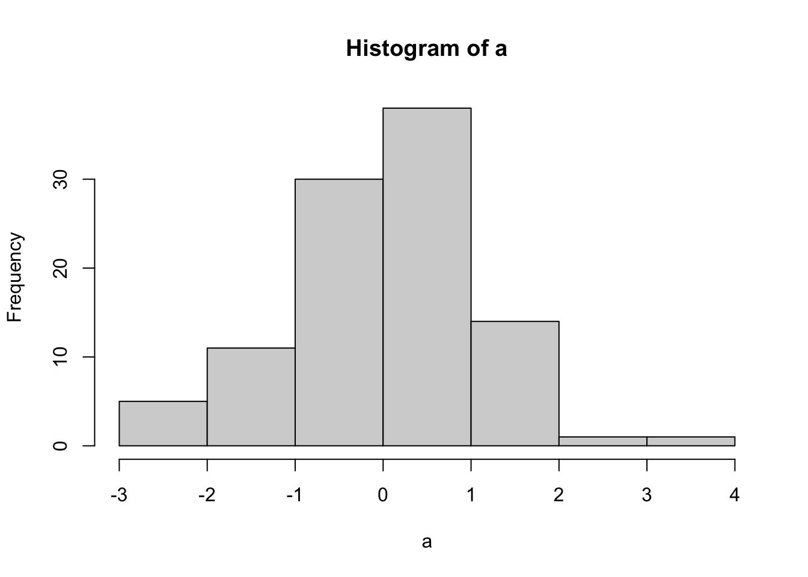

# Coding Reference {.unnumbered}


This page contains minimal explanations and examples for common coding patterns in base R and tidyverse. Students can make content requests and contribute to this reference page, just leave a message on the github issues for this course repository.

## Base R

Base R refers to intrinsics capabilities of R that come with a fresh installation of R. No additional libraries are needed.

---

## Variables

`a` is the variable name. `<-` is the assignment operator. In this example, `1` is being assigned into the object named `a`. 


```r
a <- 1
```

Variables have classes that describe their contents.


```r
x <- 1
class(x)
```

```
## [1] "numeric"
```

```r
y <- "1"
class(y)
```

```
## [1] "character"
```

```r
z <- TRUE
class(z)
```

```
## [1] "logical"
```

Classes allow and disallow some commands. For example, you can't add a numeric to a character:


```r
x+y
```

```
## Error in x + y: non-numeric argument to binary operator
```

Classes can be converted:


```r
y <- as.numeric(y)
x+y
```

```
## [1] 2
```

### Vectors

Vectors are 1-dimensional objects that have a name, and can hold multiple elements of the same class. The number of elements in the vector is the vector length. Manipulating vectors involves creating them, and storing, retrieving, and changing elements inside of the vector.

#### Vector Creation

There are multiple ways to create a vector


```r
a <- c() # create a NULL vector
a
```

```
## NULL
```

```r
a <- 1:5 # assign a sequence to a name
a
```

```
## [1] 1 2 3 4 5
```

```r
a <- c(1,2,3,4,5) # assign a vector made with combine c()
a
```

```
## [1] 1 2 3 4 5
```

```r
#pre-assign an empty vector
a <- vector(mode = "numeric", length=10)
a
```

```
##  [1] 0 0 0 0 0 0 0 0 0 0
```

```r
a <- vector(mode = "integer", length=10)
a
```

```
##  [1] 0 0 0 0 0 0 0 0 0 0
```

```r
a <- vector(mode = "logical", length=10)
a
```

```
##  [1] FALSE FALSE FALSE FALSE FALSE FALSE FALSE FALSE FALSE FALSE
```

```r
a <- vector(mode = "character", length=10)
a
```

```
##  [1] "" "" "" "" "" "" "" "" "" ""
```

`length()` returns the number of elements in the vector


```r
a < c(1,4,5)
```

```
## Warning in a < c(1, 4, 5): longer object length is not a multiple of shorter
## object length
```

```
##  [1] TRUE TRUE TRUE TRUE TRUE TRUE TRUE TRUE TRUE TRUE
```

```r
length(a)
```

```
## [1] 10
```


#### Vector Combination

It is possible to combine existing vectors together to make a new vector using `c()`.


```r
x <- 1:5
y <- 6:10

x
```

```
## [1] 1 2 3 4 5
```

```r
y
```

```
## [1]  6  7  8  9 10
```

```r
z <- c(x,y)
z
```

```
##  [1]  1  2  3  4  5  6  7  8  9 10
```

However, if you attempt to combine vectors of different classes, R will throw an error, or it will coerce (convert) one of the vectors into the class of the other.


```r
x <- 1:5
y <- c("a","b","c","d","e")

x
```

```
## [1] 1 2 3 4 5
```

```r
y
```

```
## [1] "a" "b" "c" "d" "e"
```

```r
z <- c(x,y)
z
```

```
##  [1] "1" "2" "3" "4" "5" "a" "b" "c" "d" "e"
```

#### Vector Indexing

Vector indexing is the the process of isolating specific positions or elements of a vector. Vector indexing uses the `[]` notation. 

The general syntax is `vector_name[positions]`, where `vector_name` is the name of your vector, and `positions` is a vector of positions to index.


```r
a <- c(23,34,45,56,67,78,89)

a[1] # returns the element in position 1
```

```
## [1] 23
```

```r
a[1:3] # returns elements in positions 1 to 3
```

```
## [1] 23 34 45
```

```r
a[c(4,5,6)]
```

```
## [1] 56 67 78
```

```r
a[c(1,1,1)]
```

```
## [1] 23 23 23
```

Logical vectors can indicate positions. In this case, elements in TRUE positions will be returned


```r
a <- c(45,56,78)

a[c(TRUE, FALSE, FALSE)]
```

```
## [1] 45
```

```r
a[c(FALSE, TRUE, FALSE)]
```

```
## [1] 56
```

```r
a[c(FALSE, FALSE, TRUE)]
```

```
## [1] 78
```

#### Vector indexing and assignment

Vector indexing can also be used to assign new elements to the indexed positions.


```r
a <- c(45,56,78)
a
```

```
## [1] 45 56 78
```

```r
a[3] <- 100
a
```

```
## [1]  45  56 100
```

```r
a[1:3] <- "Hello"
a
```

```
## [1] "Hello" "Hello" "Hello"
```

#### Logical indexing

Vectors can be indexing using logical comparisons (see section on logic for further explanation and examples of logical comparisons).


```r
a <- c(1,3,2,4,3,4)

a == 4 # create logical vector of positions containing 4
```

```
## [1] FALSE FALSE FALSE  TRUE FALSE  TRUE
```

```r
# inserting the above into a[] finds the elements equal to 4
a[a == 4] # elements equal to 4
```

```
## [1] 4 4
```

```r
a[a < 4] # elements less than 4
```

```
## [1] 1 3 2 3
```

```r
a[a <= 4] # elements less than or equal to 4
```

```
## [1] 1 3 2 4 3 4
```

```r
a[a != 1] # elements not equal to 1
```

```
## [1] 3 2 4 3 4
```

### Data.frame

Data.frames are 2-d storage objects, like a table (or excel sheet), they have columns and rows. 


```r
a <- data.frame() # make an empty data.frame
a
```

```
## data frame with 0 columns and 0 rows
```

```r
class(a)
```

```
## [1] "data.frame"
```

#### Data.frame creation

A common method to create a data.frame involves adding existing vectors together. Data.frames are often also created when loading in data files that are 2-d tables. See also the section on using `dplyr` to manipulate data in dataframes. Data.frames are also similar to data.tables, and tibbles, and can usually be interchanged.


```r
x <- c(1,2,3)
y <- c("a","b","c")
z <- c(TRUE, TRUE,TRUE)

a <- data.frame(x,y,z)
a
```

```
##   x y    z
## 1 1 a TRUE
## 2 2 b TRUE
## 3 3 c TRUE
```

`dim()` returns the number of rows and columns in the data.frame


```r
dim(a)
```

```
## [1] 3 3
```
#### Indexing by column name

Each column in a data.frame has a name, and can be accessed using the `$` syntax:


```r
names(a)
```

```
## [1] "x" "y" "z"
```

```r
a$x
```

```
## [1] 1 2 3
```

```r
a$y
```

```
## [1] "a" "b" "c"
```

```r
a$z
```

```
## [1] TRUE TRUE TRUE
```

```r
#re-name by assigning a new vector 
names(a) <- c("new_x","Why","Zee")
a
```

```
##   new_x Why  Zee
## 1     1   a TRUE
## 2     2   b TRUE
## 3     3   c TRUE
```

```r
a$new_x
```

```
## [1] 1 2 3
```

```r
a$Why
```

```
## [1] "a" "b" "c"
```

```r
a$Zee
```

```
## [1] TRUE TRUE TRUE
```
#### Indexing with `[rows,columns]`

Data.frames have rows and columns, and can be indexed using `[rows,columns]` notation, where `rows` is a vector of row numbers, and `columns` is a vector of column numbers


```r
a
```

```
##   new_x Why  Zee
## 1     1   a TRUE
## 2     2   b TRUE
## 3     3   c TRUE
```

```r
a[1,] # row 1
```

```
##   new_x Why  Zee
## 1     1   a TRUE
```

```r
a[,1] # column 1
```

```
## [1] 1 2 3
```

```r
a[1:2,] # rows 1 to 2
```

```
##   new_x Why  Zee
## 1     1   a TRUE
## 2     2   b TRUE
```

```r
a[,1:2] # columns 1 to 2
```

```
##   new_x Why
## 1     1   a
## 2     2   b
## 3     3   c
```

```r
a[1:2,1:2] #rows 1 to 2 and columns 1 to 2
```

```
##   new_x Why
## 1     1   a
## 2     2   b
```

```r
a[1:2,'new_x'] # Column names can be used
```

```
## [1] 1 2
```

#### row and column binding

It is possible to add more rows using `rbind()`, and add more columns using `cbind()`. 


```r
# row bind a copy of a to itself
a
```

```
##   new_x Why  Zee
## 1     1   a TRUE
## 2     2   b TRUE
## 3     3   c TRUE
```

```r
a <- rbind(a,a)
dim(a)
```

```
## [1] 6 3
```

```r
# create a new vector, add it as a new column
my_new <- c(1,4,3,2,4,5)
a <- cbind(a,my_new)
a
```

```
##   new_x Why  Zee my_new
## 1     1   a TRUE      1
## 2     2   b TRUE      4
## 3     3   c TRUE      3
## 4     1   a TRUE      2
## 5     2   b TRUE      4
## 6     3   c TRUE      5
```
#### Indexing and assignment

The elements in a data.frame can be re-assigned by `your_dataframe[row:position] <- new stuff`. It is generally necessary that any new elements have the same class as the original elements


```r
a
```

```
##   new_x Why  Zee my_new
## 1     1   a TRUE      1
## 2     2   b TRUE      4
## 3     3   c TRUE      3
## 4     1   a TRUE      2
## 5     2   b TRUE      4
## 6     3   c TRUE      5
```

```r
a[,1] <- 5 #assign column 1 all 5s

a$Why <- c("new","words","are","going","in","here")
a
```

```
##   new_x   Why  Zee my_new
## 1     5   new TRUE      1
## 2     5 words TRUE      4
## 3     5   are TRUE      3
## 4     5 going TRUE      2
## 5     5    in TRUE      4
## 6     5  here TRUE      5
```

```r
a[6,3] <- FALSE # row 6, column 3
a
```

```
##   new_x   Why   Zee my_new
## 1     5   new  TRUE      1
## 2     5 words  TRUE      4
## 3     5   are  TRUE      3
## 4     5 going  TRUE      2
## 5     5    in  TRUE      4
## 6     5  here FALSE      5
```

#### Logical indexing

It is also possible to index a data.frame with logical comparisons. For example, the following returns rows where the value in column `my_new` equals a 4


```r
a[a$my_new == 4,]
```

```
##   new_x   Why  Zee my_new
## 2     5 words TRUE      4
## 5     5    in TRUE      4
```

### Lists

Lists are objects that can store more arbitrary elements of any class, including vectors, dataframes, and even more lists. Lists are commonly used to store results from a model, especially when the model returns many different kinds of results in different formats. 

Here we create a list with three elements, a scalar, a vector, and a dataframe.


```r
x <- 1
y <- c(1,2,3,4,5)
z <- data.frame(a= 1:5, b=1:5, c=1:5)
my_list <- list(x, y, z)

my_list
```

```
## [[1]]
## [1] 1
## 
## [[2]]
## [1] 1 2 3 4 5
## 
## [[3]]
##   a b c
## 1 1 1 1
## 2 2 2 2
## 3 3 3 3
## 4 4 4 4
## 5 5 5 5
```

#### List indexing

Access elements in the list using `[[]]`


```r
my_list[[1]]
```

```
## [1] 1
```

```r
my_list[[2]]
```

```
## [1] 1 2 3 4 5
```

```r
my_list[[3]]
```

```
##   a b c
## 1 1 1 1
## 2 2 2 2
## 3 3 3 3
## 4 4 4 4
## 5 5 5 5
```

#### Named elements

Elements in a list can be given names, and indexed by name:


```r
x <- 1
y <- c(1,2,3,4,5)
z <- data.frame(a= 1:5, b=1:5, c=1:5)
my_list <- list(ex = x, why = y,zee=  z)

my_list
```

```
## $ex
## [1] 1
## 
## $why
## [1] 1 2 3 4 5
## 
## $zee
##   a b c
## 1 1 1 1
## 2 2 2 2
## 3 3 3 3
## 4 4 4 4
## 5 5 5 5
```

```r
my_list$ex
```

```
## [1] 1
```

```r
my_list$why
```

```
## [1] 1 2 3 4 5
```

```r
my_list$zee
```

```
##   a b c
## 1 1 1 1
## 2 2 2 2
## 3 3 3 3
## 4 4 4 4
## 5 5 5 5
```

```r
my_list[["ex"]]
```

```
## [1] 1
```

```r
my_list[["why"]]
```

```
## [1] 1 2 3 4 5
```

```r
my_list[["zee"]]
```

```
##   a b c
## 1 1 1 1
## 2 2 2 2
## 3 3 3 3
## 4 4 4 4
## 5 5 5 5
```

#### Add/Remove elements in lists

It is possible to assign new names elements to a list, e.g.:


```r
my_list[["new_thing"]] <- 12345

my_list
```

```
## $ex
## [1] 1
## 
## $why
## [1] 1 2 3 4 5
## 
## $zee
##   a b c
## 1 1 1 1
## 2 2 2 2
## 3 3 3 3
## 4 4 4 4
## 5 5 5 5
## 
## $new_thing
## [1] 12345
```

```r
#set an element to NULL removes it
my_list[["zee"]] <- NULL

my_list
```

```
## $ex
## [1] 1
## 
## $why
## [1] 1 2 3 4 5
## 
## $new_thing
## [1] 12345
```

## Logic

Logic statements are used to compare two things, or two sets of things. The output of comparison is a TRUE or FALSE statment. If many things are being compared at once, the output could be many TRUE or FALSE statements for each comparison

### equal to ==


```r
1==1 # is 1 equal to 1?
```

```
## [1] TRUE
```

```r
1==2 # is 1 equal to 2?
```

```
## [1] FALSE
```

```r
c(1,2,3) == c(2,1,3) # compares each element with each element
```

```
## [1] FALSE FALSE  TRUE
```

```r
1 == c(2,1,3)
```

```
## [1] FALSE  TRUE FALSE
```

### not equal to !=


```r
1!=1 # is 1 equal to 1?
```

```
## [1] FALSE
```

```r
1!=2 # is 1 equal to 2?
```

```
## [1] TRUE
```

```r
c(1,2,3) != c(2,1,3) # compares each element with each element
```

```
## [1]  TRUE  TRUE FALSE
```

```r
1 != c(2,1,3)
```

```
## [1]  TRUE FALSE  TRUE
```

### Greater than/ less than 


```r
1 > 1 # is 1 greater than 1?
```

```
## [1] FALSE
```

```r
5 > 1 # is 5 greater than 1?
```

```
## [1] TRUE
```

```r
3 < 2 # is 3 less than 2?
```

```
## [1] FALSE
```

```r
3 < 1 # is 3 less than 1?
```

```
## [1] FALSE
```

```r
c(1,2,3) > c(2,1,3) # ask the question element by element
```

```
## [1] FALSE  TRUE FALSE
```

```r
c(1,2,3) < c(2,1,3)
```

```
## [1]  TRUE FALSE FALSE
```

```r
2 > c(1,2,3) # is greater than each of the numbers
```

```
## [1]  TRUE FALSE FALSE
```

### >= <=

Is something greater than or equal to something else


```r
1 >= 1 # is 1 greater than 1?
```

```
## [1] TRUE
```

```r
5 >= 1 # is 5 greater than 1?
```

```
## [1] TRUE
```

```r
3 <= 2 # is 3 less than 2?
```

```
## [1] FALSE
```

```r
3 <= 1 # is 3 less than 1?
```

```
## [1] FALSE
```

```r
c(1,2,3) >= c(2,1,3) # ask the question element by element
```

```
## [1] FALSE  TRUE  TRUE
```

```r
c(1,2,3) <= c(2,1,3)
```

```
## [1]  TRUE FALSE  TRUE
```

```r
2 >= c(1,2,3) # is greater than each of the numbers
```

```
## [1]  TRUE  TRUE FALSE
```

### AND

The ampersand `&` is used for AND, which allows use to evaluate whether two or more properties are all TRUE.


```r
# is 16 divisible by 4 AND 8
16%%4 == 0 & 16%%8 ==0
```

```
## [1] TRUE
```

```r
# is 16 divisible by 4 AND 3
16%%4 == 0 & 16%%3 ==0
```

```
## [1] FALSE
```

```r
# is 16 divisible by 8 and 4 and 2
16%%4 == 0 & 16%%8 ==0 & 16%%2 ==0
```

```
## [1] TRUE
```

### OR

The `|` is used for OR, which allows use to evaluate at least one of the properties is TRUE.


```r
# is 16 divisible by 4 OR 8
16%%4 == 0 | 16%%8 ==0
```

```
## [1] TRUE
```

```r
# is 16 divisible by 4 OR 3
# it is divisible by 4, so the answer is TRUE
# because at least one of the comparisons is TRUE
16%%4 == 0 | 16%%3 ==0
```

```
## [1] TRUE
```

### TRUE FALSE

When R returns values as TRUE or FALSE, it return a logical variable. It also treats TRUE as a 1, and FALSE as a 0. In the example below we see it is possible sum up a logical variable with multiple TRUE and FALSE entries.


```r
c(1,2,3) == c(1,2,3)
```

```
## [1] TRUE TRUE TRUE
```

```r
sum(c(1,2,3) == c(1,2,3))
```

```
## [1] 3
```

```r
c(1,2,3) == c(2,1,3)
```

```
## [1] FALSE FALSE  TRUE
```

```r
sum(c(1,2,3) == c(2,1,3))
```

```
## [1] 1
```


## IF ELSE

A roller-coaster operator checks if people are taller than a line to see if they can ride the coaster. This is an IF ELSE control structure. IF the person is taller than the line, then they can go on the ride; ELSE (otherwise) the person can not go on the ride. 

In other words, IF the situation is X, then do something; ELSE (if the situation is not X), then do something different.

IF and ELSE statements let us specify the conditions when specific actions are taken. Generally, IF and ELSE statements are used inside loops (for, or while, or repeat loops), because at each step or iteration of the loop, we want to check something, and then do something.

Consider this:


```r
a <- 1 # define a to be a 1
if(a==1){  
  print(a) # this is what happens if a==1
} else {
  print("A is not 1") # this is what happens if a is not 1
}
```

```
## [1] 1
```

```r
a <- 2 # define a to be a 1
if(a==1){  
  print(a) # this is what happens if a==1
} else {
  print("A is not 1") # this is what happens if a is not 1
}
```

```
## [1] "A is not 1"
```

Normally we find IF and ELSE in a loop like this:


```r
a <- c(1,0,1,0,0,0,1) # make a variable contain 1s and 0s

# write a loop to check each element in the variable
# and do different things depending on the element

for(i in a){
  if(i == 1){
    print("I'm a 1") # what to do when i is 1
  } else {
    print("I'm not a 1") # what to do when i is not 1
  }
}
```

```
## [1] "I'm a 1"
## [1] "I'm not a 1"
## [1] "I'm a 1"
## [1] "I'm not a 1"
## [1] "I'm not a 1"
## [1] "I'm not a 1"
## [1] "I'm a 1"
```

We can have multiple conditions in our if statements. See the next section on loops for more info about using loops.


```r
a <- c(1,2,3,1,2,0,1) # make a variable contain 1s and 0s

# write a loop to check each element in the variable
# and do different things depending on the element

for(i in a){
  if(i == 1){
    print("I'm a 1") # what to do when i is 1
  } else if (i==2){
    print("I'm a 2") # what to do when i is 2
  } else if (i==3){
    print("I'm a 3") # what to do when i is 3
  } else {
    print("I'm not any of the above") #what to do when none are true
  }
}
```

```
## [1] "I'm a 1"
## [1] "I'm a 2"
## [1] "I'm a 3"
## [1] "I'm a 1"
## [1] "I'm a 2"
## [1] "I'm not any of the above"
## [1] "I'm a 1"
```

## Loops


Check R help for on Control Flow `?Control`.

`for(){}`
`for(loop control){do something each iteration}`


```r
for(iterator in vector){
  #do something
}
```

Loop control is defined in between the parentheses. The name of the iterator is placed on the left of `in`(can be assigned any name you want, does not need to be declared in advance). During the execution of the loop, the iterator takes on the values inside the vector which is placed on the right side of `in`. Specifically, the following is happening.

Loop steps: 
  1. iterator <- vector[1]
  2. iterator <- vector[2]
  3. iterator <- vector[3]
  4. etc.
  
The loop will automatically stop once it reaches the last item in the vector. The loop can be stopped before that using the `break` command.


```r
# Make a loop do something 5 times
# i is the iterator
# 1:5 creates a vector with 5 numbers in it, 1, 2, 3, 4, 5
# the loop will run 5 times, because there are five things to assign to i
for(i in 1:5){
  print("hello")
}
```

```
## [1] "hello"
## [1] "hello"
## [1] "hello"
## [1] "hello"
## [1] "hello"
```


```r
# show the value of i each step of the loop
for(i in 1:5){
  print(i)
}
```

```
## [1] 1
## [1] 2
## [1] 3
## [1] 4
## [1] 5
```


```r
# define the vector to loop over in advance
x <- 1:5
for(i in x){
  print(i)
}
```

```
## [1] 1
## [1] 2
## [1] 3
## [1] 4
## [1] 5
```


```r
# Reminder that i becomes the next value in the vector
# your vector can have any order 
my_sequence <- c(1,5,2,3,4)
for(i in my_sequence){
  print(i)
}
```

```
## [1] 1
## [1] 5
## [1] 2
## [1] 3
## [1] 4
```


```r
# index vector does not need to be numbers
my_things <- c("A","B","C","D")
for(i in my_things){
  print(i)
}
```

```
## [1] "A"
## [1] "B"
## [1] "C"
## [1] "D"
```

### Breaking a loop

`break` stops a loop. Used with logical statements to define the conditions necessary to cause the break.


```r
for(i in 1:10){
  if(i <5){
    print(i)
  } else{
    break
  }
}
```

```
## [1] 1
## [1] 2
## [1] 3
## [1] 4
```

### While loops

While loops run until a logical condition is met. Here there is no iterator, just a logic statement that needs to be met. 

This one prints i while i is less than 6. As soon as i becomes "not less than 6", then the loop stops. Critically, inside the loop, the value of i increases each iteration. 


```r
i <- 1 # create an variable
while (i < 6) {
  print(i)
  i = i+1 #add one eachs step of the loop
}
```

```
## [1] 1
## [1] 2
## [1] 3
## [1] 4
## [1] 5
```

### Repeat loops

Similar to while, but let's do things until a condition is met.


```r
i<-0
repeat{
  i<-i+1
  print(i)
  if(i==5){
    break
  }
}
```

```
## [1] 1
## [1] 2
## [1] 3
## [1] 4
## [1] 5
```


### Examples

Braces are not needed on one line


```r
for(i in 1:5) print(i)
```

```
## [1] 1
## [1] 2
## [1] 3
## [1] 4
## [1] 5
```

Using the value of the iterator to assign in values systematically to another variable.


```r
# put 1 into the first five positions of x
x <- c() # create empty vector
for(i in 1:5){
  x[i] <- 1  # assign 1 to the ith slot in x
}
x
```

```
## [1] 1 1 1 1 1
```

```r
# put the numbers 1-5 in the first 5 positions of x
x <-c()
for(i in 1:5){
  x[i] <- i
}
x
```

```
## [1] 1 2 3 4 5
```

Make your own counter, when you need one


```r
a <- c(1,4,3,5,7,6,8,2)
odd <- c()
counter <- 0
for(i in a){  # i will the values of a in each position
  counter <- counter+1
  if(i%%2 != 0){
    odd[counter] <- "odd"
  } else {
    odd[counter] <- "even"
  }
}
odd
```

```
## [1] "odd"  "even" "odd"  "odd"  "odd"  "even" "even" "even"
```

```r
# An alternative strategy

a <- c(1,4,3,5,7,6,8,2)
odd <- c()
# 1:length(a) creates a sequence from 1 to length
for(i in 1:length(a)){  
  if(a[i]%%2 != 0){
    odd[i] <- "odd"
  } else {
    odd[i] <- "even"
  }
}
odd
```

```
## [1] "odd"  "even" "odd"  "odd"  "odd"  "even" "even" "even"
```

Nesting loops


```r
for(i in 1:5){
  for(j in 1:5){
   print(c(i,j))
  }
}
```

```
## [1] 1 1
## [1] 1 2
## [1] 1 3
## [1] 1 4
## [1] 1 5
## [1] 2 1
## [1] 2 2
## [1] 2 3
## [1] 2 4
## [1] 2 5
## [1] 3 1
## [1] 3 2
## [1] 3 3
## [1] 3 4
## [1] 3 5
## [1] 4 1
## [1] 4 2
## [1] 4 3
## [1] 4 4
## [1] 4 5
## [1] 5 1
## [1] 5 2
## [1] 5 3
## [1] 5 4
## [1] 5 5
```

```r
# example of using nested loops to fill the contents
# of a matrix

my_matrix <- matrix(0,ncol=5,nrow=5)
for(i in 1:5){
  for(j in 1:5){
   my_matrix[i,j] <- i*j
  }
}
my_matrix
```

```
##      [,1] [,2] [,3] [,4] [,5]
## [1,]    1    2    3    4    5
## [2,]    2    4    6    8   10
## [3,]    3    6    9   12   15
## [4,]    4    8   12   16   20
## [5,]    5   10   15   20   25
```

break exits out of the immediate loop


```r
# the inside loop stops when i+j is greater than 5
# the outside loop keeps going

sum_of_i_j <- c()
counter <- 0
for(i in 1:5){
  for(j in 1:5){
    counter <- counter+1
    sum_of_i_j[counter] <- i+j
    if(i+j > 5){
      break
    }
  }
}
sum_of_i_j
```

```
##  [1] 2 3 4 5 6 3 4 5 6 4 5 6 5 6 6
```

## Functions


This section discusses the syntax for writing custom functions in R.

### function syntax


```r
function_name <- function(input1,input2){
  #code here
  return(something)
}
```

### example functions

This function has no input between the `()`. Whenever you run this function, it will simply return whatever is placed inside the `return` statement.


```r
# define the function
print_hello_world <- function(){
  return(print("hello world"))
}

# use the function
print_hello_world()
```

```
## [1] "hello world"
```

This function simply takes an input, and then returns the input without modifying it. 


```r
return_input <- function(input){
  return(input)
}

# the variable input is assigned a 1
# then we return(input), which will result in a 1
# because the function internally assigns 1 to the input
return_input(1)
```

```
## [1] 1
```

```r
a <- "something"
return_input(a)
```

```
## [1] "something"
```

This function takes an input, then creates an internal variable called temp and assigns input+1. Then the contents of temp is returned. Note there, is no checking of the input, so it will return an erro if you input a character (can't add one to a character in R)


```r
add_one <- function(input){
  temp <- input+1
  return(temp)
}

add_one(1)
```

```
## [1] 2
```

```r
add_one("a")
```

```
## Error in input + 1: non-numeric argument to binary operator
```

This function adds some input checking. We only add one if the input is a numeric type. Otheriwse, we use `stop()` to return an error message to the console


```r
add_one <- function(input){
  if(class(input) == "numeric"){
    temp <- input+1
    return(temp)
  } else {
    return(stop("input must be numeric"))
  }
}

add_one(1)
```

```
## [1] 2
```

```r
add_one("a")
```

```
## Error in add_one("a"): input must be numeric
```

A function with three inputs


```r
add_multiply <- function(input, x_plus,x_times){
  temp <- (input+x_plus)*x_times
  return(temp)
}

# input is 1
# x_plus <- 2
# x_times <- 3
# will return (1+2)*3 = 9
add_multiply(1,2,3)
```

```
## [1] 9
```

## Tidyverse

The [tidyverse](https://www.tidyverse.org) is a set of popular R packages that are convenient for many aspects of data-analysis. All of the tidyverse packages can be installed in one go:


```r
install.packages("tidyverse")
```

---

## dplyr

The `dplyr` package has several useful functions for manipulating and summarizing data.frames. To illustrate some dplyr functionality we first create a small fake data.frame. Here is a link to the [dplyr cheatsheet](https://github.com/rstudio/cheatsheets/raw/master/data-transformation.pdf)


```r
subjects <- rep(1:10)
grades <- rnorm(n = 10, mean = 65, sd = 5)
age <- sample(18:20,10,replace=TRUE)
likes_chocolate <- sample(c(TRUE,FALSE), 10, replace=TRUE)
favorite_color <- sample(c("r","o","y","g","b","i","v"), 10, replace=TRUE)

fake_data <- data.frame(subjects,
                        grades,
                        age,
                        likes_chocolate,
                        favorite_color)

knitr::kable(head(fake_data))
```


| subjects|   grades| age|likes_chocolate |favorite_color |
|--------:|--------:|---:|:---------------|:--------------|
|        1| 55.84970|  18|TRUE            |b              |
|        2| 72.72373|  18|TRUE            |g              |
|        3| 62.56238|  19|TRUE            |y              |
|        4| 65.28392|  18|TRUE            |v              |
|        5| 68.83558|  19|FALSE           |o              |
|        6| 51.93467|  20|TRUE            |o              |

### group_by and summarize

`group_by()` allows you to specify columns to split into groups for analysis, these groups are the levels of the column (e.g., unique entries in the column)

`summarize()` conducts an analysis for each group identified in the `group_by` step. The analysis is defined by variable names, and supplying a function that computes a value given the name of a measurement variable.


```r
library(dplyr)
```

```
## 
## Attaching package: 'dplyr'
```

```
## The following objects are masked from 'package:stats':
## 
##     filter, lag
```

```
## The following objects are masked from 'package:base':
## 
##     intersect, setdiff, setequal, union
```

```r
fake_data %>%
  group_by(likes_chocolate) %>%
  summarize(mean_grade = mean(grades),
            sd_grad = sd(grades))
```

```
## `summarise()` ungrouping output (override with `.groups` argument)
```

```
## # A tibble: 2 x 3
##   likes_chocolate mean_grade sd_grad
##   <lgl>                <dbl>   <dbl>
## 1 FALSE                 62.7    8.69
## 2 TRUE                  62.6    6.78
```

```r
fake_data %>%
  group_by(likes_chocolate,age) %>%
  summarize(mean_grade = mean(grades),
            sd_grad = sd(grades))
```

```
## `summarise()` regrouping output by 'likes_chocolate' (override with `.groups` argument)
```

```
## # A tibble: 4 x 4
## # Groups:   likes_chocolate [2]
##   likes_chocolate   age mean_grade  sd_grad
##   <lgl>           <int>      <dbl>    <dbl>
## 1 FALSE              19       62.7 8.69    
## 2 TRUE               18       64.6 8.46    
## 3 TRUE               19       62.6 0.000358
## 4 TRUE               20       60.7 8.84
```

### filter

Filter out rows depending on logical comparisons


```r
fake_data %>%
  filter(grades < 65)
```

```
##   subjects   grades age likes_chocolate favorite_color
## 1        1 55.84970  18            TRUE              b
## 2        3 62.56238  19            TRUE              y
## 3        6 51.93467  20            TRUE              o
## 4        7 56.55077  19           FALSE              r
## 5        8 60.60156  20            TRUE              v
## 6        9 62.56289  19            TRUE              v
```

```r
fake_data %>%
  filter(grades < 65,
         likes_chocolate == TRUE)
```

```
##   subjects   grades age likes_chocolate favorite_color
## 1        1 55.84970  18            TRUE              b
## 2        3 62.56238  19            TRUE              y
## 3        6 51.93467  20            TRUE              o
## 4        8 60.60156  20            TRUE              v
## 5        9 62.56289  19            TRUE              v
```

### select

Select specific columns


```r
fake_data %>%
  select(grades)
```

```
##      grades
## 1  55.84970
## 2  72.72373
## 3  62.56238
## 4  65.28392
## 5  68.83558
## 6  51.93467
## 7  56.55077
## 8  60.60156
## 9  62.56289
## 10 69.61198
```

```r
fake_data %>%
  select(grades,likes_chocolate)
```

```
##      grades likes_chocolate
## 1  55.84970            TRUE
## 2  72.72373            TRUE
## 3  62.56238            TRUE
## 4  65.28392            TRUE
## 5  68.83558           FALSE
## 6  51.93467            TRUE
## 7  56.55077           FALSE
## 8  60.60156            TRUE
## 9  62.56289            TRUE
## 10 69.61198            TRUE
```
### mutate

`mutate()` can add a column


```r
fake_data <- fake_data %>%
  mutate(new_thing = 0)

fake_data
```

```
##    subjects   grades age likes_chocolate favorite_color new_thing
## 1         1 55.84970  18            TRUE              b         0
## 2         2 72.72373  18            TRUE              g         0
## 3         3 62.56238  19            TRUE              y         0
## 4         4 65.28392  18            TRUE              v         0
## 5         5 68.83558  19           FALSE              o         0
## 6         6 51.93467  20            TRUE              o         0
## 7         7 56.55077  19           FALSE              r         0
## 8         8 60.60156  20            TRUE              v         0
## 9         9 62.56289  19            TRUE              v         0
## 10       10 69.61198  20            TRUE              y         0
```

## ggplot2

`ggplot2` is a library created by Hadley Wickham for plotting and graphing results, and refers to a "grammar of graphics", or a standardized syntax and organization for graphing.

### ggplot2 additional resources

- <https://ggplot2.tidyverse.org>
- <https://r4ds.had.co.nz/data-visualisation.html>
- <https://ggplot2-book.org>
- <http://r-statistics.co/ggplot2-Tutorial-With-R.html>
- <https://datacarpentry.org/R-ecology-lesson/04-visualization-ggplot2.html>

#### Add-on packages

- [https://www.ggplot2-exts.org](https://www.ggplot2-exts.org) A repository of 50+ add on packages for ggplot2
- [https://gganimate.com](https://gganimate.com)
  - allows you to create animated .gifs of ggplots
  - I made a bunch of animated gifs for a statistics textbook. They are all here along with the code [https://crumplab.github.io/statistics/gifs.html](https://crumplab.github.io/statistics/gifs.html)
- [ggrepel](https://github.com/slowkow/ggrepel]) allows you to repel overlapping text labels away from each other.
- [esquisse](https://github.com/dreamRs/esquisse) a GUI (graphic user interface) that allows you make ggplot graphs using drag-drop, and clickable options
- [ggedit](https://github.com/metrumresearchgroup/ggedit) similar to above, clickable editing of ggplot graphs
- [plotly](https://plot.ly/r/) a package similar to ggplot, makes a whole variety of graphs, mainly for use in websites. Allows interactive graphs.
  - As an example, I used plotly on my publications website, if you hover over the dots, info pops up [https://crumplab.github.io/Publications.html](https://crumplab.github.io/Publications.html).
- **ggpubr** (install from CRAN), many useful things, including the `ggarrange` function which allows you to knit multiple plots together
- **ggthemes** extra themes, scales, and geoms

### Example code

Remember to load the ggplot2 library before you use ggplot2.


```r
library(ggplot2)
```

### Scatterplot


```r
# Create dataframe
a <- c(1,2,3,2,3,4,5,4)
b <- c(4,3,4,3,2,1,2,3)
plot_df <- data.frame(a,b)

# basic scatterplot
ggplot(plot_df, aes(x=a,y=b))+
  geom_point()
```


```r
# customize, add regression line
ggplot(plot_df, aes(x=a,y=b))+
  geom_point(size=2)+
  geom_smooth(method=lm)+
  coord_cartesian(xlim=c(0,7),ylim=c(0,10))+
  xlab("x-axis label")+
  ylab("y-axis label")+
  ggtitle("I made a scatterplot")+
  theme_classic(base_size=12)+
  theme(plot.title = element_text(hjust = 0.5))
```

```
## `geom_smooth()` using formula 'y ~ x'
```


### bar graph

1 factor


```r
#Create a dataframe
factor_one <- as.factor(c("A","B","C"))
dv_means <- c(20,30,40)
dv_SEs   <- c(4,3.4,4)
plot_df <- data.frame(factor_one,
                      dv_means,
                      dv_SEs)

# basic bar graph

ggplot(plot_df, aes(x=factor_one,y=dv_means))+
  geom_bar(stat="identity")
```


```r
# adding error bars, customizing

ggplot(plot_df, aes(x=factor_one,y=dv_means))+
  geom_bar(stat="identity")+
  geom_errorbar(aes(ymin=dv_means-dv_SEs,
                    ymax=dv_means+dv_SEs),
                width=.2)+
  coord_cartesian(ylim=c(0,100))+
  xlab("x-axis label")+
  ylab("y-axis label")+
  ggtitle("I made a bar graph")+
  theme_classic(base_size=12)+
  theme(plot.title = element_text(hjust = 0.5))
```



2 factor


```r
#Create a dataframe
factor_one <- rep(as.factor(c("A","B","C")),2)
factor_two <- rep(as.factor(c("IIA","IIB")),3)
dv_means <- c(20,30,40,20,40,40)
dv_SEs   <- c(4,3.4,4,3,2,4)
plot_df <- data.frame(factor_one,
                      factor_two,
                      dv_means,
                      dv_SEs)

# basic bar graph

ggplot(plot_df, aes(x=factor_one,y=dv_means,
                    group=factor_two,
                    color=factor_two))+
  geom_bar(stat="identity", position="dodge")
```


```r
# adding error bars, customizing

ggplot(plot_df, aes(x=factor_one,y=dv_means,
                    group=factor_two,
                    color=factor_two,
                    fill=factor_two))+
  geom_bar(stat="identity", position="dodge")+
  geom_errorbar(aes(ymin=dv_means-dv_SEs,
                    ymax=dv_means+dv_SEs),
                position=position_dodge(width=0.9),
                width=.2,
                color="black")+
  coord_cartesian(ylim=c(0,100))+
  xlab("x-axis label")+
  ylab("y-axis label")+
  ggtitle("Bar graph 2 factors")+
  theme_classic(base_size=12)+
  theme(plot.title = element_text(hjust = 0.5))
```


3 factor


```r
#Create a dataframe
factor_one <- rep(rep(as.factor(c("A","B","C")),2),2)
factor_two <- rep(rep(as.factor(c("IIA","IIB")),3),2)
factor_three <- rep(as.factor(c("IIIA","IIIB")),each=6)
dv_means <- c(20,30,40,20,40,40,
              10,20,50,50,10,10)
dv_SEs   <- c(4,3.4,4,3,2,4,
              1,2,1,2,3,2)
plot_df <- data.frame(factor_one,
                      factor_two,
                      factor_three,
                      dv_means,
                      dv_SEs)

# basic bar graph

ggplot(plot_df, aes(x=factor_one,y=dv_means,
                    group=factor_two,
                    color=factor_two))+
  geom_bar(stat="identity", position="dodge")+
  facet_wrap(~factor_three)
```



### Line Graph

1 factor


```r
#Create a dataframe
factor_one <- as.factor(c("A","B","C"))
dv_means <- c(20,30,40)
dv_SEs   <- c(4,3.4,4)
plot_df <- data.frame(factor_one,
                      dv_means,
                      dv_SEs)

# basic line graph

ggplot(plot_df, aes(x=factor_one,y=dv_means, group=1))+
  geom_point()+
  geom_line()
```


```r
# adding error bars, customizing

ggplot(plot_df, aes(x=factor_one,y=dv_means, group=1))+
  geom_point()+
  geom_line()+
  geom_errorbar(aes(ymin=dv_means-dv_SEs,
                    ymax=dv_means+dv_SEs),
                width=.2)+
  coord_cartesian(ylim=c(0,100))+
  xlab("x-axis label")+
  ylab("y-axis label")+
  ggtitle("I made a line graph")+
  theme_classic(base_size=12)+
  theme(plot.title = element_text(hjust = 0.5))
```


2 factor


```r
#Create a dataframe
factor_one <- rep(as.factor(c("A","B","C")),2)
factor_two <- rep(as.factor(c("IIA","IIB")),3)
dv_means <- c(20,30,40,20,40,40)
dv_SEs   <- c(4,3.4,4,3,2,4)
plot_df <- data.frame(factor_one,
                      factor_two,
                      dv_means,
                      dv_SEs)

# basic line graph

ggplot(plot_df, aes(x=factor_one,y=dv_means,
                    group=factor_two,
                    color=factor_two,
                    linetype=factor_two))+
  geom_point()+
  geom_line()
```




### Histogram

base R

```r
a<-rnorm(100,0,1)
hist(a)
```


```r
score <- rnorm(100,0,1)
n <- 1:100
plot_df <- data.frame(score,n)

ggplot(plot_df, aes(x=score))+
  geom_histogram(bins=10,
                 color="white")
```



## knitr

`knitr` is a package used to compile R markdown documents into other formats such as html (webpages) or pdf.

### knitting to pdf

A latex installation is required in order to knit to pdf. Latex is also free and cross-platform, however a complete installation is can be quite large.

I think the advice by Frederick Aust (an author of the `papaja` package) for installing latex is worth following:

- <https://crsh.github.io/papaja_man/introduction.html#getting-started>

Basically, the advice is to install a complete tex distribution (follow the above for links), or to use the `tinytex` package in R. The tinytex package should be sufficient for most knitting to pdf duties.

1. Install the tinytex library:

```
install.packages("tinytex")
```

2. Run this command after installing the library

```
tinytex::install_tex()
```

### knitr options

When you create a new R Markdown document you will see the following code chunk underneath the yaml, at the beginning of the document. It usually looks like this:

````markdown
```{r setup, include=FALSE}
knitr::opts_chunk$set(echo = TRUE)
```
````

This chunk is named setup, it is not printed in your output, but **it controls the global setup options** for the whole document. Any option you set here applies to all of the remaining code chunks you create. It's a way of setting defaults. 

Here are some helpful defaults you can add. You turn the option on with `TRUE`, and turn it off with `FALSE`.

- `echo=TRUE` sets the default to print all remaining code blocks to the output, `FALSE` sets the default to not print the code blocks
- `warning = FALSE` turns off printing of warnings
- `message = FALSE` turns off printing of messages, these commonly occur when you load a package, where you receive a message that the package was loaded
- `eval = FALSE` sets the default to **NOT** evaluate the code chunk as R Code. This will not run the code block, but the code block will still print if `echo=TRUE`
- `error=TRUE` normally the knit fails when there is an error in the code. If you set `error=TRUE` the knit will complete, and return an error message for code blocks with errors.

````markdown
```{r setup, include=FALSE}
knitr::opts_chunk$set(echo = TRUE,
                      warning = FALSE,
                      message = FALSE, 
                      eval = FALSE,
                      error = TRUE)
```
````

### knitr figure output defaults

The following setup options are useful for figure output.

- `fig.width = 3` sets the default width in inches for all figures
- `fig.height = 3` sets the default height in inches for all figures
- `fig.path = "myfigs/"` defines folder where figure files will be saved. This will be relative to your current working directoy
- `dev = c("pdf", "png")` tells knitr to output both .png, and .pdf versions of the figure. The .pdf contains vector graphics, meaning the figure can be resized without pixelization.

````markdown
```{r setup, include=FALSE}
knitr::opts_chunk$set(echo = TRUE,
                      fig.width = 3,
                      fig.height = 3,
                      fig.path = "myfigs/",
                      dev = c("pdf", "png"))
```
````

### figure output per code block

You can set the options for remaining code blocks individually. These will overrule the default options that you specify in the setup chunk.


````markdown
```{r figurename, fig.width =5, fig.height =7}

# some code that generates a figure

```
````

## tables

There are several useful (incredible even) packages for making tables in R. Here are a few:

- `knitr` package and it's `kable` function (Create tables in Latex, HTML, Markdown)
- `xtable` package, lots of functions for tables. [Here are some xtable examples xtable](https://cran.r-project.org/web/packages/xtable/vignettes/xtableGallery.pdf)
- `kableExtra` lots of additional table functionality
- `tangram` a grammar of tables approach
- `papaja` for apa-style tables

### Important table info

Two things to note, tables can be difficult, and there are different output formats.

1. Tables in R can be difficult. For example, if you are comfortable with making tables in Excel, then R will be much more difficult by comparison. In Excel, it is easy to enter information in any cell, merge any cells, add any kind of formatting you want anywhere, just by clicking around and making the changes. In R, every detail of the table is specified by script. Some of the table packages make simple tables easy (hurray!), and some of them make complicated tables possible (also good), but not necessarilly easy.

2. R can output tables in many formats including HTML for the web, Latex for .pdf, and other formats (e.g., word, markdown). Sometimes (depending on the functions you are using) you will run into issues with outputting tables in different formats. Or, you will have to take steps to ensure that you are outputting the table in the format that you want.

### knitr::kable

`kable()` is a function inside the knitr package. To use it you need to load the knitr library, or you can use `knitr::kable()`, which tells R to find kable inside the knitr package if you haven't loaded knitr using `library(knitr)`.

`kable()` is great for quickly rendering data frames as nice tables without much hassle.


```r
df <- data.frame(A=1,
                 B=2,
                 C=3,
                 D=4)
knitr::kable(df)
```


|  A|  B|  C|  D|
|--:|--:|--:|--:|
|  1|  2|  3|  4|

### xtable

Look at the xtable examples document for more info. [https://cran.r-project.org/web/packages/xtable/vignettes/xtableGallery.pdf](https://cran.r-project.org/web/packages/xtable/vignettes/xtableGallery.pdf)


```r
library(xtable) # load xtable
data(tli) # loads a sample data frame

# conduct an ANOVA
 fm1 <- aov(tlimth ~ sex + ethnicty + grade + disadvg, data = tli)
 
# print the table for HTML using xtable and kable together
knitr::kable(xtable(fm1))
```


|          | Df|      Sum Sq|   Mean Sq|   F value|    Pr(>F)|
|:---------|--:|-----------:|---------:|---------:|---------:|
|sex       |  1|    75.37255|  75.37255| 0.3751912| 0.5416830|
|ethnicty  |  3|  2572.14918| 857.38306| 4.2679008| 0.0071831|
|grade     |  1|    36.30740|  36.30740| 0.1807318| 0.6717271|
|disadvg   |  1|    59.30338|  59.30338| 0.2952017| 0.5882062|
|Residuals | 93| 18682.86749| 200.89105|        NA|        NA|

```r
# Note this will print a table in latex for .pdf
# xtable(fm1)
```

### kableExtra

There are many great things about `kableExtra`. One great thing is that `kableExtra` has unique table options for html and for formatting to .pdf through latex. For example, interactive tables are possible in html, but not in .pdf. Another great thing is the ability to add rows of headers on top of each other. For example, data.frames in R only have one row of headers for the columns, `kableExtra` can add more on top.

- [HTML info for kableExtra](https://cran.r-project.org/web/packages/kableExtra/vignettes/awesome_table_in_html.html)
- [Latex info (pdf) for kableExtra](http://haozhu233.github.io/kableExtra/awesome_table_in_pdf.pdf)


```r
library(kableExtra)
```

```
## 
## Attaching package: 'kableExtra'
```

```
## The following object is masked from 'package:dplyr':
## 
##     group_rows
```

```r
df <- data.frame(A=1,
                 B=2,
                 C=3,
                 D=4)
kable(df) %>%
  kable_styling("striped") %>%
  add_header_above(c("Group 1" = 2, "Group 2" = 2))
```

<table class="table table-striped" style="margin-left: auto; margin-right: auto;">
 <thead>
<tr>
<th style="border-bottom:hidden;padding-bottom:0; padding-left:3px;padding-right:3px;text-align: center; " colspan="2"><div style="border-bottom: 1px solid #ddd; padding-bottom: 5px; ">Group 1</div></th>
<th style="border-bottom:hidden;padding-bottom:0; padding-left:3px;padding-right:3px;text-align: center; " colspan="2"><div style="border-bottom: 1px solid #ddd; padding-bottom: 5px; ">Group 2</div></th>
</tr>
  <tr>
   <th style="text-align:right;"> A </th>
   <th style="text-align:right;"> B </th>
   <th style="text-align:right;"> C </th>
   <th style="text-align:right;"> D </th>
  </tr>
 </thead>
<tbody>
  <tr>
   <td style="text-align:right;"> 1 </td>
   <td style="text-align:right;"> 2 </td>
   <td style="text-align:right;"> 3 </td>
   <td style="text-align:right;"> 4 </td>
  </tr>
</tbody>
</table>

### tangram

This package implements a grammar of tables. Similar to the concept behind `ggplot2`, which implements a grammar of graphics for figures.

- [tangram github](https://github.com/spgarbet/tangram)
- [tangram html examples](http://htmlpreview.github.io/?https://raw.githubusercontent.com/spgarbet/tangram/master/inst/doc/example.html)

## papaja

`papaja` is a package for rendering APA-style manuscripts in pdf using R Markdown. We will learn more about `papaja` in class. One feature of `papaja` is that it supports APA-style tables.

- [papaja documentation](https://crsh.github.io/papaja_man/)
- [papaja APA tables](https://crsh.github.io/papaja_man/reporting.html#tables)

### Installing papaja

<iframe width="560" height="315" src="https://www.youtube.com/embed/Oo-PobY1dgY" frameborder="0" allow="accelerometer; autoplay; clipboard-write; encrypted-media; gyroscope; picture-in-picture" allowfullscreen></iframe>

papaja requires a latex installation in order to compile .Rmd documents to pdf. The papaja documentation provides some guidance on installing latex and then papaja, see the [getting started section](https://crsh.github.io/papaja_man/introduction.html#getting-started).

You can also watch this video, which goes through some of the same steps below:


```r
## install tinytex
if(!"tinytex" %in% rownames(installed.packages())) install.packages("tinytex")

## initialize tinytex
tinytex::install_tinytex()

# Install devtools package if necessary
if(!"devtools" %in% rownames(installed.packages())) install.packages("devtools")

# Install the stable development verions from GitHub
devtools::install_github("crsh/papaja")
```

## Vectorized approaches

Loops are a common tool for doing something many times. R can accomplish the goal of "doing something many times" without loops, using a vectorized approach. 

### Basic examples

Let's take a close look at some very basic differences between using a loop, and using R's vectorized approach

Consider the problem of adding a single number to all of the numbers in a vector.


```r
nums <- c(1,2,3,4)

# vectorized approach
# R automatically adds 1 to all of the numbers
nums+1
```

```
## [1] 2 3 4 5
```

```r
# loop approach
# much longer to write out
for(i in 1:length(nums)){
  nums[i] <- nums[i]+1
}
nums
```

```
## [1] 2 3 4 5
```

How about adding two vectors together, so we add the first two numbers together, then the second two numbers etc.


```r
A <- c(1,2,3,4)
B <- c(1,2,3,4)

# vectorized approach
A+B
```

```
## [1] 2 4 6 8
```

```r
# loop approach
the_sum <-c()
for(i in 1:length(A)){
  the_sum[i] <- A[i]+B[i]
}
the_sum
```

```
## [1] 2 4 6 8
```

How about comparing the identity of the elements in two vectors to see if they are the same or not?


```r
A <- c("c","e","f","g")
B <- c("d","e","f","g")

#vectorized approach
A==B
```

```
## [1] FALSE  TRUE  TRUE  TRUE
```

```r
# loop approach
compared <-c()
for(i in 1:length(A)){
  if(A[i]==B[i]){
    compared[i] <- TRUE
  } else {
    compared[i] <- FALSE
  }
}
compared
```

```
## [1] FALSE  TRUE  TRUE  TRUE
```


### Replicate

`replicate(n, expr)` allows you to repeat a function many times, and return the answer in a vector


```r
# returns 1 randomly sampled number from 1 to 10
sample(1:10,1)
```

```
## [1] 5
```

```r
# let's repeat the above 10 times using replicate
replicate(10,sample(1:10,1))
```

```
##  [1] 9 8 5 4 7 4 3 5 8 7
```

The next example shows how to write a function to do something, and then use the function inside replicate to repeat the function many times. 

For example, we write a function to run a one-sample t-test on a random sample drawn from a normal distribution


```r
ttest_result <- function(){
  sample <- rnorm(10,0,1)
  t_out <- t.test(sample, mu=0)
  return(t_out$statistic)
}

# get 10 t-values from repeating the above 10 times
replicate(10, ttest_result() )
```

```
##          t          t          t          t          t          t          t 
##  1.2285797 -1.2046597 -0.3494351  0.7185505  0.5159204 -1.3921941 -0.5216106 
##          t          t          t 
##  0.6332596 -1.2184595 -0.5722303
```

### apply family

The `apply` family of functions can be used to "apply" a function across elements of an object. A general overview can be found [here](https://www.datacamp.com/community/tutorials/r-tutorial-apply-family) 

Some of the apply functions include: `apply()`, `lapply`, and `sapply`.

### lapply and sapply

Here is part of the definition of lapply from the help file:

lapply returns a list of the same length as X, each element of which is the result of applying FUN to the corresponding element of X.

Let's see some examples:

Let's apply a function to each of the elements in a vector. To keep things simple, our function will add 1 to a number

```r
some_numbers <- c(1,2,3,4)

add_one <- function(x){
  return(x+1)
}

# returns a list, containing the answers
lapply(some_numbers, add_one)
```

```
## [[1]]
## [1] 2
## 
## [[2]]
## [1] 3
## 
## [[3]]
## [1] 4
## 
## [[4]]
## [1] 5
```

```r
# unlists the list
unlist(lapply(some_numbers,add_one))
```

```
## [1] 2 3 4 5
```

```r
# sapply does the unlisting for you
sapply(some_numbers, add_one)
```

```
## [1] 2 3 4 5
```

An alternative syntax for lapply and sapply let's you define the function you want to apply inside the `lapply` or `sapply` function.

In this case, each element in the vector `some_numbers` will become the `x` value in the function.


```r
some_numbers <- c(1,2,3,4)

lapply(some_numbers, FUN = function(x){x+1})
```

```
## [[1]]
## [1] 2
## 
## [[2]]
## [1] 3
## 
## [[3]]
## [1] 4
## 
## [[4]]
## [1] 5
```

```r
sapply(some_numbers, FUN = function(x){x+1})
```

```
## [1] 2 3 4 5
```


### apply

The `apply` function can be used on 2-dimensional data, and allows you to apply a function across the rows or the columns of the data.

Let's say you had a 5x5 matrix of random numbers. Let's find the sum of each row


```r
random_matrix <- matrix(sample(1:10,25, replace=TRUE),ncol=5)

# applies the sum function to each row
# 1 tells apply to go across rows
apply(random_matrix,1,sum)
```

```
## [1] 33 20 39 29 17
```

The sum of each column


```r
# applies the sum function to each column
# 2 tells apply to go across columns
apply(random_matrix, 2, sum)
```

```
## [1] 28 31 20 21 38
```

Let's say we have a matrix storing 3 samples. Each sample has 10 numbers. Each sample is stored in a column, and each row represents an observation.


```r
sample_matrix <- matrix(rnorm(30,0,1),ncol=3)
```

Let's use apply to conduct 10 one-sample t-tests, one for each column. In this example, we can pass the `mu=0` parameter into the `t.test` function. However, we will return the entire ouput of each t-test in a list.


```r
apply(sample_matrix,2,t.test, mu=0)
```

```
## [[1]]
## 
## 	One Sample t-test
## 
## data:  newX[, i]
## t = -0.21055, df = 9, p-value = 0.8379
## alternative hypothesis: true mean is not equal to 0
## 95 percent confidence interval:
##  -0.7203009  0.5976341
## sample estimates:
##   mean of x 
## -0.06133339 
## 
## 
## [[2]]
## 
## 	One Sample t-test
## 
## data:  newX[, i]
## t = -0.2568, df = 9, p-value = 0.8031
## alternative hypothesis: true mean is not equal to 0
## 95 percent confidence interval:
##  -0.7290393  0.5803925
## sample estimates:
##   mean of x 
## -0.07432344 
## 
## 
## [[3]]
## 
## 	One Sample t-test
## 
## data:  newX[, i]
## t = -0.89387, df = 9, p-value = 0.3947
## alternative hypothesis: true mean is not equal to 0
## 95 percent confidence interval:
##  -0.8796071  0.3813526
## sample estimates:
##  mean of x 
## -0.2491273
```

What if we wanted to return only the t-values, rather than whole output?

You might try this, but it doesn't work

```r
apply(sample_matrix,2,t.test$statistic, mu=0)
```

```
## Error in t.test$statistic: object of type 'closure' is not subsettable
```

So, we write a custom function


```r
apply(sample_matrix, 2, 
      FUN = function(x){
        t_out <- t.test(x,mu=0)
        return(t_out$statistic)
      })
```

```
## [1] -0.2105502 -0.2568004 -0.8938669
```


