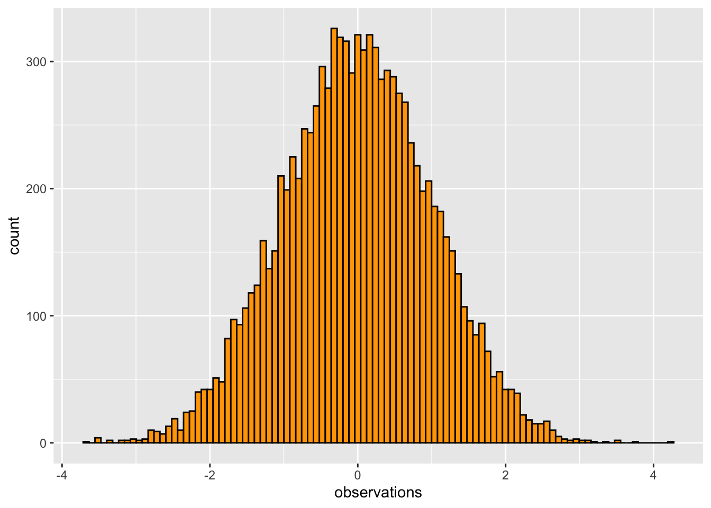
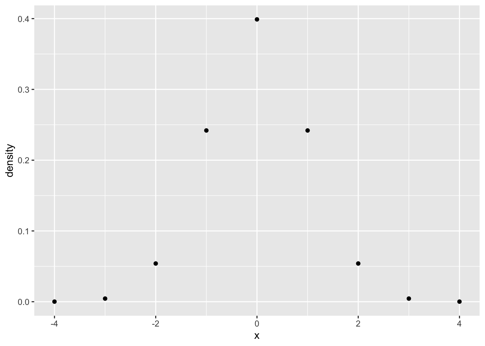
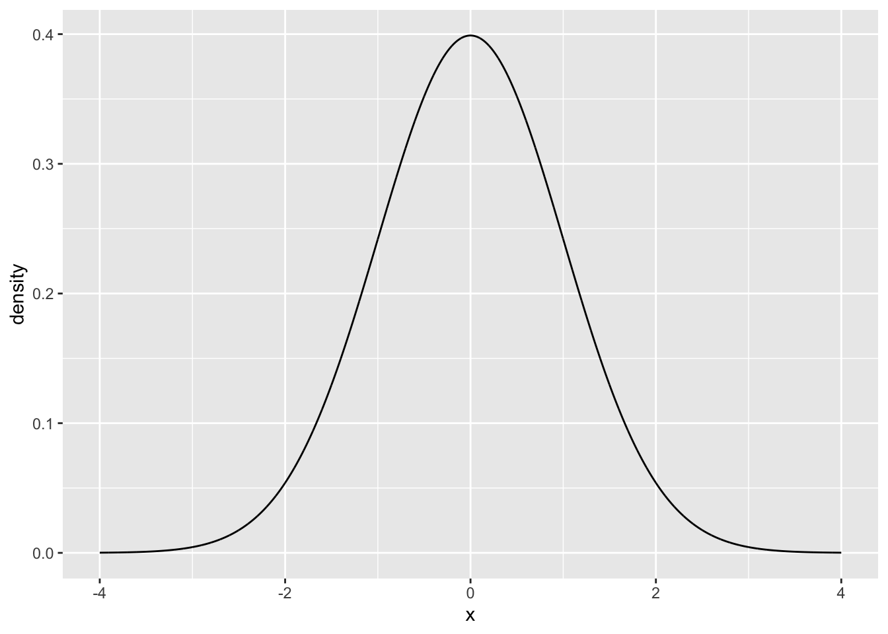
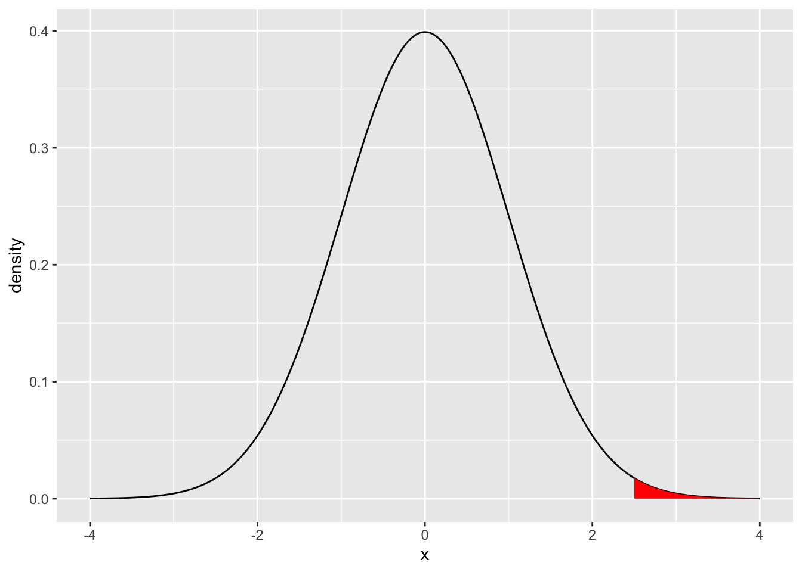
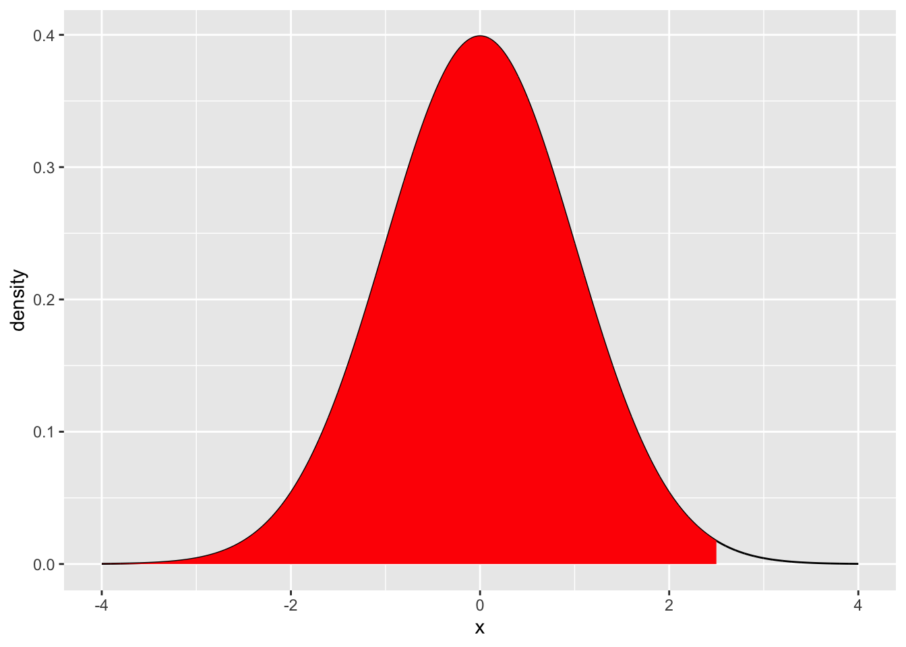
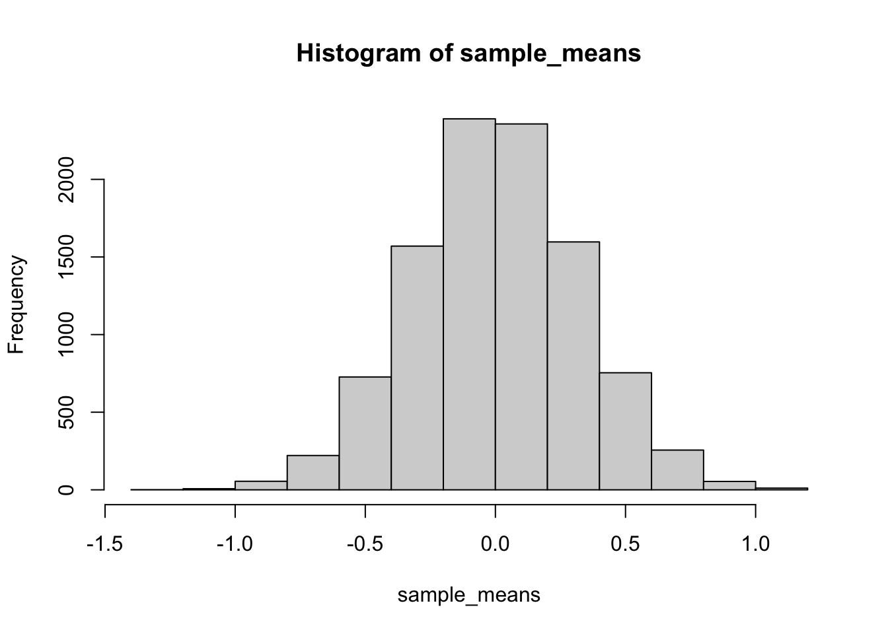

# Sampling Distributions

"10/2/2020 | Last Compiled: 2022-04-26"

## Readings

@crumpAnsweringQuestionsData2018, [4.8 - 4.10](https://crumplab.github.io/statistics/probability-sampling-and-estimation.html#samples-populations-and-sampling)

## Review

<div class="videoWrapper">  <iframe width="560" height="315" src="https://www.youtube.com/embed/xbQaPWdKUp0" frameborder="0" allow="accelerometer; autoplay; clipboard-write; encrypted-media; gyroscope; picture-in-picture" allowfullscreen></iframe> </div>

In the last two labs we have begun to explore distributions, and have used R to create and sample from distributions. We will continue this exploration in many of the following labs. 

As we continue I want to point out a major conceptual goal that I have for you. This is to have a nuanced understanding of one statement and one question:

1. Chance can do things
2. What can chance do?

To put this into concrete terms from previous labs. You know that 'chance' can produce different outcomes when you flip a coin. This is a sense in which chance do things. A 50% chance process can sometimes make a heads, and sometimes a tails. Also, we have started to ask "what can chance do?" in prior labs. For example, we asked how often chance produces 10 heads in a row, when you a flip a coin. We found that chance doesn't do that very often, compared to say 5 heads and 5 tails.

We are using these next labs to find different ways to use R to experience 1) **that** chance can do things, and 2) how **likely** it is that some things happen by chance. We are working toward a third question (for next lab), which is 3) did chance do it?...or when I run an experiment, is it possible that chance alone produced the data that was collected?

## Overview

This lab has the following modules:

1. Conceptual Review I: Probability Distributions
  - we review sampling from probability distributions using R and examine a few additional aspects of base R distribution functions
  
2. Conceptual II: Sampling Distributions
  - we use R to create a new kind of distribution, called a sampling distribution. This will prepare you for future statistics lectures and concepts that all fundamentally depend on sampling distributions.
  - **Understanding sampling distributions may well be the most fundamental thing to understand about statistics** (but that's just my opinion).
  
## Probability Distributions

In previous labs we learned that it is possible to sample numbers from particular distributions in R.

```
#see all the distribution functions
?distributions
```

### Normal Distribution

We use `rnorm()` to sample numbers from a normal distribution:


```r
rnorm(n=10, mean = 0, sd = 1)
#>  [1] -0.4262326 -1.9504370 -0.2630845 -1.4325022  0.5692190  0.3995944
#>  [7] -0.1543729 -0.3256509  0.3089172 -0.9080528
```

We can 'see' the distribution by sampling a large number of observations, and plotting them in a histogram:


```r
library(ggplot2)
some_data <- data.frame(observations = rnorm(n=10000, mean = 0, sd = 1),
                        type = "A")

ggplot(some_data, aes(x=observations)) +
  geom_histogram(bins=100, color="black", 
                 fill= 'orange')
```



We can see in this example that using random chance to sample from this distribution caused these numbers to be observed. So, we can see that "chance did something". We can also see that chance did some things more than others. Values close to 0 were sampled much more often than values larger 2.5.

How often did we sample a value larger than 2.5? What is the probability that chance would produce a value larger than 2.5? What about any other value for this distribution? To answer these questions, we need to get more specific about exactly what chance in this situation, for this distribution, is capable of doing.

1. We can answer a question like the above through observation. We can look at the sample that we generated, and see how many numbers out of the total are larger than a particular value:


```r
some_data$observations[some_data$observations > 2.5]
#>  [1] 2.569002 2.854438 2.542498 2.911574 2.741360 2.875751 2.642938 2.607074
#>  [9] 2.699894 2.751360 2.520366 3.512031 2.704728 3.038817 2.664322 2.752404
#> [17] 2.586985 2.780469 2.929764 3.362060 2.746399 2.537388 3.434642 2.533305
#> [25] 2.787945 2.923204 2.581067 2.754448 2.783801 3.000941 2.626614 2.781184
#> [33] 2.607430 3.364519 2.544195 3.340397 3.130555 2.788952 4.106499 2.547435
#> [41] 3.282487 2.608786 2.702069 3.177433 2.500632 3.176734 2.828287 3.000135
#> [49] 2.865655 2.765614 2.500413 2.930355 2.847117 2.981198 2.910288 2.661948
#> [57] 2.635070 2.555418 2.625948 3.025801 2.506846
length(some_data$observations[some_data$observations > 2.5])
#> [1] 61
length(some_data$observations[some_data$observations > 2.5])/10000
#> [1] 0.0061
```
2. We could also compute the probability directly using analytical formulas. And, these formulas also exist in R. Specifically, distribution formulas begin with `d`, `p`, `q`, and `r`, so there are `dnorm`, `pnorm`, `qnorm`, and `rnorm` functions for the normal distribution (and other distributions).


#### rnorm()

`rnorm(n, mean = 0, sd = 1)` samples observations (or random deviates) from a normal distribution with specified mean and standard deviation.


```r
rnorm(n=10, mean = 0, sd = 1)
#>  [1]  1.1903046  1.8631129  0.9828581  0.8447314 -0.7088629 -1.1957783
#>  [7] -0.4183044 -0.1706795  1.0815985 -0.2198671
```

#### dnorm()

`dnorm(x, mean = 0, sd = 1, log = FALSE)` is the probability density function. It returns the probability density of the distribution for any value that can be obtained from the distribution.

For example, in the above histogram, we can see that the distribution produces values roughly between -3 and 3, or perhaps -4 to 4. We also see that as values approach 0, they happen more often. So, the probability density changes across the distribution. We can plot this directly using `dorm()`, by supplying a sequence of value, say from -4 to 4.


```r
library(ggplot2)
some_data <- data.frame(density = dnorm(-4:4, mean = 0, sd = 1),
                        x = -4:4)

knitr::kable(some_data)
```


|   density|  x|
|---------:|--:|
| 0.0001338| -4|
| 0.0044318| -3|
| 0.0539910| -2|
| 0.2419707| -1|
| 0.3989423|  0|
| 0.2419707|  1|
| 0.0539910|  2|
| 0.0044318|  3|
| 0.0001338|  4|

```r

ggplot(some_data, aes(x=x, y=density)) +
  geom_point()
```


To generate a plot of the full distribution in R, you could calculate additional intervening values on the x-axis, and use a line plot.


```r
some_data <- data.frame(density = dnorm(seq(-4,4,.001), mean = 0, sd = 1),
                        x = seq(-4,4,.001))

ggplot(some_data, aes(x=x, y=density)) +
  geom_line()
```


Note, that this probability density function could be consulted to ask a question like, what is the probability of getting a value larger than 2.5? The answer is given by the area under the curve (in red).


```r
library(dplyr)
some_data <- data.frame(density = dnorm(seq(-4,4,.001), mean = 0, sd = 1),
                        x = seq(-4,4,.001))

region_data <- some_data %>%
  filter(x > 2.5)

ggplot(some_data, aes(x=x, y=density)) +
  geom_line()+
  geom_ribbon(data = region_data, 
              fill = "red",
              aes(ymin=0,ymax=density))
```


### pnorm

`pnorm(q, mean = 0, sd = 1, lower.tail = TRUE, log.p = FALSE)` takes a given value that the distribution could produce as an input called `q` for quantile. The function then returns the proportional area under the curve up to that value. 

For example, what is the area under the curve starting from the left (e.g., negative infinity) all the way to 2.5?


```r
pnorm(2.5, mean=0, sd = 1)
#> [1] 0.9937903
```

This is the "complement" of our question. That is 99.37903% of all values drawn from the distribution are expected to be **less than 2.5**. We have just determined the probability of getting a number smaller than 2.5, otherwise known as the lower tail.


```r
some_data <- data.frame(density = dnorm(seq(-4,4,.001), mean = 0, sd = 1),
                        x = seq(-4,4,.001))
region_data <- some_data %>%
  filter(x < 2.5)

ggplot(some_data, aes(x=x, y=density)) +
  geom_line()+
  geom_ribbon(data = region_data, 
              fill = "red",
              aes(ymin=0,ymax=density))
```


By default, `pnorm` calculates the lower tail, or the area under the curve from the `q` value point to the left side of the plot. 

To calculate the the probability of getting a number larger than a particular value you can take the complement, or set `lower.tail=FALSE`


```r
1 - pnorm(2.5, mean=0, sd = 1)
#> [1] 0.006209665

pnorm(2.5, mean=0, sd = 1, lower.tail=FALSE)
#> [1] 0.006209665
```

#### qnorm

`qnorm(p, mean = 0, sd = 1, lower.tail = TRUE, log.p = FALSE)` is similar to `pnorm`, but it takes a probability as an input, and returns a specific point value (or quantile) on the x-axis. More formally, you specify a proportional area under the curve starting from the left, and the function tells which number that area corresponds to.

For the remaining we assume mean=0 and sd =1.

What number on the x-axis is the location where 25% of the values are smaller than that value?


```r
qnorm(.25, mean= 0, sd =1)
#> [1] -0.6744898
```

What number on the x-axis is the location where 50% of the values are smaller than that value?


```r
qnorm(.5, mean= 0, sd =1)
#> [1] 0
```

What is the number where 95% of the values are larger than that number?


```r
qnorm(.95, mean= 0, sd =1, lower.tail = FALSE)
#> [1] -1.644854

qnorm(.05, mean = 0 , sd =1, lower.tail = FALSE)
#> [1] 1.644854
```

### Summary

Focusing on the normal distribution functions, we have learned that chance can produce different kinds of numbers from a normal distribution. And, we can use the `dnorm`, `qnorm`, and `pnorm` functions to exactly compute the specific probabilities that **certain ranges of values** occur.

## Conceptual: Sampling Distributions

When we collect data we assume they come from some "distribution", which "causes" some numbers to occur more than others. The data we collect is a "sample" or portion of the "distribution". 

We know that when we sample from distributions chance can play a role. Specifically, by chance alone one sample of observations could look different from another sample, even if they came from the same distribution. In other words, **we recognize that the process of sampling from a distribution involves variability or uncertainty**.

We can use **sampling distributions** as a tool to help us understand and predict how our sampling process will behave. This way we can have information about how variable or uncertain our samples are.

### Confusing jargon

Throughout this course you will come across terms like, "sampling distributions", "the sampling distribution of the sample mean", "the sampling distribution of any sample statistic", "the standard deviation of the sampling distribution of the sample mean is the standard error of the mean". Although all of these sentence are hard to parse and in my opinion very jargony, they all represent very important ideas that need to be distinguished and well understood. We are going to work on these things in this lab.

### The sample mean

For all of the remaining examples we will use a normal distribution with mean = 0 and sd =1.

We already know what the sample mean is and how to calculate it in R. Here is an example of calculating a sample mean, where the number of observations (n) in the sample is 10.


```r
mean(rnorm(10, mean=0, sd =1))
#> [1] -0.4239849
```

### Multiple sample means

We can repeat the above process as many times as we like, each time creating a sample of 10 observations and computing the mean.

Here is an example of creating 5 sample means from 5 sets of 10 observations.


```r
mean(rnorm(10, mean=0, sd =1))
#> [1] -0.04471581
mean(rnorm(10, mean=0, sd =1))
#> [1] -0.2384895
mean(rnorm(10, mean=0, sd =1))
#> [1] 0.376665
mean(rnorm(10, mean=0, sd =1))
#> [1] 0.0569266
mean(rnorm(10, mean=0, sd =1))
#> [1] 0.1866335
```

Notice each of the sample means is different, this is because of the variability introduced by randomly choosing values from the same normal distribution.

The mean of the distribution that the samples come from is 0, what do we expect the mean of the samples to be? In general, we expect 0, but we can see that not all of the sample means are exactly 0.

How much variability can we expect for our sample mean? In other words, if we are going to obtain a sample of 10 numbers from this distribution, **what kinds of sample means could we get?**.

### The sampling distribution of the sample means

The answer to the question **what kinds of sample means could we get?** is "the sampling distribution of the sample means". In other words, if you do the work to actually find out and create a bunch of samples, and then find their means, then you have a bunch of sample means, and all of these numbers form a distribution. This distribution is effectively showing you all of the different ways that random chance can produce particular sample means. 

Let's make a distribution of sample means. We will create 10,000 samples, each with 10 observations, and compute the mean for each. We will save and look at all of the means in a histogram.


```r
sample_means <- replicate(10000, mean(rnorm(10,0,1)))
hist(sample_means)
```


The above is a histogram representing the means for 10,000 samples. We can refer to this as a sampling distribution of the sample means. It is how sample means (in this one particular situation) are generally distributed.

If you wanted to know what to expect from a single sample mean (if you knew you were taking values from this normal distribution), then you could look at this sampling distribution. 

Sample means close to 0 happen the most. So, most of the time, when you take a sample from this distribution, the mean of that sample will be 0. It is rare for a sample mean to be larger than .5. It is very very rare for a sample mean to be larger than 1. 


### The standard error the mean

We have not discussed the concept or definition of the standard error the mean in the lecture portion of this class. However, we have seen that the mean for a sample taken from a distribution has expected variability, specifically the fact that there is a distribution of different sample means shows that there is variability.

What descriptive statistic have we already discussed that provides measures of variability? One option is the standard deviation. For example, we could do the following to measure the variability associated with a distribution of sample means.

1. Generate a distribution of sample means
2. Calculate the standard deviation of the sample means

The standard deviation of the sample means would give us an idea of how much variability we expect from our sample mean. We could do this quickly in R like this:


```r
sample_means <- replicate(10000, mean(rnorm(10,0,1)))
sd(sample_means)
#> [1] 0.3225278
```

The value we calculated is a standardized unit, and it describes the amount of error we expect in general from a sample mean. Specifically, if the true population mean is 0, then when we obtain samples, we expect the sample means will have some error, they should on average be 0, but plus or minus the standard deviation we calculated.

We do not necessarily have to generate a distribution of sample means to calculate the standard error. If we know the population standard deviation ($\sigma$), then we can use this formula for the standard error of the mean (SEM) is:

$\text{SEM} = \frac{\sigma}{\sqrt{N}}$

where $\sigma$ is the population standard deviation, and $N$ is the sample size.

We can also compare the SEM from the formula to the one we obtained by simulation, and we find they are similar.


```r
# simulation SEM
sample_means <- replicate(10000, mean(rnorm(10,0,1)))
sd(sample_means)
#> [1] 0.3181567

# analytic SEM

1/sqrt(10)
#> [1] 0.3162278
```


## Lab 5 Generalization Assignment

<div class="videoWrapper">  <iframe width="560" height="315" src="https://www.youtube.com/embed/rjp7kmIo2Qk" frameborder="0" allow="accelerometer; autoplay; clipboard-write; encrypted-media; gyroscope; picture-in-picture" allowfullscreen></iframe> </div>

### Instructions

In general, labs will present a discussion of problems and issues with example code like above, and then students will be tasked with completing generalization assignments, showing that they can work with the concepts and tools independently. 

Your assignment instructions are the following:

1. Work inside the R project "StatsLab1" you have been using
2. Create a new R Markdown document called "Lab5.Rmd"
3. Use Lab5.Rmd to show your work attempting to solve the following generalization problems. Commit your work regularly so that it appears on your Github repository.
4. **For each problem, make a note about how much of the problem you believe you can solve independently without help**. For example, if you needed to watch the help video and are unable to solve the problem on your own without copying the answers, then your note would be 0. If you are confident you can complete the problem from scratch completely on your own, your note would be 100. It is OK to have all 0s or 100s anything in between. 
5. Submit your github repository link for Lab 5 on blackboard.
6. There are five problems to solve


### Problems

1. Trust but verify. We trust that the `rnorm()` will generate random deviates in accordance with the definition of the normal distribution. For example, we learned in this lab, that a normal distribution with mean = 0, and sd =1 , should only produce values larger than 2.5 with a specific small probability, that is P(x>2.5) = 0.006209665. Verify this is approximately the case by randomly sampling 1 million numbers from this distribution, and calculate what proportion of numbers are larger than 2.5. (1 point)

2. If performance on a standardized test was known to follow a normal distribution with mean 100 and standard deviation 10, and 10,000 people took the test, how many people would be expected to achieve a score higher than 3 standard deviations from the mean? (1 point)

3. You randomly sample 25 numbers from a normal distribution with mean = 10 and standard deviation = 20. You obtain a sample mean of 12. You want to know the probability that you could have received a sample mean of 12 or larger.

Create a sampling distribution of the mean for this scenario with at least 10,000 sample means (1 point). Then, calculate the proportion of sample means that are 12 or larger (1 point).

4. You randomly sample **100** numbers from a normal distribution with mean = 10 and standard deviation = 20. You obtain a sample mean of 12. You want to know the probability that you could have received a sample mean of 12 or larger.

Create a sampling distribution of the mean for this scenario with at least 10,000 sample means. Then, calculate the proportion of sample means that are 12 or larger. Is the proportion different from question 3, why? (1 point).

5. You randomly sample 25 numbers from a normal distribution with mean = 10 and standard deviation = 20. You obtain a sample standard deviation of 15. You want to know the probability that you could have received a sample standard deviation of 15 or less. 

Create a sampling distribution of standard deviations for this scenario with at least 10,000 sample standard deviations. Then, calculate the proportion of sample standard deviations that are 15 or less. (1 point)

