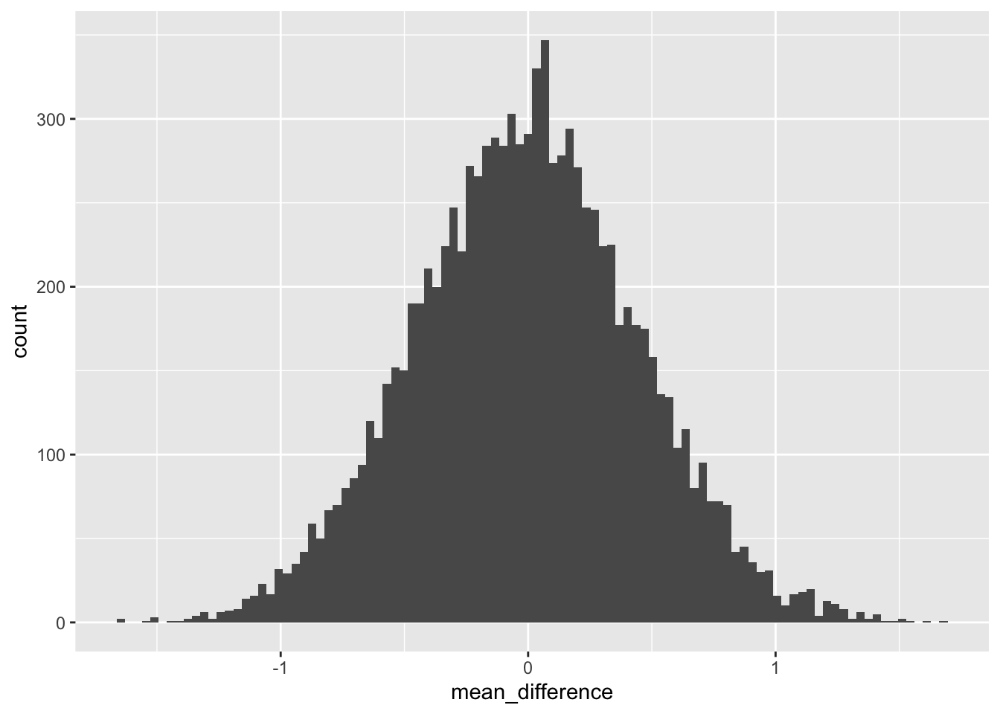
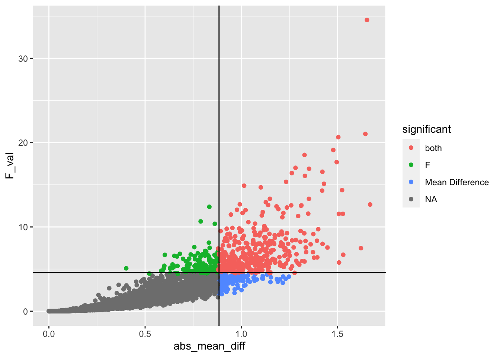

# WYOR

## Reading

Chapter 22 from @abdiExperimentalDesignAnalysis2009.

## Overview

WYOR refers to "Writing Your own statistical Recipes". A goal of this course has been to explore principles of statistical analysis to the point where you would be able to use those general principles to craft statistical analyses that are tailored to your designs of interest. In this final lab, the practical section discusses some of the general aspects of R formula for declaring ANOVA and linear regression models. This can help you analyze many designs similar to those discussed in class throughout the last two semesters. The conceptual section is a final example of a simulated statistical analysis, and a few parting thoughts.

## Practical I: R formula

Throughout this course we have used the `lm()` and `aov()` functions to conduct linear regressions and ANOVAs. For specific designs, we also demonstrated how to use the formula syntax to declare a design of interest. However, I did not present a more general description of the formula syntax, and how it can be used to declare many different kinds of designs. This practical section provides a quick look into the formula syntax. Also, check out this blog piece on writing formulas in R as an alternate resource, <https://conjugateprior.org/2013/01/formulae-in-r-anova/>.

### Read the formula() help file

It turns out that there is a help file for the formula syntax that is actually pretty helpful. So, make sure you read it.


```r
?formula()
?formula
```

### Formula basics

We normally see a formula inside aov or lm, as follows. The column name of the dependent variable of interest (DV) is located on the left, followed by a tilda (~), followed by the independent variable(s) of interest, and a pointer to your data frame.


```r
aov(DV ~ IV, data = your_data)
lm(DV ~ IV, data = your_data)
```

Formulas can also be declared outside of these functions. For example, we can assign a formula to a named object.


```r
my_formula <- DV~IV
```

And, we can see that the class of this object is "formula".


```r
class(my_formula)
#> [1] "formula"
```

Entering the name of the object alone will print out the formula to the console


```r
my_formula
#> DV ~ IV
```

There are also helper functions for formula objects that allow you inspect the individual terms in the formula.


```r
terms(my_formula)
#> DV ~ IV
#> attr(,"variables")
#> list(DV, IV)
#> attr(,"factors")
#>    IV
#> DV  0
#> IV  1
#> attr(,"term.labels")
#> [1] "IV"
#> attr(,"order")
#> [1] 1
#> attr(,"intercept")
#> [1] 1
#> attr(,"response")
#> [1] 1
#> attr(,".Environment")
#> <environment: R_GlobalEnv>
```

If you have assigned a formula to an object, you can then use the object in place of the formula in `aov()` or `lm()`.


```r
library(tibble)
some_data <- tibble(DV=rnorm(20,0,1),
                    IV=rep(c("A","B"), each=10))

summary(aov(DV ~ IV, some_data))
#>             Df Sum Sq Mean Sq F value Pr(>F)
#> IV           1   0.00  0.0004       0  0.983
#> Residuals   18  16.07  0.8926

# is the same as

my_formula <- DV ~ IV
summary(aov(my_formula, some_data))
#>             Df Sum Sq Mean Sq F value Pr(>F)
#> IV           1   0.00  0.0004       0  0.983
#> Residuals   18  16.07  0.8926
```

### Formula operators

There are several formula operators to be aware of, including `~`, `+`, `:`, `*`, `^`, `%in%`, `/`, and `-`. 

The tilda `~` operator is used to separately declare the dependent variable from the "model", or set of independent variables used to account for variation in the dependent variable. 


```r

# examples of DV ~ model

# one factor
DV ~ A

# two factors no interaction
DV ~ A+B

# three factors, all possible interactions
DV ~ A*B*C

```

The plus `+` operator is used to "add" specific terms to the model. For example, if you had one, two, or three independent variables, you could have different models that contain one, two, or three of those variables.


```r
DV ~ A
DV ~ A+B
DV ~ A+B+C
```

Importantly, the `+` sign adds individual terms only and nothing more. For example, a factorial design with three independent variables (A, B, C), has several two-way interactions and a three-way interaction. However, using the plus operator, these interaction terms will not be added unless they are explicitly declared.

For example, we can inspect the terms for the formula `DV ~ A+B+C`, and see that there are only three terms, one for each independent variable.


```r
attributes(terms(DV ~ A+B+C))$factors
#>    A B C
#> DV 0 0 0
#> A  1 0 0
#> B  0 1 0
#> C  0 0 1
```

Interaction terms can be declared using `:`. For example, `A:B` would specify an interaction between and A and B. Using the `+` operator, we can add in individual interaction terms declared using the `:` operator. 


```r
## add the two-interaction between A and B
DV ~ A + B + C + A:B
#> DV ~ A + B + C + A:B

attributes(terms(DV ~ A + B + C + A:B))$factors
#>    A B C A:B
#> DV 0 0 0   0
#> A  1 0 0   1
#> B  0 1 0   1
#> C  0 0 1   0

## add all two-way interactions

DV ~ A + B + C + A:B + A:C + B:C
#> DV ~ A + B + C + A:B + A:C + B:C

attributes(terms(DV ~ A + B + C + A:B + A:C + B:C))$factors
#>    A B C A:B A:C B:C
#> DV 0 0 0   0   0   0
#> A  1 0 0   1   1   0
#> B  0 1 0   1   0   1
#> C  0 0 1   0   1   1

## add all interactions

DV ~ A + B + C + A:B + A:C + B:C + A:B:C
#> DV ~ A + B + C + A:B + A:C + B:C + A:B:C

attributes(terms(DV ~ A + B + C + A:B + A:C + B:C + A:B:C))$factors
#>    A B C A:B A:C B:C A:B:C
#> DV 0 0 0   0   0   0     0
#> A  1 0 0   1   1   0     1
#> B  0 1 0   1   0   1     1
#> C  0 0 1   0   1   1     1
```

The `*` operator signifies the crossing of factors. For example, in a 2x2 design, the two levels of A are fully crossed with the two levels of B. This design has two main effects (A and B), and one interaction term (A:B). The `*` operator is a shortcut to include all of the terms (main effects and interactions) in a crossed design, without having to specify each of them individually.


```r
DV ~ A*B
#> DV ~ A * B
attributes(terms(DV ~ A*B))$factors
#>    A B A:B
#> DV 0 0   0
#> A  1 0   1
#> B  0 1   1

# is the same as
DV ~ A + B + A:B
#> DV ~ A + B + A:B

# 3-factor crossed

DV ~ A*B*C 
#> DV ~ A * B * C
attributes(terms(DV ~ A*B*C))$factors
#>    A B C A:B A:C B:C A:B:C
#> DV 0 0 0   0   0   0     0
#> A  1 0 0   1   1   0     1
#> B  0 1 0   1   0   1     1
#> C  0 0 1   0   1   1     1

#is the same as 

DV ~ A + B + C + A:B + A:C + B:C + A:B:C
#> DV ~ A + B + C + A:B + A:C + B:C + A:B:C
```

The `-` operator can subtract terms from the model. For example, let's say you had a design with three crossed factors, but you did not want to include the 3-way interaction:


```r
# omit the three-way interaction
DV ~ A*B*C - A:B:C
#> DV ~ A * B * C - A:B:C
attributes(terms(DV ~ A*B*C - A:B:C))$factors
#>    A B C A:B A:C B:C
#> DV 0 0 0   0   0   0
#> A  1 0 0   1   1   0
#> B  0 1 0   1   0   1
#> C  0 0 1   0   1   1

# omit the two-way interactions
DV ~ A*B*C - A:B - A:C - B:C
#> DV ~ A * B * C - A:B - A:C - B:C
```

The `%in%` operator is used to declare nesting, such as `A%in%B`, where the term on the left is nested in the term on the right. The `/` operator can also be used to indicate nesting.


```r
DV ~ A + A%in%B
#> DV ~ A + A %in% B
attributes(terms(DV ~ A + A%in%B))$factors
#>    A A:B
#> DV 0   0
#> A  1   2
#> B  0   1

DV ~ A+ A/B
#> DV ~ A + A/B
attributes(terms(DV ~ A + A/B))$factors
#>    A A:B
#> DV 0   0
#> A  1   2
#> B  0   1
```

### Error()

The above formulas would apply to between-subjects variables,  or "fixed" effects. It is also possible to include random effects, however it is assumed that the designs are balanced. The `Error()` term is used to "specify error strata" (according the help file from aov). We have used `Error()` in class for designs with repeated measures. Here are some examples:

#### One Random factor


```r
DV ~ Error(A)
#> DV ~ Error(A)
```

#### One Factor, with repeated Measures

Note, `subject` refers to the column name coding the subject variable in your data frame.


```r
DV ~ A + Error(subject)
#> DV ~ A + Error(subject)
```

#### Two factor, both repeated measures


```r
DV ~ A*B + Error(subject/(A*B))
#> DV ~ A * B + Error(subject/(A * B))
```

#### Two factor, A between fixed, B repeated measures


```r
DV ~ A*B + Error(subject/B)
#> DV ~ A * B + Error(subject/B)
```

### Conclusion...when in doubt, reproduce a textbook example

Specifying formula in base R for a design of interest can be challenging, especially as the designs become more complicated. If you have unbalanced designs with multiple IVs, that are combinations of fixed and random and nested and repeated measures, then you will have more work to do. For example, you may have to learn about different R packages for mixed models such as `lme4` or `nlme`, along with the slightly different formula syntax that they use. To the extent possible, when using unfamiliar statistics software or packages, it can be very helpful to find a textbook example that you can trust (e.g., a fully worked out example analysis for a design of interest), and then attempt to reproduce that example using software as a way to confirm expected behavior.

## Conceptual I: Simulating statistics

Throughout the course we conducted several statistical simulations, including simulations for power analysis. The simulations had several purposes. First, they give you some experience with general coding in R (e.g., to run loops and stored data from the simulations). Second, they concretely illustrate concepts like random sampling and sampling distributions and show how simulated results should converge on analytic procedures over the long run. Last, they are very flexible and can be used to anticipate possible outcomes of experimental designs, as well as develop inferential models to interpret possible outcomes. 

### Basic recipe for simulating designs in R

1. Declare a data frame that represents the structure of your design, down to the smallest detail you are interested in. For example, your data frame could include columns for the dependent variable and independent variables in the design. Each row could be an individual subject mean.
2. Make explicit assumptions about the distributions underlying your measurements. Populate the DV with values sampled from those distributions. 
3. A null model assumes that the distribution of your DV does not change across the conditions/levels of the IV. Alternate models assume that the distributions between conditions/levels are different somehow. You get to choose what kind of simulation you are running, so you choose to specify the form of any differences in the distributions.
4. After you have populated the data frame with possible data, then you can analyse the simulated data to answer a question of interest. This could involve applying a standard inferential test, to generate a test-statistic (e..g, t, F, r, etc), or some other statistic of interest (e.g., a mean difference).
5. Repeat the process of randomly generating simulated data, and analyzing it to arrive at test-statistics of interest. Repeat roughly 10,000 times, save the test-statistics every time to produce a simulated sampling distribution for the each test-statistic.
6. Use the simulated sampling distribution for inference or power analysis for design planning.

### A conundrum: Concrete vs. abstract test-statistics

Many test-statistics, like z, t, F, and r, are somewhat abstract and opaque. For example, is an F-value of 3, large or small? Does it mean that you should care about a difference between two means? It depends on factors like the degrees of freedom etc. Alternatively, sometimes test-statistics could be more concrete. For example, if I told you one population had a mean height of 5 ft, and another had a mean height of 6ft, then we could have a mean difference of 1ft. Because we are familiar with feet to measure height, a 1 ft difference is fairly concrete and, relative to an F value, fairly immediate to interpret. 

Using simulation techniques it is possible to evaluate "concrete" statistics. For example, consider a simple 1 factor design (between-subjects). The purpose of this design is simply to determine if there is a difference between the means of group A and group B. 

The simulation below conducts such an experiment 10,000. It is a simulation of the null hypothesis, so measures are randomly drawn from a normal distribution with mean = 0 and sd = 1. I create several simulated sampling distributions of various test-statistics to illustrate how the simulation procedure is very flexible. Then, we look at whether the null-hypotheses agree.


```r
library(tibble)
library(dplyr)

# declare simulation paramters
N <- 10
effect_size <- 0
null_distribution <- tibble()
iterations <- 10000

# run simulation
for(i in 1:iterations){
  
  # create a random sample of data
  null_data <- tibble(subjects = as.factor(c(1:(N*2))),
                      IV = as.factor(rep(c("A","B"), each = N)),
                      DV = c(rnorm(N,0,1),rnorm(N,effect_size,1))
                      )
  
  # run statistical analyses
  aov_summary <- summary(aov(DV~IV, data = null_data))
  
  SS_IV <- aov_summary[[1]]$`Sum Sq`[1]
  SS_residuals <- aov_summary[[1]]$`Sum Sq`[2]
  SS_total <- SS_IV+SS_residuals
  MS_IV <- aov_summary[[1]]$`Mean Sq`[1]
  MS_residuals <- aov_summary[[1]]$`Mean Sq`[2]
  F_val <- aov_summary[[1]]$`F value`[1] 
  
  means <- null_data %>%
    group_by(IV) %>%
    summarize(meanDV = mean(DV),
              sdDV = sd(DV))
  
  mean_difference <- means[means$IV == "B",]$meanDV - means[means$IV == "A",]$meanDV 
  
  abs_mean_diff <- abs(mean_difference)
  
  cohens_D <- mean_difference / sqrt((sum(means$sdDV)/2))
  
  t <- t.test(DV~IV, var.equal=TRUE, null_data)$statistic
  
  abs_t <- abs(t)
  
  # save all test-statistics
  sim_vals <- tibble(SS_IV,
                    SS_residuals,
                    SS_total,
                    MS_IV,
                    MS_residuals,
                    F_val,
                    mean_difference,
                    abs_mean_diff,
                    cohens_D,
                    t,
                    abs_t
                    )
  
  # append saved test-statsistics to the null-distribution tibble
  null_distribution <- rbind(null_distribution,
                             sim_vals)
}
```

We have now created separate null-distributions for each of the statistics that we saved. Each null-distribution has 10,000 values. 

Consider the simulated F-distribution that we created. Let's get the critical value from the simulated distribution, and compare it to the known critical value of F.


```r
# write a general function to get critical values from
# a simulated distribution (vector of values)

get_critical_value <- function(x,alpha){
  x_sorted <- sort(abs(x))
  ind <- round(length(x)*(1-alpha))
  return(x_sorted[ind])
}

# simulated F critical value
get_critical_value(null_distribution$F_val,
                   alpha = .05)
#> [1] 4.581539

# analytical F critical value
qf(.95,1,18)
#> [1] 4.413873

library(ggplot2)

ggplot(null_distribution, aes(x=F_val))+
  geom_histogram(bins=100)+
  geom_vline(xintercept=get_critical_value(null_distribution$F_val,
                   alpha = .05))
```


Now let's look instead at the sampling distribution of the mean difference between group A and B.


```r
ggplot(null_distribution, aes(x=mean_difference))+
  geom_histogram(bins=100)
```



Let's convert this distribution to the absolute value of the mean difference, and then find the critical value (assuming alpha =.05) associated with this distribution.


```r
get_critical_value(null_distribution$abs_mean_diff,
                   alpha = .05)
#> [1] 0.8843424

ggplot(null_distribution, aes(x=abs_mean_diff))+
  geom_histogram(bins=100)+
  geom_vline(xintercept=get_critical_value(null_distribution$abs_mean_diff,
                   alpha = .05))
```


### Which null is the true null?

We have created several true null distributions. Above we looked at the values of F that can be produced by chance for this design. As well, we looked at the absolute mean differences that can be produced by chance for this design. We found the critical values for both test-statistics. We could use either of them for the purposes of "null-hypothesis testing".

However, the conundrum that I alluded to earlier is that the different Null distributions don't necessarilly agree. In this particular case, they agree fairly closely, but not perfectly. 

For example, we could use the correlation coefficienty to quickly look check whether the F values are related to the absolute mean differences across the simulations.


```r
knitr::kable(round(cor(null_distribution),digits=2))
```


|                | SS_IV| SS_residuals| SS_total| MS_IV| MS_residuals| F_val| mean_difference| abs_mean_diff| cohens_D|     t| abs_t|
|:---------------|-----:|------------:|--------:|-----:|------------:|-----:|---------------:|-------------:|--------:|-----:|-----:|
|SS_IV           |  1.00|         0.00|     0.23|  1.00|         0.00|  0.91|           -0.01|          0.94|    -0.01|  0.01|  0.90|
|SS_residuals    |  0.00|         1.00|     0.97|  0.00|         1.00| -0.21|            0.00|          0.00|     0.00|  0.00| -0.21|
|SS_total        |  0.23|         0.97|     1.00|  0.23|         0.97|  0.00|            0.00|          0.22|     0.00|  0.00|  0.01|
|MS_IV           |  1.00|         0.00|     0.23|  1.00|         0.00|  0.91|           -0.01|          0.94|    -0.01|  0.01|  0.90|
|MS_residuals    |  0.00|         1.00|     0.97|  0.00|         1.00| -0.21|            0.00|          0.00|     0.00|  0.00| -0.21|
|F_val           |  0.91|        -0.21|     0.00|  0.91|        -0.21|  1.00|           -0.01|          0.85|    -0.01|  0.02|  0.92|
|mean_difference | -0.01|         0.00|     0.00| -0.01|         0.00| -0.01|            1.00|         -0.01|     1.00| -0.98| -0.02|
|abs_mean_diff   |  0.94|         0.00|     0.22|  0.94|         0.00|  0.85|           -0.01|          1.00|    -0.01|  0.02|  0.96|
|cohens_D        | -0.01|         0.00|     0.00| -0.01|         0.00| -0.01|            1.00|         -0.01|     1.00| -1.00| -0.02|
|t               |  0.01|         0.00|     0.00|  0.01|         0.00|  0.02|           -0.98|          0.02|    -1.00|  1.00|  0.02|
|abs_t           |  0.90|        -0.21|     0.01|  0.90|        -0.21|  0.92|           -0.02|          0.96|    -0.02|  0.02|  1.00|

The table above shows the entire correlation matrix. We can see that there is a large positive correlation between F and the absolute mean difference. In other words, when large differences in the means are produced by chance large  F values are also produced. 

However, because the two vectors are not perfectly correlated, they each have different opinions on what constitutes a type I error. This issue is more easily inspected below, which shows a scatterplot of the simulated F values and simulated absolute mean differences, along with critical values for each.


```r
test <- null_distribution %>%
  mutate(significant = case_when(
    abs_mean_diff > .88 & F_val > 4.4 ~ "both",
    abs_mean_diff > .88 & F_val < 4.4 ~ "Mean Difference",
    abs_mean_diff < .88 & F_val > 4.4 ~ "F"
  ))

ggplot(test, aes(x=abs_mean_diff,
                 y=F_val,
                 color=significant))+
  geom_point()+
  geom_vline(xintercept=get_critical_value(null_distribution$abs_mean_diff,
                   alpha = .05))+
  geom_hline(yintercept = get_critical_value(null_distribution$F_val,
                   alpha = .05))
```



The red points are simulations that exceed both critical values (these would be significant on both measures, and represent similar conclusions about what type I errors look like), note this group is less than 5% of the simulations


```r
test %>%
  group_by(significant) %>%
  summarize(counts= n(),
            proportion = n()/10000)
#> # A tibble: 4 × 3
#>   significant     counts proportion
#>   <chr>            <int>      <dbl>
#> 1 both               374     0.0374
#> 2 F                  168     0.0168
#> 3 Mean Difference    135     0.0135
#> 4 <NA>              9323     0.932
```


## References
