# Multiple Regression I

## Readings

Chapters 4 and 5 from @abdiExperimentalDesignAnalysis2009.

<iframe width="560" height="315" src="https://www.youtube.com/embed/qvpNGAMFZ0o" frameborder="0" allow="accelerometer; autoplay; clipboard-write; encrypted-media; gyroscope; picture-in-picture" allowfullscreen></iframe>

## Overview

**The purpose of this lab** is to show how simple linear regression (using a line) can be extended into multiple linear regression (using a plane or hyperplane).

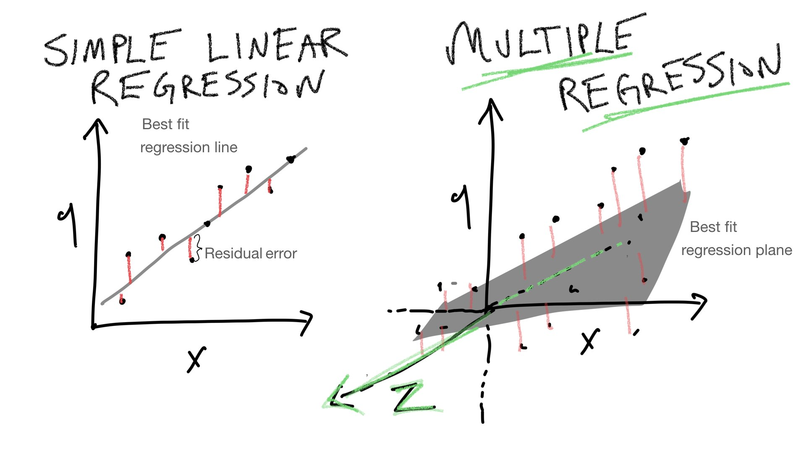

Before we begin, let's take stock of how far we got last semester. Remember, the entire purpose of this course is to understand how statistical inference is applied to experimental designs. In experimental designs, researchers are interested in whether manipulations to one experimental variable cause change in a measured dependent variable. Last semester we considered very simple situations involving *one independent variable (manipulation) with two levels*, and *one dependent variable (measure*. A design like this could be analyzed with a t-test.

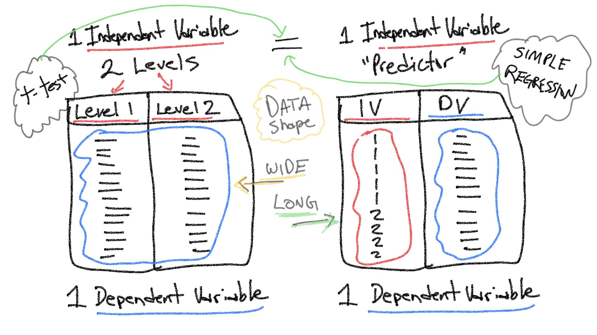

Note also, that by the end of last semester we began discussing another relatively simple situation involving two variables, a *predictor* variable and a *dependent variable*; and, we saw how linear regression could be applied to examine potential linear relationships between a predictor variable and dependent variable. As the above figure implies, there can be a relationship between both of the simple situations. In this lab, we will show that a t-test and a simple linear regression can be equivalent. This equivalence also exists for more complicated designs, and throughout the semester we will show that ANOVAs and Multiple Linear Regression are different expressions of the same analysis.

The entire rest of this semester focuses on expansions of the simplest experimental design (one independent variable with two levels, and one dependent variable). For example, one way to expand on this design is to *increase the number of levels* of a single independent variable. We will see that designs with multiple levels can be analyzed with ANOVA (Analysis of Variance) or Linear Regression, and both with produce the same results.

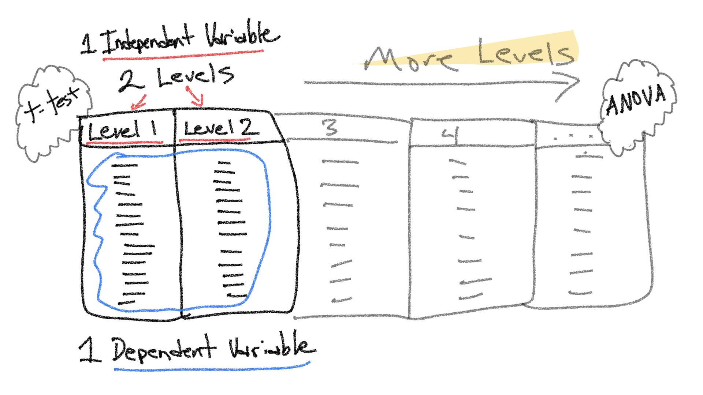

Another way to expand the simple design is to *increase the number of manipulations, or independent variables*. Designs with multiple IVs, each with multiple levels, can all be analyzed with ANOVA and Multiple Linear Regression, to produce the same results.

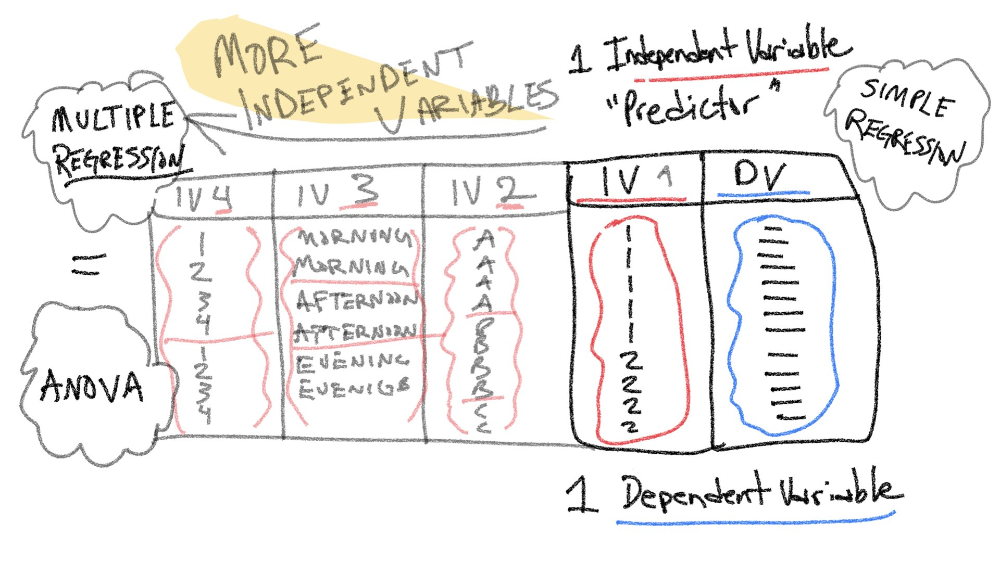


## Concept I: t-tests and simple regression

Throughout the course we will be mostly focusing on extensions to the t-test in the form of ANOVA (Analysis of Variance). These extensions allow for analyses of more complicated designs with multiple independent variables each with multiple levels. However, *before* we discuss ANOVA, we spend this lab and the next one discussing multiple linear regression. This is because linear regression can also be extended to handle the same more complicated designs. The extension is termed multiple linear regression. Last, ANOVA and multiple linear regression are fundamentally the same analysis, they produce the same results.

The relationship holds true for simple designs too. So, before we head into multiple linear regression, let's quickly revisit simple linear regression and see how it can be the same as a t-test.

### Independent sample t-test for two groups

Let's quickly make some sample data for an experiment with two groups that could be analyzed with a t-test.


```r
library(tibble)
simple_design <- tibble(group = rep(c(0,1), each=10),
                        DV = c(1,3,2,4,3,4,5,6,5,4,5,4,3,2,3,4,5,6,8,9))
```

Here's a table of the data (arranged in long-format):


```r
knitr::kable(simple_design)
```


| group| DV|
|-----:|--:|
|     0|  1|
|     0|  3|
|     0|  2|
|     0|  4|
|     0|  3|
|     0|  4|
|     0|  5|
|     0|  6|
|     0|  5|
|     0|  4|
|     1|  5|
|     1|  4|
|     1|  3|
|     1|  2|
|     1|  3|
|     1|  4|
|     1|  5|
|     1|  6|
|     1|  8|
|     1|  9|

Here's a bar graph showing the means for each group, and the data-points for each subject overlaid on top of the bars.


```r
library(ggplot2)

ggplot(simple_design, aes(x=group, y=DV))+
  geom_bar(stat = "summary", fun = "mean", position="dodge")+
  geom_point()
```

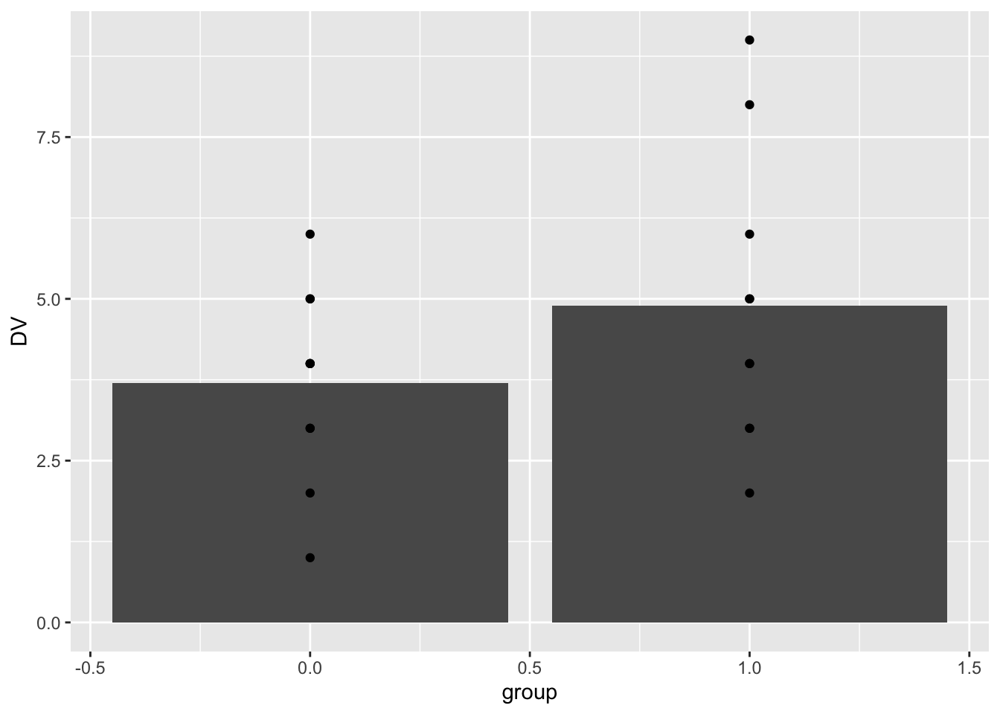

Here's the t-test results:


```r
t.test(DV~group, var.equal=TRUE, data=simple_design)
#> 
#> 	Two Sample t-test
#> 
#> data:  DV by group
#> t = -1.412, df = 18, p-value = 0.175
#> alternative hypothesis: true difference in means between group 0 and group 1 is not equal to 0
#> 95 percent confidence interval:
#>  -2.9854404  0.5854404
#> sample estimates:
#> mean in group 0 mean in group 1 
#>             3.7             4.9
```
### Linear regression for two groups

It is common to apply linear regression to a situation involving two continuous variables. However, we can also apply simple linear regression to the above situation. For example, the predictor variable is 'group', and it ranges from 0 to 1. The dependent variable is 'DV'.

We can add a regression line to the graph. Notice that the regression line goes across the boundaries from 0 to 1 (even though there is no data in between 0 and 1). Also, notice that the regression line crosses exactly at the mean for group. This is because the regression line is the line that goes through the means of the two levels.


```r
ggplot(simple_design, aes(x=group, y=DV))+
  geom_bar(stat = "summary", fun = "mean", position="dodge")+
  geom_point()+
  geom_smooth(method="lm", se=FALSE)
```

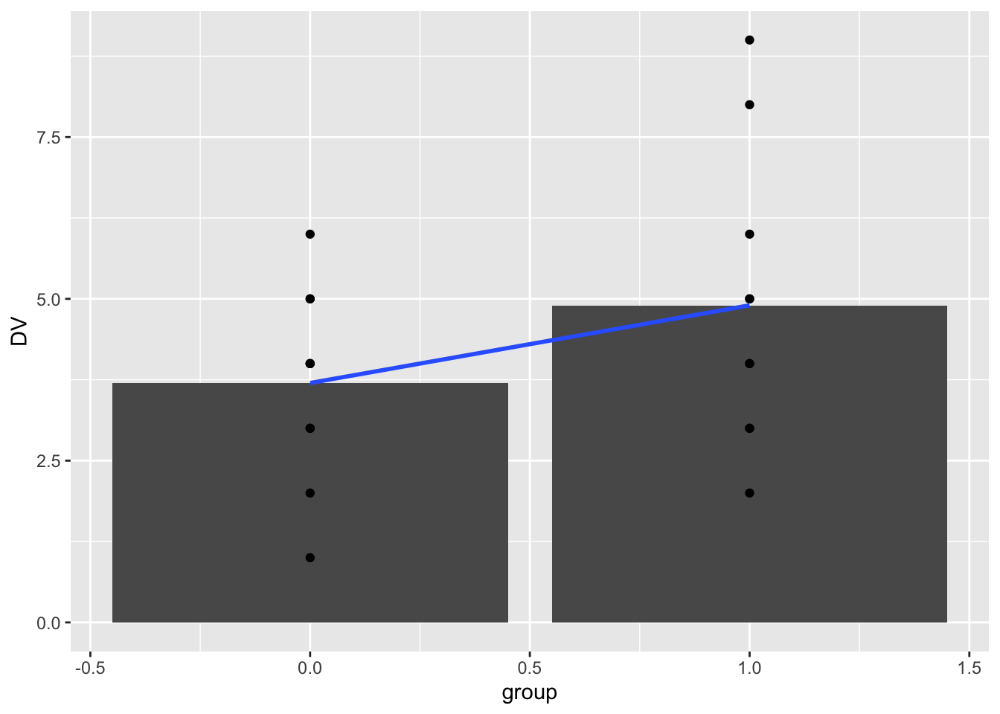

Next, we conduct a linear regression on the same data.


```r
lm(DV~group, data=simple_design)
#> 
#> Call:
#> lm(formula = DV ~ group, data = simple_design)
#> 
#> Coefficients:
#> (Intercept)        group  
#>         3.7          1.2
```

Notice the intercept is 3.7. This is value of DV on the line when group = 0, and it is also the mean value of DV for group 0. Notice that the coefficient for group is 1.2. This represents the idea that as the line goes up by 1, the value of DV will go up by 1.2. So, if we go from group = 0, to group =1, we should go from 3.7 to 3.7+1.2 = 4.9. Notice, that 4.9 is the mean of group 1.

Last, we can look at a summary of the linear regression. Notice that the p-value is .175, the same as the t-test from above. Notice that there is no t-value here, however the square root of the F-value 1.994 is 1.412, which is the same as the t-value from the t-test.


```r
summary(lm(DV~group, data=simple_design))
#> 
#> Call:
#> lm(formula = DV ~ group, data = simple_design)
#> 
#> Residuals:
#>    Min     1Q Median     3Q    Max 
#>  -2.90  -1.10   0.10   1.15   4.10 
#> 
#> Coefficients:
#>             Estimate Std. Error t value Pr(>|t|)    
#> (Intercept)   3.7000     0.6009   6.157 8.18e-06 ***
#> group         1.2000     0.8498   1.412    0.175    
#> ---
#> Signif. codes:  0 '***' 0.001 '**' 0.01 '*' 0.05 '.' 0.1 ' ' 1
#> 
#> Residual standard error: 1.9 on 18 degrees of freedom
#> Multiple R-squared:  0.09972,	Adjusted R-squared:  0.04971 
#> F-statistic: 1.994 on 1 and 18 DF,  p-value: 0.175
```

## Concept II: Adding more levels is still simple linear regression

We ended last lab with an assignment to read @slameckaRetroactiveInhibitionConnected1960. The research design from that paper is used in chapter 5 [@abdiExperimentalDesignAnalysis2009] to explain multiple orthogonal linear regression. We are working toward explaining this example. The full design has two independent variables, each with three levels. Before we take a look at that, let's consider the issue of extending the number of levels for one independent variable.

### A simplified memory experiment

Let's simplify the @slameckaRetroactiveInhibitionConnected1960 experiment for the moment. Read the following sentence one time:

"We must postulate that from strictly semantic points of vantage, most confusions in communication revolve about inadequate stipulation of meaning."

Now, imagine that in 5 minutes you try to recall the entire sentence from memory. The original sentence has 20 words. How many do you think you can correctly recall? 

In @slameckaRetroactiveInhibitionConnected1960, subjects were given sentences with 20 words in them, and they had different amounts of practice, termed Original Learning (OL). Some subjects got 2, 4, or 8 trials of practice on sentence. Thus, the first Independent variable is OL (or amount of practice), and it had three levels, 2, 4, and 8. 

The expectation is that manipulating amount of practice will change memory performance. Specifically, the more you practice the sentence, the more you will be able to remember it. I created a quick sketch to illustrate the basic predictions.

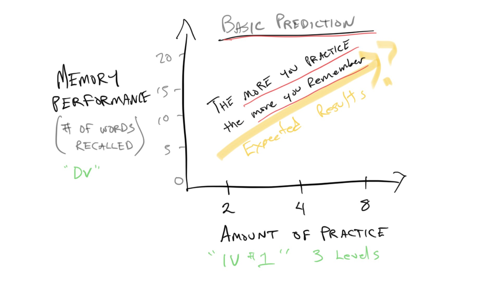

Notice this prediction graph is not terribly different from the t-test graph from the previous example. Instead of groups 0 and 1 on the x-axis, we have three levels of practice, 2, 4, and 8. If we ran this experiment, we might expect that memory performance goes up as the amount of practice goes up, and we could put line on the data as a basic way to see if the amount of practice actually has an effect. If practice has no effect, then the line would be flat. If there is an effect, then the line would go up like the yellow line in the graph.

So, let's quickly reproduce this situation in R. I'll imagine we have data for 3 subjects in each practice condition. And, I make up some numbers to reflect the idea that more practice will lead to more words recalled. Finally, we fit a regression line.


```r
recall_design <- tibble(practice = rep(c(2,4,8), each=3),
                        subjects = 1:9,
                        recall = c(5,7,8,
                                   8,10,12,
                                   12,15,17))
knitr::kable(recall_design)
```


| practice| subjects| recall|
|--------:|--------:|------:|
|        2|        1|      5|
|        2|        2|      7|
|        2|        3|      8|
|        4|        4|      8|
|        4|        5|     10|
|        4|        6|     12|
|        8|        7|     12|
|        8|        8|     15|
|        8|        9|     17|

```r

ggplot(recall_design, aes(x=practice, y=recall))+
  geom_bar(stat = "summary", fun = "mean", position="dodge")+
  geom_point()+
  geom_smooth(method="lm", formula = y~x, se=FALSE)
```

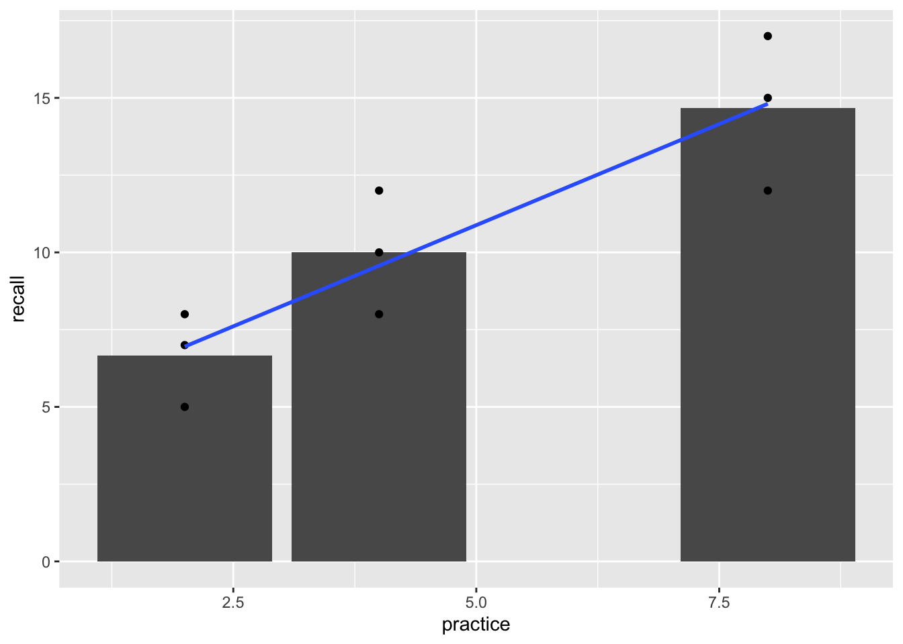

There are some tiny wrinkles here to note. If you look closely, the regression line does not go exactly through the means for each level of practice. Also, the bar for 8 trials of practice is far away from the bar for 4 trials of practice. 

What is happening here is that the levels of practice variable is being treated as a continuous variable. When the independent variable is treated like a continuous predictor variable, the regression and ANOVA will be the same, but the regression line may not go through the means in each level.


```r
summary(lm(recall~practice, data=recall_design))
#> 
#> Call:
#> lm(formula = recall ~ practice, data = recall_design)
#> 
#> Residuals:
#>     Min      1Q  Median      3Q     Max 
#> -2.8095 -1.5714  0.1905  1.0476  2.4286 
#> 
#> Coefficients:
#>             Estimate Std. Error t value Pr(>|t|)   
#> (Intercept)   4.3333     1.3678   3.168  0.01575 * 
#> practice      1.3095     0.2585   5.066  0.00145 **
#> ---
#> Signif. codes:  0 '***' 0.001 '**' 0.01 '*' 0.05 '.' 0.1 ' ' 1
#> 
#> Residual standard error: 1.934 on 7 degrees of freedom
#> Multiple R-squared:  0.7857,	Adjusted R-squared:  0.7551 
#> F-statistic: 25.67 on 1 and 7 DF,  p-value: 0.001453
summary(aov(recall~practice, data=recall_design))
#>             Df Sum Sq Mean Sq F value  Pr(>F)   
#> practice     1  96.03   96.03   25.67 0.00145 **
#> Residuals    7  26.19    3.74                   
#> ---
#> Signif. codes:  0 '***' 0.001 '**' 0.01 '*' 0.05 '.' 0.1 ' ' 1
```

It is also possible to treat the independent variable as a categorical variable. We can do this be redefining the `practice` variable as factor in R. This has a couple different consequences. First, the bar for 8 trials of practice is now located beside the 4. It is now considered to be one category away, and not four steps away, from 4. Also, ggplot2 does not show the regression line even though we asked it to draw one. And, the results of the linear regression and ANOVA are different than before (although they are the same as each other).


```r
recall_design$practice <- as.factor(recall_design$practice)

ggplot(recall_design, aes(x=practice, y=recall))+
  geom_bar(stat = "summary", fun = "mean", position="dodge")+
  geom_point()+
  geom_smooth(method="lm", formula = y~x, se=FALSE)
```

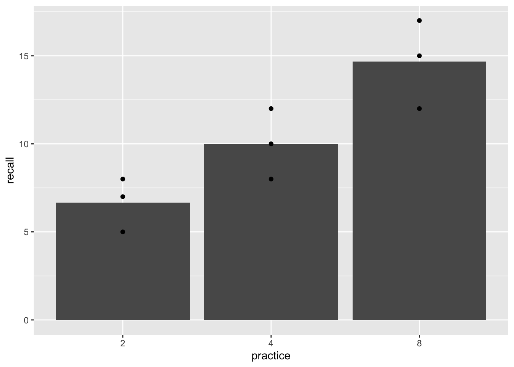

```r

summary(lm(recall~practice, data=recall_design))
#> 
#> Call:
#> lm(formula = recall ~ practice, data = recall_design)
#> 
#> Residuals:
#>     Min      1Q  Median      3Q     Max 
#> -2.6667 -1.6667  0.3333  1.3333  2.3333 
#> 
#> Coefficients:
#>             Estimate Std. Error t value Pr(>|t|)   
#> (Intercept)    6.667      1.186   5.620  0.00136 **
#> practice4      3.333      1.678   1.987  0.09413 . 
#> practice8      8.000      1.678   4.768  0.00310 **
#> ---
#> Signif. codes:  0 '***' 0.001 '**' 0.01 '*' 0.05 '.' 0.1 ' ' 1
#> 
#> Residual standard error: 2.055 on 6 degrees of freedom
#> Multiple R-squared:  0.7927,	Adjusted R-squared:  0.7236 
#> F-statistic: 11.47 on 2 and 6 DF,  p-value: 0.008905
summary(aov(recall~practice, data=recall_design))
#>             Df Sum Sq Mean Sq F value Pr(>F)   
#> practice     2  96.89   48.44   11.47 0.0089 **
#> Residuals    6  25.33    4.22                  
#> ---
#> Signif. codes:  0 '***' 0.001 '**' 0.01 '*' 0.05 '.' 0.1 ' ' 1
```

## Concept III: Multiple orthogonal linear regression

@slameckaRetroactiveInhibitionConnected1960 manipulated a second independent variable in addition to practice. The second variable was called interpolated learning (IL), and it also had three levels (0,4,8). Here's what happened. After subjects practiced learning a sentence they had to learn some MORE sentences. These additional sentences would likely have a distracting effect. 

How well would you remember this sentence...

"We must postulate that from strictly semantic points of vantage, most confusions in communication revolve about inadequate stipulation of meaning."

If that's all you had to do (0 distraction sentences afterwards). How well would you remember the above sentence if you had to practice this new sentence four times:

"Communicators can exercise latitude in specifying meaning however they choose, provided that such definitions correspond somewhat closely to customary usage."

What if you had to practice the new sentence 8 times? The expectation was that your memory for the first sentence would get worse as you practiced additional sentences that would probably distract you from the first one.

The design was a 3x3 design. The first independent variable was amount of practice on the first sentence (2,4,8 trials of original learning). The second independent variable we'll call amount of distraction sentences (interpolated learning: 0,4,8). The design was fully crossed, which means that each level of the first independent variable was paired with each level of the second. There are 3x3 = 9 total cells in the design. Here are some general expectations for the data:

Notice there are 9 dots representing rough predictions for memory recall in each of the 9 conditions (cells) in the design. The practice variable is indicated on the x-axis. The distraction variable is indicated by different colors and connected lines.

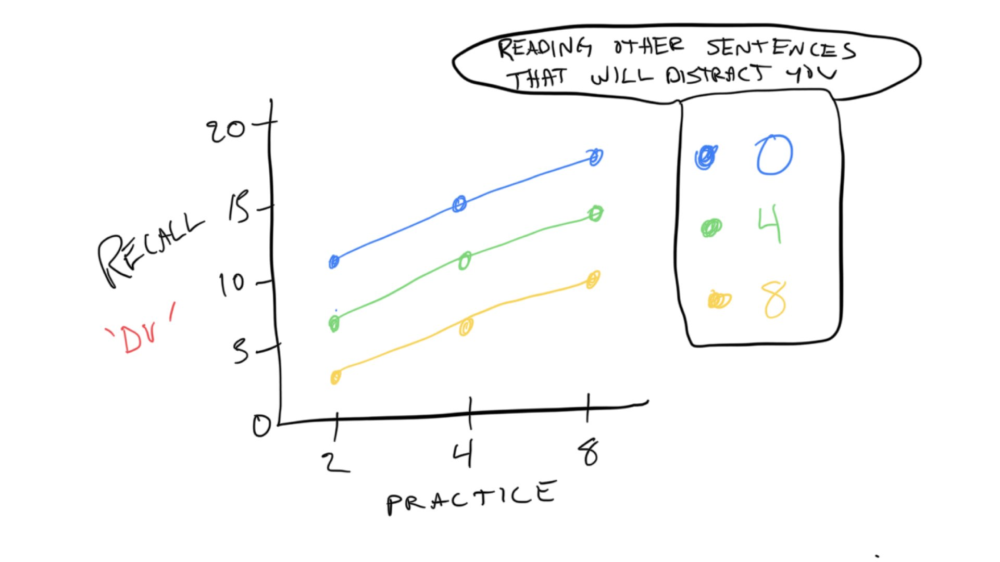

Just like in Concept section II, we expect that increasing practice will increase the number of words recalled. We can see the prediction for the practice variable (IV) in all of the colored lines. They all move up to the right, indicating that the more you practice a sentence, the more we expect you to remember more words from the sentence.

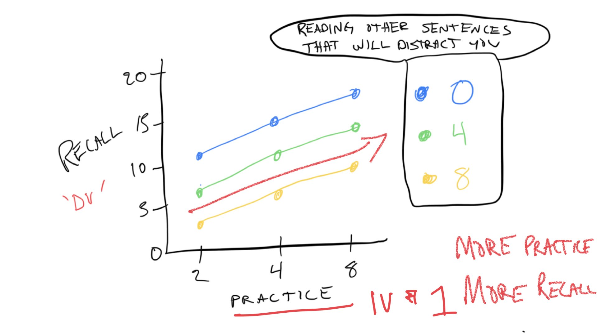

The predictions for the second IV, the distraction variable can be see by looking at the colored lines. When there is 0 distraction, we expect the best performance overall, so the blue line representing 0 distraction is at the top. When there is 4 trials of distraction, we expect memory performance to go down, so the green line is lower than the blue line. Finally, when there is 8 trials of distraction, we expect memory performance to go down even more. So, the yellow lines is below the green line.

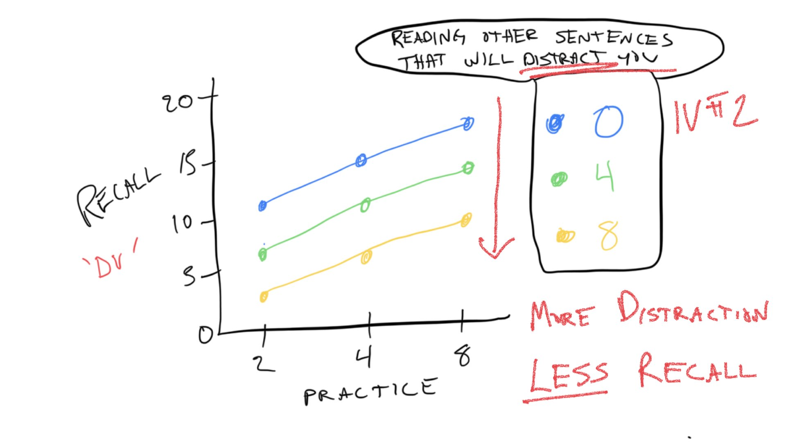

These trends are referred to as "main effects". We expect the main effect of practice to increase memory performance. We expect the main effect distraction to decrease memory performance. We expect that both things can happen at the same time, so the total memory performance is basically the sum of your practice minus the distraction.

To follow along with your textbook, we can visualize predictions for performance in this design in terms of 3-D space. One dimension represents the DV (more or less memory recall), and the other two dimensions represent the IVs (more or less practice, and more or less distraction). When we only had one IV, we could look for the best fit line relating the IV to the DV. Now, that we have two IVs we have to add a dimension to our line. A two-dimensional line is a plane. So, when we have two IVs, we can find the best fit plane that runs through the means in each cell in the design.

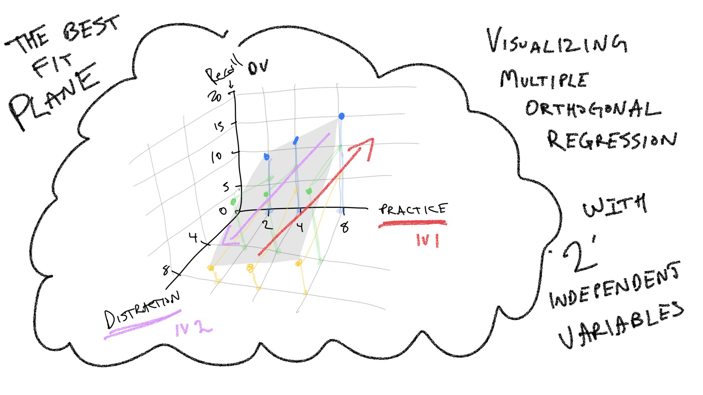

Multiple linear regression can be extended to as many IVs as you like. However, it becomes difficult to visualize the extensions. We can go from a line to a plane, but it's harder to visualize what happens when you add a third IV to the mix. This would require a four-dimensional graph that is hard to draw. But, we would extend the plane just like we did before, and there would be some best fit cube. As we keep adding more IVs, we need more and more geometrical dimensions that we can't visualize. To keep things "simple", in those situations we say that we are fitting a "hyperplane" to the data. 

**Summary**: The main purpose of the preceding section was to illustrate that multiple linear regression has a geometric interpretation, and that the geometric interpretation can be extended from a simple 2-D space involving one IV and one DV, to a 3-D space involving 2 IVs and one DV, and beyond.

## Practical I: Simulating Slamecka (1960)

The purpose of this section is to conduct the @slameckaRetroactiveInhibitionConnected1960 example from the textbook in R. Note, that in the original design the IL (number of interpolated lists) had three levels 0, 4, and 8. In the textbook, the 0 is a 2. To align with the textbook, we use a 2 here too.

### Representing the data in long-form


```r
slamecka_design <- tibble(number_of_learning_trials = rep(c(2,4,8), each=6),
                          number_of_IL = rep(rep(c(2,4,8), 2), 3),
                          subjects = 1:18,
                          recall = c(35,21,6,
                                   39,31,8,
                                   40,34,18,
                                   52,42,26,
                                   61,58,46,
                                   73,66,52
                                   )
                          )

knitr::kable(slamecka_design)
```


| number_of_learning_trials| number_of_IL| subjects| recall|
|-------------------------:|------------:|--------:|------:|
|                         2|            2|        1|     35|
|                         2|            4|        2|     21|
|                         2|            8|        3|      6|
|                         2|            2|        4|     39|
|                         2|            4|        5|     31|
|                         2|            8|        6|      8|
|                         4|            2|        7|     40|
|                         4|            4|        8|     34|
|                         4|            8|        9|     18|
|                         4|            2|       10|     52|
|                         4|            4|       11|     42|
|                         4|            8|       12|     26|
|                         8|            2|       13|     61|
|                         8|            4|       14|     58|
|                         8|            8|       15|     46|
|                         8|            2|       16|     73|
|                         8|            4|       17|     66|
|                         8|            8|       18|     52|

### Visualizing the data


```r
ggplot(slamecka_design,aes(x=number_of_IL,
                           group = number_of_learning_trials,
                           y=recall))+
  geom_line(stat = "summary", fun = "mean")+
  geom_point(stat = "summary", fun = "mean",)+
  theme_classic()
```

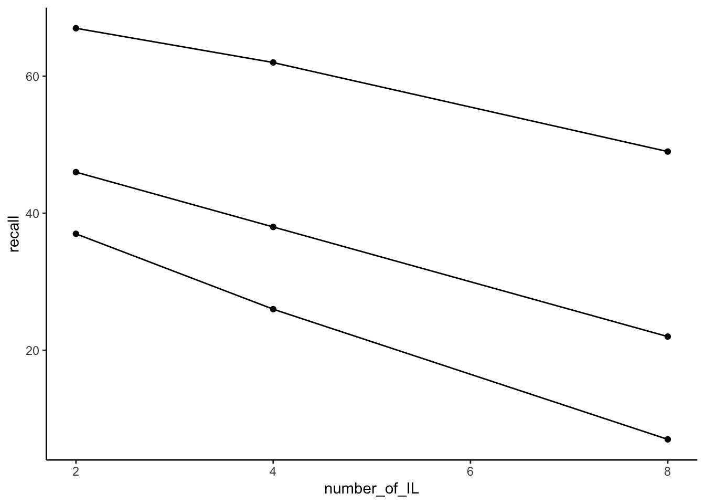

### Running the multiple regression in R

Note, the main purpose of this example is to show correspondence between the fully worked out example in the textbook, and output from R. 


```r
lm(recall~ number_of_learning_trials + number_of_IL,data = slamecka_design)
#> 
#> Call:
#> lm(formula = recall ~ number_of_learning_trials + number_of_IL, 
#>     data = slamecka_design)
#> 
#> Coefficients:
#>               (Intercept)  number_of_learning_trials  
#>                        30                          6  
#>              number_of_IL  
#>                        -4

summary(lm(recall~ number_of_learning_trials + number_of_IL,data = slamecka_design))
#> 
#> Call:
#> lm(formula = recall ~ number_of_learning_trials + number_of_IL, 
#>     data = slamecka_design)
#> 
#> Residuals:
#>    Min     1Q Median     3Q    Max 
#>   -9.0   -4.0    0.5    4.0    6.0 
#> 
#> Coefficients:
#>                           Estimate Std. Error t value Pr(>|t|)    
#> (Intercept)                30.0000     3.3993   8.825 2.52e-07 ***
#> number_of_learning_trials   6.0000     0.4818  12.453 2.60e-09 ***
#> number_of_IL               -4.0000     0.4818  -8.302 5.44e-07 ***
#> ---
#> Signif. codes:  0 '***' 0.001 '**' 0.01 '*' 0.05 '.' 0.1 ' ' 1
#> 
#> Residual standard error: 5.099 on 15 degrees of freedom
#> Multiple R-squared:  0.9372,	Adjusted R-squared:  0.9289 
#> F-statistic:   112 on 2 and 15 DF,  p-value: 9.609e-10
```

## Practical II: Graphing designs with multiple IVs and levels

This section provides several example code snippets of using ggplot2 to graph means from designs with multiple IVs and levels. 

Notice the textbook version the Slamecka results plotted number of interpolated learning trials on the x-axis, whereas in concept section III, we had plotted amount of practice on the x-axis. It's easy to swap this around, by assigning different variables to `x` or `group`.


```r
ggplot(slamecka_design,aes(x=number_of_IL,
                           group = number_of_learning_trials,
                           y=recall))+
  geom_line(stat = "summary", fun = "mean")+
  geom_point(stat = "summary", fun = "mean",)+
  theme_classic()
```


```r
slamecka_design$number_of_IL <- as.factor(slamecka_design$number_of_IL)

ggplot(slamecka_design,aes(x= number_of_learning_trials,
                           group = number_of_IL,
                           y=recall))+
  geom_line(stat = "summary", fun = "mean")+
  geom_point(stat = "summary", fun = "mean", aes(shape=number_of_IL))+
  theme_classic()
```

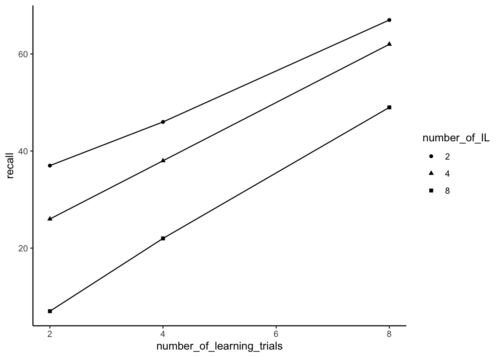

### facet-wrapping

`ggplot2` has a very useful function called `facet_wrap()` that can be used to graph complicated designs in different ways.

Facets are created for each level of an independent variable. Below, we at facets for each level of the distraction (IL) variable.


```r
ggplot(slamecka_design,aes(x= number_of_learning_trials,
                           y=recall))+
  geom_line(stat = "summary", fun = "mean")+
  geom_point(stat = "summary", fun = "mean")+
  theme_classic() +
  facet_wrap(~number_of_IL)
```

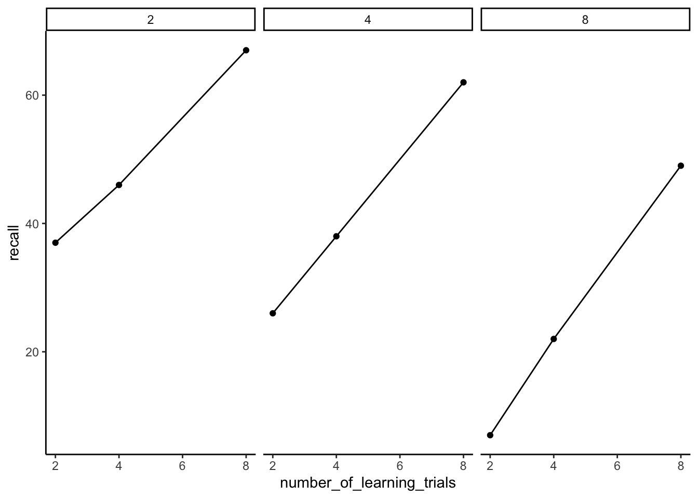

Let's imagine that there were 6 subjects in the experiment, and they were assigned to the conditions in the following manner:


```r
slamecka_design <- tibble(number_of_learning_trials = rep(c(2,4,8), each=6),
                          number_of_IL = rep(rep(c(2,4,8), 2), 3),
                          subjects = rep(1:6, each=3),
                          recall = c(35,21,6,
                                   39,31,8,
                                   40,34,18,
                                   52,42,26,
                                   61,58,46,
                                   73,66,52
                                   )
                          )

knitr::kable(slamecka_design)
```


| number_of_learning_trials| number_of_IL| subjects| recall|
|-------------------------:|------------:|--------:|------:|
|                         2|            2|        1|     35|
|                         2|            4|        1|     21|
|                         2|            8|        1|      6|
|                         2|            2|        2|     39|
|                         2|            4|        2|     31|
|                         2|            8|        2|      8|
|                         4|            2|        3|     40|
|                         4|            4|        3|     34|
|                         4|            8|        3|     18|
|                         4|            2|        4|     52|
|                         4|            4|        4|     42|
|                         4|            8|        4|     26|
|                         8|            2|        5|     61|
|                         8|            4|        5|     58|
|                         8|            8|        5|     46|
|                         8|            2|        6|     73|
|                         8|            4|        6|     66|
|                         8|            8|        6|     52|

I made this change to illustrate that `facet_wrap` can create facets that combine two variables, in this practice and individual subjects:


```r
ggplot(slamecka_design,aes(x= number_of_IL,
                           y=recall))+
  geom_line()+
  geom_point()+
  theme_classic() +
  facet_wrap(~number_of_learning_trials*subjects, ncol=2)
```

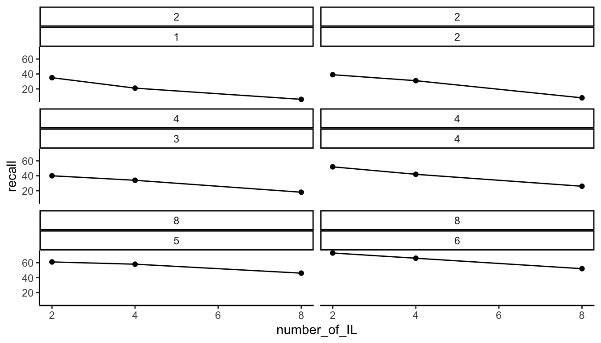

## Lab 2 Generalization Assignment

<iframe width="560" height="315" src="https://www.youtube.com/embed/oQwYnBGj_C8" frameborder="0" allow="accelerometer; autoplay; clipboard-write; encrypted-media; gyroscope; picture-in-picture" allowfullscreen></iframe>


### Instructions

Your assignment instructions are the following:

1.  Work inside the new R project for stats II that you created
2.  Create a new R Markdown document called "Lab2.Rmd"
3.  Use Lab2.Rmd to show your work attempting to solve the following generalization problems. Commit your work regularly so that it appears on your Github repository.
4.  **For each problem, make a note about how much of the problem you believe you can solve independently without help**. For example, if you needed to watch the help video and are unable to solve the problem on your own without copying the answers, then your note would be 0. If you are confident you can complete the problem from scratch completely on your own, your note would be 100. It is OK to have all 0s or 100s anything in between.
5.  Submit your github repository link for Lab 2 on blackboard.

### Problems

1. (3 points) The following code roughly reproduces figure 5.5 from the textbook [@abdiExperimentalDesignAnalysis2009]. Modify the ggplot code so that the graph looks as close as possible to the figure from textbook:

- change the x-axis title
- change the y-axis title
- make the x-axis and y axis ticks the same
- include different symbols to differentiate the lines


```r
slamecka_design <- tibble(number_of_learning_trials = rep(c(2,4,8), each=6),
                          number_of_IL = rep(rep(c(2,4,8), 2), 3),
                          subjects = 1:18,
                          recall = c(35,21,6,
                                   39,31,8,
                                   40,34,18,
                                   52,42,26,
                                   61,58,46,
                                   73,66,52
                                   )
                          )

ggplot(slamecka_design,aes(x=number_of_IL,
                           group = number_of_learning_trials,
                           y=recall))+
  geom_line(stat = "summary", fun = "mean")+
  geom_point(stat = "summary", fun = "mean",)+
  theme_classic()
```

2. (3 points) The Slamecka design was a 3x3 design. The practice variable had three levels (2, 4, and 8), and was assumed to increase memory recall with increasing amount of practice. The interpolated learning (IL or distraction) variable had three levels (0, 4, and 8), and was assumed to decrease memory recall with increasing amounts of distraction.

Imagine Slamecka had included a third independent variable that also had three levels. This new IV is expected to increase memory recall. For example, maybe the third IV is amount of reward given to subjects (0, 50 dollars, 1 million dollars) for completing the study. As the amount of expected reward is increased, subjects are more motivated so they remember more words. 

Use R to create a dataframe to represent predictions for this new 3x3x3 design. Then use ggplot and facet wrapping to show predicted means for each condition. As a hint, I have provided a drawing and I expect your ggplot graph will look something like this drawing. 

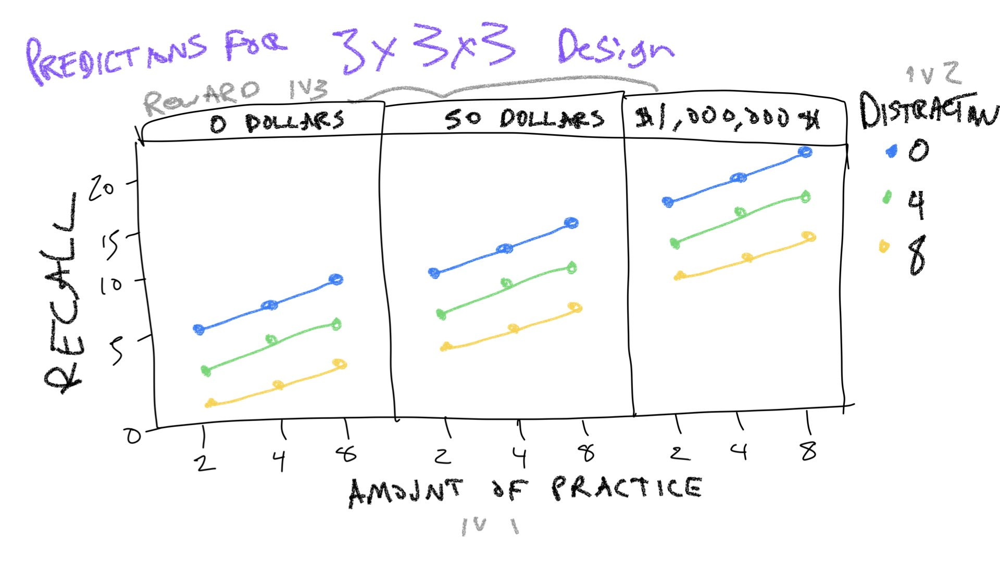

## References


