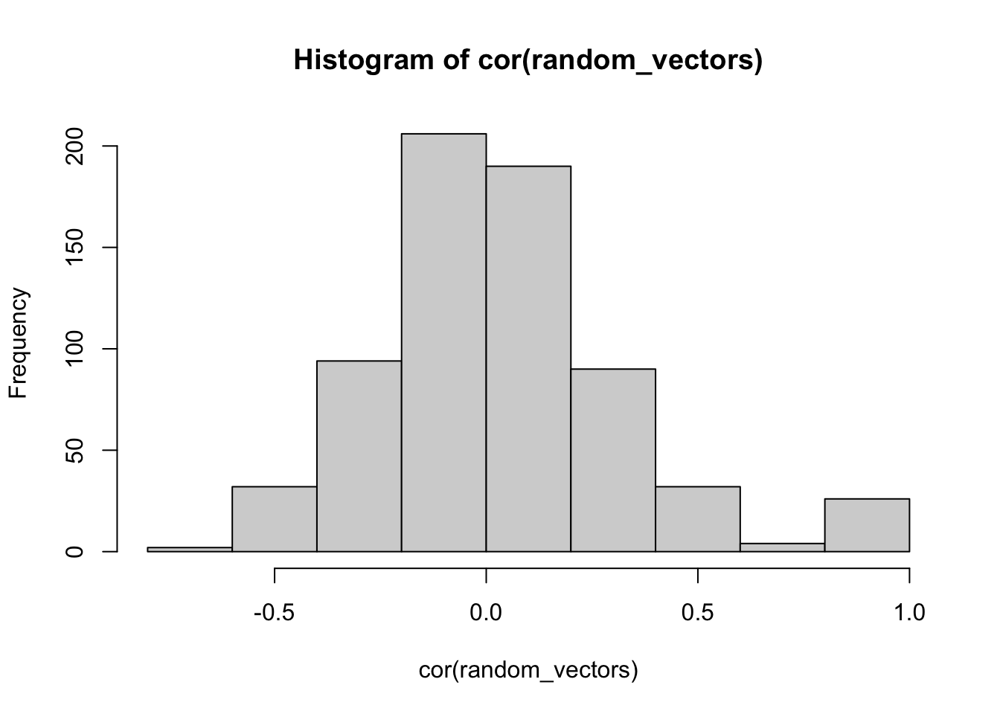

# Multiple Regression II"

## Readings

Chapters 6 on semi-partial correlation from @abdiExperimentalDesignAnalysis2009.

<iframe width="560" height="315" src="https://www.youtube.com/embed/56hUV8Gvyrk" frameborder="0" allow="accelerometer; autoplay; clipboard-write; encrypted-media; gyroscope; picture-in-picture" allowfullscreen></iframe>

## Overview

An overarching goal of this semester is to discuss how experimental research designs and statistical tools are combined together to test causal hypotheses about psychological phenomena. For the most part, we will use ANOVA as the statistical tool for experimental research designs with multiple IVs. Currently, we are discussing regression en route to discussing ANOVA. One reason is that ANOVA and regression are fundamentally the same analyses, and it is important to recognize that equivalence. A focus of today's lab is the concept of semi-partial correlation in the context of non-orthogonal multiple regression. This is a statistical tool that is often is used in non-experimental research, and it is useful to discuss some its uses and limitations as we prepare for ANOVA next week.

## A note on Explanation

Briefly, we will be using the word explanation many times throughout this lab and the next ones. For the most part we will be talking about explanation in a highly restricted statistical sense. For example, $R^2$, termed the co-efficient of determination, is often described as a quantity of explanation; specifically, how much variation in one variable **explains** variation in another. $F$ is a ratio of "explained" variance divided by "unexplained" variance. Because we will mainly deal with linear models, "explanation" always refers to a geometrical account of the the data, wherein data points are described as one part that falls on a line (the explained part), and a leftover part that does not (error, or unexplained part). Although we use the word explanation, this term does not imply anything about theoretical or causal explanation. 

## Concept I: Explaining variance with multiple variables

In multiple linear regression there is one dependent variable and multiple predictor variables. The variation in the dependent variable is "explained" in terms of combinations of linear relationships to the other variables. 

One issue with multiple linear regression is that adding more predictor variables generally increases the amount of variation explained. We quickly illustrate this below:

First, I create a matrix of random values from a normal distribution. There are 26 variables, each labeled from a to z. We will pick `a` as the DV, and use the other random vectors as predictor variables to explain the variation in `a`.


```r

random_vectors <- matrix(rnorm(20*26,0,1), nrow=20, ncol=26)
colnames(random_vectors) <- letters
random_vectors <- as.data.frame(random_vectors)
```

First, because everything is random, the variables are "ortho-normal in expectation". That is, we expect that the variables are not correlated with each other. Let's find out if that is true:


```r
hist(cor(random_vectors))
```



In general, the distribution of correlations is centered on 0. And, the other "correlations" are all caused by chance (except for the identities, which must be one...`a` correlated with itself is 1, and so on).

Now, let's try to predict the values of `a` from the random vectors in `b` to `z`, and see what happens... notice that the total $R^2$ keeps increasing.


```r

summary(lm(a~b,data=random_vectors))
#> 
#> Call:
#> lm(formula = a ~ b, data = random_vectors)
#> 
#> Residuals:
#>     Min      1Q  Median      3Q     Max 
#> -1.2576 -0.6878  0.0128  0.5432  1.4502 
#> 
#> Coefficients:
#>             Estimate Std. Error t value Pr(>|t|)
#> (Intercept) -0.05156    0.17567  -0.293    0.773
#> b            0.09756    0.17086   0.571    0.575
#> 
#> Residual standard error: 0.7838 on 18 degrees of freedom
#> Multiple R-squared:  0.01779,	Adjusted R-squared:  -0.03678 
#> F-statistic: 0.326 on 1 and 18 DF,  p-value: 0.5751

summary(lm(a~b,data=random_vectors))$r.squared
#> [1] 0.01778961
summary(lm(a~b+c,data=random_vectors))$r.squared
#> [1] 0.02377437
summary(lm(a~b+c+d,data=random_vectors))$r.squared
#> [1] 0.1699112
summary(lm(a~b+c+d+e,data=random_vectors))$r.squared
#> [1] 0.2029563
summary(lm(a~b+c+d+e+f,data=random_vectors))$r.squared
#> [1] 0.3896615
summary(lm(a~b+c+d+e+f+g,data=random_vectors))$r.squared
#> [1] 0.6958678
summary(lm(a~b+c+d+e+f+g+h,data=random_vectors))$r.squared
#> [1] 0.6963296
```

The above example uses `+` to add new variables in the linear regression formula. This adds each variable as its own predictor and does not add in potential interactions with other variables. We have not discussed the concept of statistical interaction yet in this course, and we do that in coming lectures. Nevertheless, consider what happens to $R^2$ when the `*` is used in the formula. 


```r
summary(lm(a~b,data=random_vectors))$r.squared
#> [1] 0.01778961
summary(lm(a~b*c,data=random_vectors))$r.squared
#> [1] 0.3995137
summary(lm(a~b*c*d,data=random_vectors))$r.squared
#> [1] 0.5424997
summary(lm(a~b*c*d*e,data=random_vectors))$r.squared
#> [1] 0.8313199
summary(lm(a~b*c*d*e*f,data=random_vectors))$r.squared
#> [1] 1
```

The `*` adds interactions of variables, which effectively increases the number of random predictor variables in this regression. As you can see, with only 5 predictor variables, when we include the potential interactions, this grows to many linearly independent variables (15 in this case):


```r
summary(lm(a~b*c*d*e,data=random_vectors))
#> 
#> Call:
#> lm(formula = a ~ b * c * d * e, data = random_vectors)
#> 
#> Residuals:
#>         1         2         3         4         5         6         7         8 
#>  0.652511 -0.024001 -0.098379  0.116578 -0.204449  0.004711 -0.020795 -0.168447 
#>         9        10        11        12        13        14        15        16 
#>  0.271648 -0.001472 -0.400620 -0.145215  0.300497  0.513969 -0.190503  0.045478 
#>        17        18        19        20 
#>  0.232799  0.221906 -0.640894 -0.465322 
#> 
#> Coefficients:
#>             Estimate Std. Error t value Pr(>|t|)
#> (Intercept) -0.13734    0.34838  -0.394    0.714
#> b            0.31257    0.42573   0.734    0.504
#> c            0.08714    0.33773   0.258    0.809
#> d            0.55964    0.43853   1.276    0.271
#> e           -0.66598    0.74829  -0.890    0.424
#> b:c         -0.27126    0.43110  -0.629    0.563
#> b:d         -0.46982    0.56138  -0.837    0.450
#> c:d          0.43685    0.40141   1.088    0.338
#> b:e          1.80883    1.43068   1.264    0.275
#> c:e          0.36233    0.29596   1.224    0.288
#> d:e         -0.37405    0.41018  -0.912    0.413
#> b:c:d       -0.22123    0.31566  -0.701    0.522
#> b:c:e       -0.74718    0.56292  -1.327    0.255
#> b:d:e        0.30411    0.62552   0.486    0.652
#> c:d:e        0.86560    0.55083   1.571    0.191
#> b:c:d:e      0.34905    0.44491   0.785    0.477
#> 
#> Residual standard error: 0.689 on 4 degrees of freedom
#> Multiple R-squared:  0.8313,	Adjusted R-squared:  0.1988 
#> F-statistic: 1.314 on 15 and 4 DF,  p-value: 0.4333
```

When you have more predictor variables than you have rows of data in the DV, you will overfit the data because you will have more ways of explaining the data with lines than you have data points. So, when we have 6 predictor variables, and their interactions, the multiple $R^2$ value goes to 1.


```r
summary(lm(a~b*c*d*e*f,data=random_vectors))
#> 
#> Call:
#> lm(formula = a ~ b * c * d * e * f, data = random_vectors)
#> 
#> Residuals:
#> ALL 20 residuals are 0: no residual degrees of freedom!
#> 
#> Coefficients: (12 not defined because of singularities)
#>             Estimate Std. Error t value Pr(>|t|)
#> (Intercept) -0.15626        NaN     NaN      NaN
#> b            0.53401        NaN     NaN      NaN
#> c           -0.17132        NaN     NaN      NaN
#> d            1.25351        NaN     NaN      NaN
#> e           -0.88703        NaN     NaN      NaN
#> f           -0.73748        NaN     NaN      NaN
#> b:c         -0.19513        NaN     NaN      NaN
#> b:d         -1.18972        NaN     NaN      NaN
#> c:d          0.94783        NaN     NaN      NaN
#> b:e          1.99134        NaN     NaN      NaN
#> c:e          0.06818        NaN     NaN      NaN
#> d:e         -0.27148        NaN     NaN      NaN
#> b:f          1.47168        NaN     NaN      NaN
#> c:f         -0.50005        NaN     NaN      NaN
#> d:f          0.56888        NaN     NaN      NaN
#> e:f         -0.90304        NaN     NaN      NaN
#> b:c:d       -0.10050        NaN     NaN      NaN
#> b:c:e       -1.27961        NaN     NaN      NaN
#> b:d:e       -0.48266        NaN     NaN      NaN
#> c:d:e        1.56388        NaN     NaN      NaN
#> b:c:f             NA         NA      NA       NA
#> b:d:f             NA         NA      NA       NA
#> c:d:f             NA         NA      NA       NA
#> b:e:f             NA         NA      NA       NA
#> c:e:f             NA         NA      NA       NA
#> d:e:f             NA         NA      NA       NA
#> b:c:d:e           NA         NA      NA       NA
#> b:c:d:f           NA         NA      NA       NA
#> b:c:e:f           NA         NA      NA       NA
#> b:d:e:f           NA         NA      NA       NA
#> c:d:e:f           NA         NA      NA       NA
#> b:c:d:e:f         NA         NA      NA       NA
#> 
#> Residual standard error: NaN on 0 degrees of freedom
#> Multiple R-squared:      1,	Adjusted R-squared:    NaN 
#> F-statistic:   NaN on 19 and 0 DF,  p-value: NA
```

Consider what has been explained here. The DV was generated at random, so there is nothing there to explain in the first place. All of the predictor variables are also generated at random, and shouldn't explain any variance. Yet, when we use enough random vectors to "explain" the variation in another random vector, we can do so perfectly, explaining 100% of the variance. It is in this sense that we explained everything statistically, without having explained anything at all. These numeric realities are always at play during analyses of real data.


## Review Concept: Slamecka and orthogonality

In the last lab we discussed **orthogonal** multiple regression. We defined orthogonal as a geometric concept, whereby one dimension is orthogonal to another when they are perpendicular, or connected at a 90 degree angle. Whenever this occurs, it is possible to move along one dimension without also moving along any other dimensions (e.g., you can go back and forth on an X-axis without going anywhere on a Y-axis, so those are orthogonal dimensions because of their 90 degree relationship). Another way of saying this is that variation along one dimension does not influence variation along another. In other words, dimensions are orthogonal when they are un-correlated with each other.

We also described the @slameckaRetroactiveInhibitionConnected1960 design as an orthogonal design. In chapter 6, we see an example of non-orthogonal multiple regression, where the research design involved non-orthogonal independent variables. Specifically, the IVs are correlated with each other, so they are not orthogonal

Before we discuss that design, it is worth clarifying how it was that the Slamecka design was orthogonal. For example, how exactly is it the case that the IVs in that design were uncorrelated with each other?

Remember that the Slamecka design had two IVs, with three levels each. Original learning had 3 levels (2, 4, & 8); and interpolated learning had 3 levels (0, 4, and 8). At first glance it might seem that these two IVs are highly correlated:


```r
OL <- c(2,4,8)
IL <- c(0,4,8)

cor(OL,IL)
#> [1] 0.9819805
```

The reason that the Slamecka design is an orthogonal design has to do with the **experimental design**, specifically how subjects were assigned to the different levels of each of the independent variables. Depending on how subjects are assigned, the IVs can be correlated (confounded) or uncorrelated.

The lab assignment from week 1 involved writing a table indicating how subjects were assigned to each condition. This is reprinted below:


```r
library(tibble)

slamecka_design <- tribble(
  ~Subjects, ~OL, ~IL,
  #--|--|----
  1, 2, 0,
  1, 4, 4,
  1, 8, 8,
  2, 4, 0,
  2, 8, 4,
  2, 2, 8,
  3, 8, 0,
  3, 2, 4,
  3, 4, 8,
  4, 2, 4,
  4, 4, 0,
  4, 8, 8,
  5, 4, 4,
  5, 2, 8,
  5, 8, 0,
  6, 8, 4,
  6, 4, 8,
  6, 2, 0,
  7, 2, 8,
  7, 4, 0,
  7, 8, 4,
  8, 4, 8,
  8, 2, 4,
  8, 8, 0,
  9, 8, 8,
  9, 4, 4,
  9, 2, 0
)
```

Now, if the Subjects, OL, and IL variables are orthogonal, they must all be uncorrelated with each other. We can check this using the `cor()` function, which will return a matrix of correlations.


```r
cor(slamecka_design)
#>          Subjects OL IL
#> Subjects        1  0  0
#> OL              0  1  0
#> IL              0  0  1
```

Finally, consider for the moment what a confounded design would look like. For example:


```r
slamecka_confounded <- tribble(
  ~Subjects, ~OL, ~IL,
  #--|--|----
  1, 2, 0,
  1, 4, 4,
  1, 8, 8,
  2, 4, 4,
  2, 8, 8,
  2, 2, 0,
  3, 8, 8,
  3, 2, 0,
  3, 4, 4,
  4, 2, 0,
  4, 4, 4,
  4, 8, 8,
  5, 4, 4,
  5, 2, 0,
  5, 8, 8,
  6, 8, 8,
  6, 4, 4,
  6, 2, 0,
  7, 2, 0,
  7, 4, 4,
  7, 8, 8,
  8, 4, 4,
  8, 2, 0,
  8, 8, 8,
  9, 8, 8,
  9, 4, 4,
  9, 2, 0
)
```

I set up the confounded design such that individual subjects were assigned to basically the same levels in OL and IL. As you can see, now the OL and IL variables are perfectly correlated (not orthogonal). They are confounded in the design because if either of them causes some change in the DV, it won't be clear which one caused the change.


```r
cor(slamecka_confounded)
#>          Subjects        OL        IL
#> Subjects        1 0.0000000 0.0000000
#> OL              0 1.0000000 0.9819805
#> IL              0 0.9819805 1.0000000
```

Research designs like Slamecka's [@slameckaRetroactiveInhibitionConnected1960] that employ experimental manipulations of orthogonal variables are, in principle, capable of making causal claims. Specifically, results showing some DV (like recall) clearly changed as a function of the levels of the IVs support a causal claim that something about the IVs caused the change. When we conclude that a manipulation does cause change (and reject the null hypothesis that it was chance causing the change), we are saying that some of the variation in the dependent variable can be "explained" in terms of changes in the IV. 

To connect back to my earlier venting about explanation, even in this case the statistical explanation is a very thin kind of explanation. For example, consider a researcher who has no idea about magnetism. They find themselves at a table with a bunch of metal filings. And they move a rock toward and away from the table, and the metal filings don't move. This rock isn't magnetic, it doesn't do anything to the position of the metal filings. The researcher then accidentally grabs a magnet and moves it toward the table. They notice that the metal filings move more and more as the magnet moves closer to the table. It appears to be like magic. The researcher then very systematically measure metal filing displacement as a function of magnet distance, and produces clear results that the the IV (magnet distance) appears to cause metal filings to move. They then publish a paper titled the effect of this weird rock on moving metal filings on my table.

I made up this example to highlight two levels of explanation, statistical and theoretical. At a statistical level the position of the magnet "explains" variance in the displacement of metal filings. However, this level of explanation says nothing about how the cause works, it is not an explanation of magnetism. The statistical level of explanation produces a phenomena or effect (the effect of magnets on moving metal filings) that itself still needs to be explained (e.g., by a theory of magnetism). So, although we take about manipulations in terms of whether they explain our measurements, at the theoretical level manipulations never explain anything. Instead they produce phenomena that require theoretical (an account of how the causes work to produce the phenomena) and not statistical explanation.

## Concept II: Semi-partial Correlation

Above I tried to briefly develop the idea that explanation is hard, even when you are using the best in class tools like orthogonal experimental designs. For example, even when we have a really powerful manipulation like a magnet that can move metal, just running the experiment doesn't explain why magnetism works, that part requires a theory of magnetism.

In non-experimental designs the prospect of explanation is even more remote and in my opinion extremely difficult. For example, in correlational research, a typical strategy is to take many measurements and then see what correlates with what. This strategy can find patterns in data, but as we saw in the first concept section it is possible to "explain" variance with completely random vectors too. 

In Chapter 6, @abdiExperimentalDesignAnalysis2009 contrasts orthogonal multiple regression suitable for experimental designs with non-orthogonal multiple regression typical of correlation research. In both cases the research design has multiple variables that could "explain" variance in some dependent measure. Most measures of human behavior are complex and multiply determined, so it is natural consider the idea that different variables may or may not have a causal influence on the measure, and if they do cause change, then each variable may cause different amounts of change. As a result, when there are multiple variables, researchers might be interested in figuring out, for each variable, how much it causes change in the measure.

In the case of experimental research with orthogonal designs, the determination of the action of causal variables is done by independently manipulating a variable of interest, and measuring whether the manipulation has an effect on the measure. In the case of non-orthogonal correlational research it is not possible make any causal claims. However, it is possible to add variables of interest into a regression, and this will raise many more questions about possible causes. Let's consider some of the issues by looking at the textbook example.

### Age, speech rate, and memory

@abdiExperimentalDesignAnalysis2009  discusses a research design by @hulmeSpeechRateDevelopment1984 who were interested in whether the variables of age and speech rate were involve in memory ability. The basic claim was that older children who can talk faster will have better memory abilities compared to younger children who talk slower, perhaps because faster speech rate would help one rehearse more information.

It is not possible to randomly assign people to different ages or different speech rate abilities, so this kind of research can not employ an experimental design with orthogonal variables. As a result, the "Independent Variables" of Age (X) and speech rate (T) are not independent from each other, they are confounded and correlated with one another. For example, as children age they also talk faster, so the age variable is positively correlated with talking faster.

Example data from the textbook is below:


```r
library(tibble)
library(dplyr)
library(ggplot2)

data <- tibble(X = c(4,4,7,7,10,10),
               T = c(1,2,2,4,3,6),
               Y = c(14,23,30,50,39,67))
```

We can run a multiple linear regression to ask the question, how much does Age (X) and Speech Rate (T) explain variance in memory ability (Y). In this fake date, we see that $R^2$ is nearly one, so taken togetehr, X and T seem to 'explain' almost all the variation in Y.


```r
# Predict Y as a function of X and T
(overall_model <- summary(lm(Y~X+T, data=data)))
#> 
#> Call:
#> lm(formula = Y ~ X + T, data = data)
#> 
#> Residuals:
#>      1      2      3      4      5      6 
#> -1.167 -1.667  2.333  3.333 -1.167 -1.667 
#> 
#> Coefficients:
#>             Estimate Std. Error t value Pr(>|t|)   
#> (Intercept)    1.667      3.598   0.463  0.67470   
#> X              1.000      0.725   1.379  0.26162   
#> T              9.500      1.087   8.736  0.00316 **
#> ---
#> Signif. codes:  0 '***' 0.001 '**' 0.01 '*' 0.05 '.' 0.1 ' ' 1
#> 
#> Residual standard error: 2.877 on 3 degrees of freedom
#> Multiple R-squared:  0.9866,	Adjusted R-squared:  0.9776 
#> F-statistic: 110.1 on 2 and 3 DF,  p-value: 0.001559
```

We can also look at the correlations and $R^2$ values between all the variables.


```r
cor(data)
#>           X         T         Y
#> X 1.0000000 0.7500000 0.8027961
#> T 0.7500000 1.0000000 0.9889517
#> Y 0.8027961 0.9889517 1.0000000
cor(data)^2
#>           X         T         Y
#> X 1.0000000 0.5625000 0.6444815
#> T 0.5625000 1.0000000 0.9780254
#> Y 0.6444815 0.9780254 1.0000000
```
Here we see that X explains .64 of the variation in Y, and T explains .97 of the variation in Y. Notice this adds up to .97+.64 = 1.61, which is greater than 1. In other words we are explaining more than 100% of the variation, which is nonsensical. How could this happen?

The assumption is that X and T are correlated with each other, and we can see in the correlation matrix that this is true, the correlation is $r=.75$. As a result, we consider the idea that there are three parts of the puzzle. The unique potential influence of X, the unique potential influence T, and the shared part between X and T. In other words, part of the age and speech rate variables are measuring the same underlying thing (we call this the shared part), but they are also each measuring some unique things.

The $R^2$ for X and Y is .64, and this includes the unique part of X and the shared part with T. The $R^2$ for T and Y is .97 and includes the unique part of T, and the shared part with X. If we add the two together, we add the shared part twice, which causes the total $R^2$ to be greater than 1. **Using the technique of semi-partial correlation, it is possible to re-express the two confounded variables into three sources of variation, the unique parts of each, and the shared part.**

Semi-partial correlation involves a process of "de-correlation", or "taking the line out the data". Let's take a closer look at the de-correlation process before using it for semi-partial correlation.

### The residuals are de-correlated

Consider how much X (Age) explains variation in Y (memory ability). We conduct the regression, then we look at two components of the Y data expressed in terms X. These are the parts of Y that fall on the regression line (the predicted parts), and the parts of Y that are not on the line (the residual error). 


```r
# Predict Y as a function of X

lm.x <- lm(Y~X, data=data)

data <- data %>%
  mutate(X_residuals = residuals(lm.x),
         X_predicted_Y = predict(lm.x))

knitr::kable(data)
```


|  X|  T|  Y| X_residuals| X_predicted_Y|
|--:|--:|--:|-----------:|-------------:|
|  4|  1| 14|   -5.916667|      19.91667|
|  4|  2| 23|    3.083333|      19.91667|
|  7|  2| 30|   -7.166667|      37.16667|
|  7|  4| 50|   12.833333|      37.16667|
| 10|  3| 39|  -15.416667|      54.41667|
| 10|  6| 67|   12.583333|      54.41667|

Now, the `data` table contains three versions of Y, the original Y variable decomposed into the predicted part (regression line part), and the residual part. Let's plot all of these and run a regression line through them.


```r

A <- ggplot(data, aes(y=Y, x=X))+
  geom_point()+
  geom_smooth(method="lm", se=FALSE)

B <- ggplot(data, aes(y=X_predicted_Y, x=X))+
  geom_point()+
  geom_smooth(method="lm",se=FALSE)

C <- ggplot(data, aes(y=X_residuals, x=X))+
  geom_point()+
  geom_smooth(method="lm",se=FALSE)

library(patchwork)

A+B+C
```


Notice that the residuals have a flat line. The process of decomposing Y into one part that is on the regression line, and a residual part reflecting deviation or error from the line, is a process of **de-correlation**. Specifically, the residual part of X is the part that does not correlate with Y. In other words, the residuals are what the pattern looks like when the correlation has been subtracted out. When you subtract out the linear correlation, the leftover part by definition has no correlation left, so the residuals are forced to be statistically independent from the dependent measure.

We can show the same thing using the other predictor variable T. If we predict Y from T, then we can plot the residuals and show that they too have the correlation removed.


```r

# Predict Y as a function of T

lm.t <- lm(Y~T, data=data)

data <- data %>%
  mutate(T_residuals = residuals(lm.t),
         T_predicted_Y = predict(lm.t))
D <- ggplot(data, aes(y=Y, x=T))+
  geom_point()+
  geom_smooth(method="lm", se=FALSE)

E <- ggplot(data, aes(y=T_predicted_Y, x=T))+
  geom_point()+
  geom_smooth(method="lm",se=FALSE)

F <- ggplot(data, aes(y=T_residuals, x=T))+
  geom_point()+
  geom_smooth(method="lm",se=FALSE)

D+E+F
```


### Semi-partial correlation

The technique of semi-partial correlation relies on the decorrelation process that we just reviewed. The idea is that our predictor variables X and T each have unique variance, but they also have shared variance. We want to separate these three sources of variance into $X_{\text{unique}}$, $T_{\text{unique}}$, and $XT_{\text{shared}}$.

### Finding the unique part of X

What part of X is unique to X and not correlated with T? Let's consider X as the dependent variable, and regress T onto it as the predictor variable.


```r
## Semi-partial correlation
# Part uniquely explained by X
lm.xt <- lm(X~T, data=data)
```

Now, we know that the residuals here are the part of X that is not linearly correlated with T.


```r
residuals(lm.xt)
#>      1      2      3      4      5      6 
#> -0.750 -1.875  1.125 -1.125  3.000 -0.375
```

In other words, these values are $X_{\text{unique}}$ with the $XT_{\text{shared}}$ part removed. Remember, the original question was to figure out how much X alone explained Y. We can do this by computing the $R^2$ between this vector of residuals, and the Y dependent measure.


```r
cor(residuals(lm.xt),data$Y)^2
#> [1] 0.008528111
```

### Finding the unique part of T

We repeat the process to find $T_{\text{unique}}$, except now we regress X as the predictor onto T as the dependent variable.


```r
# Part uniquely explained by T
lm.tx <- lm(T~X, data=data)
residuals(lm.tx)
#>    1    2    3    4    5    6 
#> -0.5  0.5 -1.0  1.0 -1.5  1.5
cor(residuals(lm.tx),data$Y)^2
#> [1] 0.342072
```

### The shared part

To estimate how much variance the shared part of X and T explain we can do a bit algebra. We take the total multiple $R^2$ from the original model `lm(Y~X+T)`, and then subtract $X_{\text{unique}}$ and $T_{\text{unique}}$ from the total.


```r
# Part common to X and T
overall_model$r.squared - cor(residuals(lm.xt),data$Y)^2 - cor(residuals(lm.tx),data$Y)^2
#> [1] 0.6359534
```

### What has been explained?

Semi-partial correlation is a useful demonstration of the idea of partitioning sources of variance into unique and shared portions. However, if we returned to the question of what has been explained, we may have more questions than we had in the first place. 

The unique part of Age (X) only explained a small part of the variation in memory ability (.0085). The Age variable is not a clear measure in the first place--it is a proxy variable for many things that change over development. Speech rate is more specific than age, but it explains less variance (.34) than the shared part between age and speech rate (.63). What is the shared part actually referring to? Who knows? It's a latent construct that in some sense is not related to age or speech rate. And, because the design is correlational, it is not clear if the things that cause memory ability are causing this latent construct to change or vice-versa. Explanation is hard, and non-orthogonal designs can easily raise more questions than they answer. Partly for this reason, we stick to examining experimental designs for the remainder of this course.

## Practical I: semi-partial correlation with `ppcor`

The `ppcor` package has a function for computing semi-partial correlations. We can see that the `spcor()` function returns the same values as in the textbook example.


```r
library(ppcor)

data <- tibble(X = c(4,4,7,7,10,10),
               T = c(1,2,2,4,3,6),
               Y = c(14,23,30,50,39,67))

spcor(data, method = "pearson")
#> $estimate
#>             X          T         Y
#> X  1.00000000 -0.2963241 0.4120552
#> T -0.07367089  1.0000000 0.6488088
#> Y  0.09234777  0.5848692 1.0000000
#> 
#> $p.value
#>           X         T         Y
#> X 0.0000000 0.6283051 0.4906046
#> T 0.9062842 0.0000000 0.2362282
#> Y 0.8825865 0.3002769 0.0000000
#> 
#> $statistic
#>            X          T         Y
#> X  0.0000000 -0.5373837 0.7832889
#> T -0.1279494  0.0000000 1.4767956
#> Y  0.1606375  1.2489073 0.0000000
#> 
#> $n
#> [1] 6
#> 
#> $gp
#> [1] 1
#> 
#> $method
#> [1] "pearson"
```

Note that `spcor()` returns correlations ($r$ values). Square them to produce coefficients of determination ($R^2$).


```r
spcor(data, method = "pearson")$estimate^2
#>             X          T         Y
#> X 1.000000000 0.08780798 0.1697895
#> T 0.005427400 1.00000000 0.4209528
#> Y 0.008528111 0.34207202 1.0000000
```


## Lab 3 Generalization Assignment


### Instructions

Your assignment instructions are the following:

1.  Work inside the new R project for stats II that you created
2.  Create a new R Markdown document called "Lab3.Rmd"
3.  Use Lab3.Rmd to show your work attempting to solve the following generalization problems. Commit your work regularly so that it appears on your Github repository.
5.  Submit your github repository link for Lab 3 on blackboard.

### Problems

1. The problem for this week is to develop a little bit of content (tutorial material) that could be added to this lab. (6 points)

As I mentioned in lab, I ran out of time a little bit this week, so I didn't get a chance to provide lots of examples of doing semi-partial correlation in R. I also didn't cover everything in Chapter 6, for example, I didn't talk about the difference between partial and semi-partial correlation. On the whole, I am assuming that there are many ways the tutorial content in this lab could be improved.

The purpose of this lab is for you to try and create something that could in principle be added to the content of this lab. For example, maybe you think there is another way to explain semi-partial correlation, or the concept of orthogonality, or you would like to provide a different example computing semi-partial correlation.

This is a fairly open lab assignment. Your task is to develop a little tutorial or example that could be inserted into this lab. I'm not going to give guidelines on how long this should be. It probably shouldn't be as long as an entire lab, and it probably shouldn't be as short as 1 line of code and one sentence. I'm thinking a paragraph or two of explanation, and a code snippet or two to illustrate your example. Imagine you are trying to explain these concepts or practical tips, and see what you come up with. 

When you submit your assignment **please let me know if you are OK with me putting your example up on this course website for this lab.** It is totally OK if you do not want to do this. If you are OK with this, then I will add a new section to this lab called "Student contributed examples"; and, you will be recognized as a contributing author to this lab. Note also, that I am sharing this lab on a creative commons license (CC BY SA 4.0), which basically means that other people can copy, edit, and re-use this material as they wish, but they do have to credit the content creators if they do this. If you choose to have your example displayed, then your content will also be on this license. We can discuss the license in more detail next week if you have questions.

Good luck!

## References
