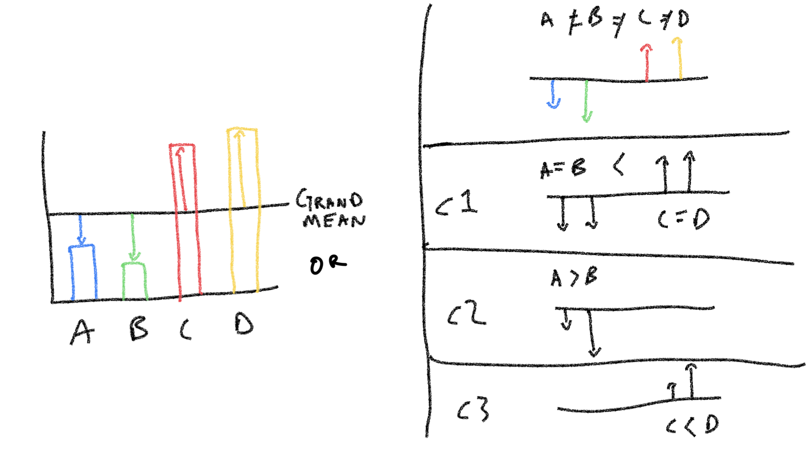

# Linear Contrasts

## Readings

Chapters 12, 13, and 14 from [@abdiExperimentalDesignAnalysis2009].

## Overview

## Practical I: Orthogonal Constrasts

<iframe width="560" height="315" src="https://www.youtube.com/embed/Og1cPcO551w" frameborder="0" allow="accelerometer; autoplay; clipboard-write; encrypted-media; gyroscope; picture-in-picture" allowfullscreen></iframe>

We will start with a practical example of how to do orthogonal contrasts in R. The following R code shows how to reproduce the example from 12.4 in @abdiExperimentalDesignAnalysis2009. The video briefly reviews that example and discusses some of the details of implementing orthogonal contrasts in R.


```r
library(tibble)
library(tidyr)
library(dplyr)
options(dplyr.summarise.inform = FALSE)

# create the example data
smith_example <- tribble(
  ~Same, ~Different, ~Imagery, ~Photo, ~Placebo,
  #--|--|--|--|----
  25,11,14,25,8,
  26,21,15,15,20,
  17,9,29,23,10,
  15,6,10,21,7,
  14,7,12,18,15,
  17,14,22,24,7,
  14,12,14,14,1,
  20,4,20,27,17,
  11,7,22,12,11,
  21,19,12,11,4
) %>% 
  pivot_longer(cols = everything(),
               names_to = "IV",
               values_to = "DV") %>%
  mutate(IV = factor(IV,levels = c("Same", 
                                    "Different", 
                                    "Imagery", 
                                    "Photo", 
                                    "Placebo")))

# Note: R automatically orders Factor levels alphabetically
# we later define contrasts between groups using
# the the order from the textbook
# so we need to explicitly declare the order of levels

# run the omnibus test
aov.out <- aov(DV~IV, smith_example)
summary(aov.out)
#>             Df Sum Sq Mean Sq F value  Pr(>F)   
#> IV           4    700     175   5.469 0.00112 **
#> Residuals   45   1440      32                   
#> ---
#> Signif. codes:  0 '***' 0.001 '**' 0.01 '*' 0.05 '.' 0.1 ' ' 1

# check the existing contrasts for your factor
contrasts(smith_example$IV)
#>           Different Imagery Photo Placebo
#> Same              0       0     0       0
#> Different         1       0     0       0
#> Imagery           0       1     0       0
#> Photo             0       0     1       0
#> Placebo           0       0     0       1

# define your new set of contrasts

c1 <- c(2,-3,2,2,-3)
c2 <- c(2,0,-1,-1,0)
c3 <- c(0,0,+1,-1,0)
c4 <- c(0,+1,0,0,-1)

# combine them into the columns of a matrix
my_contrasts <- cbind(c1, c2, c3, c4)

# assign them to the contrast property for your IV
contrasts(smith_example$IV) <- my_contrasts

# rerun ANOVA
aov.out <- aov(DV~IV, smith_example)
summary(aov.out)
#>             Df Sum Sq Mean Sq F value  Pr(>F)   
#> IV           4    700     175   5.469 0.00112 **
#> Residuals   45   1440      32                   
#> ---
#> Signif. codes:  0 '***' 0.001 '**' 0.01 '*' 0.05 '.' 0.1 ' ' 1

# use summary.aov and split to print out contrast info
# define your contrast labels that will get printed to the table

(full_summary <- summary.aov(aov.out,
                             split=list(IV=list("(1+3+4) vs (2+5)"=1, 
                                                "(1) vs (3+4)" = 2, 
                                                "(3) vs (4)"= 3,
                                                "(2) vs (5)"= 4)
                                        )
                             )
  )
#>                        Df Sum Sq Mean Sq F value   Pr(>F)    
#> IV                      4    700     175   5.469  0.00112 ** 
#>   IV: (1+3+4) vs (2+5)  1    675     675  21.094 3.52e-05 ***
#>   IV: (1) vs (3+4)      1      0       0   0.000  1.00000    
#>   IV: (3) vs (4)        1     20      20   0.625  0.43334    
#>   IV: (2) vs (5)        1      5       5   0.156  0.69450    
#> Residuals              45   1440      32                     
#> ---
#> Signif. codes:  0 '***' 0.001 '**' 0.01 '*' 0.05 '.' 0.1 ' ' 1
```


```r
library(papaja)
apa_table(apa_print(full_summary)$table)
```

<caption>(\#tab:example_table)</caption>

<div custom-style='Table Caption'>**</div>


Effect                      $\hat{\eta}^2_G$   90\% CI        $F$     $\mathit{df}$   $\mathit{df}_{\mathrm{res}}$   $p$    
--------------------------  -----------------  -------------  ------  --------------  -----------------------------  -------
IV                          .327               [.109, .462]   5.47    4               45                             .001   
IV $\times$  1+3+4 vs 2+5   .319               [.143, .476]   21.09   1               45                             < .001 
IV $\times$  1 vs 3+4       .000               [.000, .000]   0.00    1               45                             > .999 
IV $\times$  3 vs 4         .014               [.000, .116]   0.62    1               45                             .433   
IV $\times$  2 vs 5         .003               [.000, .008]   0.16    1               45                             .695   

As a sidenote, @abdiExperimentalDesignAnalysis2009 points out that when you use a complete set of orthogonal contrasts, the omnibus F-value is the same as the average of the F-values from each of the contrasts. 


```r
full_summary[[1]]$`F value`[1]
#>         
#> 5.46875
mean(full_summary[[1]]$`F value`[2:5])
#> [1] 5.46875
```

## Concept 1: Understanding orthogonal contrasts

<iframe width="560" height="315" src="https://www.youtube.com/embed/egoVLWApFMU" frameborder="0" allow="accelerometer; autoplay; clipboard-write; encrypted-media; gyroscope; picture-in-picture" allowfullscreen></iframe>


```r

```


The figure shows some group means that are different from the grand mean. The top right panel shows how each group mean can be considered as a unique source for each difference. The bottom three panels on the right show a set of three orthogonal contrasts, which is an alternative way of breaking down the sources of the differences. 

Here are a similar pattern of group means, along with the grand mean, deviations, and sum of squares.


```r

group_means <- c(4,3,10,11)
(grand_mean <- mean(group_means))
#> [1] 7
(differences <- group_means-grand_mean)
#> [1] -3 -4  3  4
(squared_differences <- differences^2)
#> [1]  9 16  9 16
(sum_squares <- sum(squared_differences))
#> [1] 50
```

If all of the groups are different, and each of them have an independent influence on the grand mean, then we can think of each group mean as having it's own unique effect (represented as four different colored lines in the top right of panel above).

Even though there are four presumed influences, because we are estimating them on the basis of the grand mean, one degree of freedom is lost. So, three of the group means could be any number, but the last one would be fixed in order for the set to produce the specific grand mean here. 

When we define linear contrasts, we are defining the make-up of specific means in terms of combinations of the set of means. So, the default ANOVA assumption that each mean is unique, can be thought of itself as a very basic set of orthogonal contrasts.

If we enter the group names and means into a dataframe, and declare the IV as a factor, we can see the basic set of orthogonal contrasts.


```r
fake_data <- tibble(IV = factor(c("A","B","C","D")),
                    DV = c(4,3,10,11))

contrasts(fake_data$IV)
#>   B C D
#> A 0 0 0
#> B 1 0 0
#> C 0 1 0
#> D 0 0 1
```

Let's walk through this and answer some rhetorical questions. Our question for each group mean is, "how will we estimate this mean?". First of all, we assume that all of the group means are deviations from the grand mean. So each group mean will be expressed as the sum of the grand mean and a deviation.

Let's start with D. What values from the data will we use to estimate the mean of D? The values in the column for D show the contrast **weights**. We are saying we will take 100% of deviation for D (an 4), and 0% of the other means.


```r
contrasts(fake_data$IV)[,'D']
#> A B C D 
#> 0 0 0 1

contrasts(fake_data$IV)[,'D'] * differences
#> A B C D 
#> 0 0 0 4

# the formula for D
grand_mean + (1 * differences[4])
#> [1] 11
```

The same goes for C and B. We will estimate each of those means, with the grand mean and their unique deviations


```r
contrasts(fake_data$IV)
#>   B C D
#> A 0 0 0
#> B 1 0 0
#> C 0 1 0
#> D 0 0 1

contrasts(fake_data$IV) * differences
#>    B C D
#> A  0 0 0
#> B -4 0 0
#> C  0 3 0
#> D  0 0 4
```

So far if we say that each mean is the sum of the grand mean and the unique deviations from the grand mean, we get the original mean back for B, C, and D:


```r
grand_mean*contrasts(fake_data$IV) + contrasts(fake_data$IV) * differences
#>   B  C  D
#> A 0  0  0
#> B 3  0  0
#> C 0 10  0
#> D 0  0 11
```

Notice that there is no contrast weight for A. This is the last mean left. Remember the degrees of freedom issue. We can define three of means in terms of the grand mean, but the last one will be fixed. There is only one value that A can be, in order for the grand mean to be 7.


```r
grand_mean
#> [1] 7

# A has to be four, if the others are 3, 10, and 11)
mean(c(4, 3, 10, 11))
#> [1] 7
```

### Other orthogonal contrasts


```r

```


Just to keep this picture close at hand, the previous section showed how the top right panel, showing the idea that each mean is a unique source, can be described in terms of linear contrasts.

The same set of means can be described by **any** set of orthogonal linear contrasts. For example, consider the set of three contrasts in the figure.


```r
c1 <- c(-1,-1,1,1)
c2 <- c(1,-1,0,0)
c3 <- c(0,0,-1,1)

my_contrasts <- cbind(c1,c2,c3)

contrasts(fake_data$IV) <- my_contrasts
contrasts(fake_data$IV)
#>   c1 c2 c3
#> A -1  1  0
#> B -1 -1  0
#> C  1  0 -1
#> D  1  0  1

# check they are orthogonal
cor(contrasts(fake_data$IV))
#>    c1 c2 c3
#> c1  1  0  0
#> c2  0  1  0
#> c3  0  0  1
```

The formula from the textbook for computing Sums of Squares for contrasts is:

$\frac{S(\sum{C_a M_a})^2}{\sum{C_a^2}}$

If we compute the SSs for each contrast, we can see that they add up to the same total SS (50) from the example above. This will be true for any set of orthogonal linear contrasts.


```r
# multiple contrast weights by group means
contrasts(fake_data$IV) * group_means
#>   c1 c2  c3
#> A -4  4   0
#> B -3 -3   0
#> C 10  0 -10
#> D 11  0  11

# Find the sums for each column
colSums(contrasts(fake_data$IV) * group_means)
#> c1 c2 c3 
#> 14  1  1

# Square the sums
colSums(contrasts(fake_data$IV) * group_means)^2
#>  c1  c2  c3 
#> 196   1   1

# divide by the SS for the contrast weights
(colSums(contrasts(fake_data$IV) * group_means)^2)/ colSums(contrasts(fake_data$IV)^2)
#>   c1   c2   c3 
#> 49.0  0.5  0.5
```


### Explanation part 2

<iframe width="560" height="315" src="https://www.youtube.com/embed/ET-Hz1tUVKM" frameborder="0" allow="accelerometer; autoplay; clipboard-write; encrypted-media; gyroscope; picture-in-picture" allowfullscreen></iframe>

This is an addendum to the above "explanation", which I gave a low score to myself for explanatory value. I thought I could do better, so I came up with this...

**Here's the thing about orthogonal linear contrasts**: if you add them up in the right way, you are guaranteed to get the original means back.

Let's see this process in action:

From the above example, our means are:


```r
fake_data$DV
#> [1]  4  3 10 11
```

and our set of three linear contrasts are:


```r
contrasts(fake_data$IV)
#>   c1 c2 c3
#> A -1  1  0
#> B -1 -1  0
#> C  1  0 -1
#> D  1  0  1
```

The claim is that if I add these contrasts up in the right way, I can get back the original pattern of means.

Let's try adding, remember we start with the grand means. So, the question will be, "can we add some combination of the linear contrasts in such a way that we can get the original pattern of means back?".


```r
grand_means <- c(7,7,7,7)
grand_means
#> [1] 7 7 7 7
```

First, note that we need all of the contrasts to do this. For example, there is now way we can add just the first linear contrast and somehow get the original means back...


```r
grand_means + contrasts(fake_data$IV)[,1]
#> A B C D 
#> 6 6 8 8
grand_means + contrasts(fake_data$IV)[,1]*2
#> A B C D 
#> 5 5 9 9
grand_means + contrasts(fake_data$IV)[,1]*3
#>  A  B  C  D 
#>  4  4 10 10
```

In the above example no matter how many times we add the linear contrast to the grand means, we can never get the pattern in the original means...A will also be the same as B, and C will always be the same as D. We won't capture those extra nuances, so we need the other two contrasts.

Check this out, I add three of the first contrast, and 1 each of the second and third contrasts. I'm getting something close to the pattern of original means. But, it's not clear to me exactly how much of each to add. The claim is that there is some combination that will produce the original means, what is it? what are the "coefficients" telling me how much of each contrast to add?

I could fiddle about by hand and try different coefficients...


```r
grand_means+
(contrasts(fake_data$IV)[,1]*3.5)+
(contrasts(fake_data$IV)[,2]*.5)+
(contrasts(fake_data$IV)[,3]*.5)  
#>  A  B  C  D 
#>  4  3 10 11
```

Or, we could connect this issue with the concept of linear regression. Effectively, we are trying to explain the pattern of means (4,3,10,11), in terms of the multiple *linear* regression of the three different linear contrasts. Our question is what are the weights for each?


```r
fake_data_2 <- fake_data
fake_data_2 <- cbind(fake_data,contrasts(fake_data$IV))

lm(DV ~ c1 + c2 + c3, data = fake_data_2 )
#> 
#> Call:
#> lm(formula = DV ~ c1 + c2 + c3, data = fake_data_2)
#> 
#> Coefficients:
#> (Intercept)           c1           c2           c3  
#>         7.0          3.5          0.5          0.5
summary(lm(DV ~ c1 + c2 + c3, data = fake_data_2 ))
#> 
#> Call:
#> lm(formula = DV ~ c1 + c2 + c3, data = fake_data_2)
#> 
#> Residuals:
#> ALL 4 residuals are 0: no residual degrees of freedom!
#> 
#> Coefficients:
#>             Estimate Std. Error t value Pr(>|t|)
#> (Intercept)      7.0        NaN     NaN      NaN
#> c1               3.5        NaN     NaN      NaN
#> c2               0.5        NaN     NaN      NaN
#> c3               0.5        NaN     NaN      NaN
#> 
#> Residual standard error: NaN on 0 degrees of freedom
#> Multiple R-squared:      1,	Adjusted R-squared:    NaN 
#> F-statistic:   NaN on 3 and 0 DF,  p-value: NA
```

Ok, we just used multiple linear regression to find how much of each contrast we need to add together to reproduce the original pattern of means. The above coefficients were 3, 1, and, 1, we just need to change this to 3.5, .5, and, .5:


```r
grand_means+
(contrasts(fake_data$IV)[,1]*3.5)+
(contrasts(fake_data$IV)[,2]*.5)+
(contrasts(fake_data$IV)[,3]*.5)  
#>  A  B  C  D 
#>  4  3 10 11
```

Although we don't have time in this lab to dive into the issue. The above will always be true for any set of orthogonal linear contrasts. You can always decompose and recompose a set of means into weighted contributions of linear contrasts. I will leave it to you to define different orthogonal linear contrasts for this set of means, and then show that they can be added up to produce the original set of means (sounds like a good generalization problem).

To do one last demonstration. The point here is that any set of means can be described as the combination of a set of orthogonal contrasts. We made one example of a set of orthogonal linear contrasts for a four group situation, so we should be able to show that this set of contrasts can reproduce any set of means.

I've assembled code from our previous examples. We are using the previously defined set of orthogonal contrasts. Now, we should be able to put any numbers we want for the group means (DV), and find that our set of contrasts can perfectly explain them.


```r
# you should be able to change any of the DV numbers
# and always find a combination of contrasts
# that perfectly explains the data

fake_data <- tibble(IV = factor(c("A","B","C","D")),
                    DV = c(43,22,53,104))

c1 <- c(-1,-1,1,1)
c2 <- c(1,-1,0,0)
c3 <- c(0,0,-1,1)
my_contrasts <- cbind(c1,c2,c3)

contrasts(fake_data$IV) <- my_contrasts

fake_data_2 <- cbind(fake_data,contrasts(fake_data$IV))

lm(DV ~ c1 + c2 + c3, data = fake_data_2 )
#> 
#> Call:
#> lm(formula = DV ~ c1 + c2 + c3, data = fake_data_2)
#> 
#> Coefficients:
#> (Intercept)           c1           c2           c3  
#>        55.5         23.0         10.5         25.5
summary(lm(DV ~ c1 + c2 + c3, data = fake_data_2 ))
#> 
#> Call:
#> lm(formula = DV ~ c1 + c2 + c3, data = fake_data_2)
#> 
#> Residuals:
#> ALL 4 residuals are 0: no residual degrees of freedom!
#> 
#> Coefficients:
#>             Estimate Std. Error t value Pr(>|t|)
#> (Intercept)     55.5        NaN     NaN      NaN
#> c1              23.0        NaN     NaN      NaN
#> c2              10.5        NaN     NaN      NaN
#> c3              25.5        NaN     NaN      NaN
#> 
#> Residual standard error: NaN on 0 degrees of freedom
#> Multiple R-squared:      1,	Adjusted R-squared:    NaN 
#> F-statistic:   NaN on 3 and 0 DF,  p-value: NA
```


<!--
composable on the basis of

-->


<!--

Consider showing examples of creating other orthogonal contrasts...but oh ya, I was going to do that for the assignments...
-->

<!--

do a monte-carlo simulation...familywise etc.

-->

## Concept 2: Family-wise error rate

<iframe width="560" height="315" src="https://www.youtube.com/embed/hh1BM6Z6O4M" frameborder="0" allow="accelerometer; autoplay; clipboard-write; encrypted-media; gyroscope; picture-in-picture" allowfullscreen></iframe>

Orthogonal linear contrasts show how a single omnibus ANOVA can be broken down into a set of contrasts. This is useful especially when the contrasts are designed to examine patterns of interest. 

At the same time, conducting linear contrasts is like conducting multiple independent significance tests, and as you conduct more tests, you will increase the likelihood of making an inferential error (e.g., rejecting the null even the effect isn't real).

This section is a supplement to the textbook section 12.3.2, describing a Monte Carlo simulation to illustrate the difference between to alphas:

1. $\alpha(PC)$ or alpha per comparison: the probability of making a type I error for a single test

2. $\alpha(PF)$, or alpha per family of comparisons, the probability of making at least one type I error across a whole set of related tests.

### Monte-Carlo simulation of two alphas

The textbook describes a monte-carlo simulation of a one-factor design with 6 groups. There are 100 observations per group, all sampled from a normal distribution. 

For each simulation we do two things:

1. Conduct an omnibus ANOVA and compute F. If the p-value is smaller than .05, we "reject the null", and count this a type I error.

2. conduct 5 linear orthogonal contrasts, compute each F, and if any have p-values smaller than .05, we "reject" them, and count them as type I errors.

In the textbook example, there were 10,000 simulations. The below code contains the basic components we need to perform the simulation. 


```r
# example dataframe to simulate null
sim_data <- tibble(DV = rnorm(6*100,0,1),
                   IV = factor(rep(1:6, each = 100)))

# example orthogonal linear contrasts
c1 <- c(1,-1,0,0,0,0)
c2 <- c(0,0,1,-1,0,0)
c3 <- c(0,0,0,0,1,-1)
c4 <- c(-1,-1,2,2,-1,-1)
c5 <- c(1,1,0,0,-1,-1)

# create contrast matrix
orth_contrasts <- cbind(c1,c2,c3,c4,c5)

# check contrasts are orthogonal
cor(orth_contrasts)
#>    c1 c2 c3 c4 c5
#> c1  1  0  0  0  0
#> c2  0  1  0  0  0
#> c3  0  0  1  0  0
#> c4  0  0  0  1  0
#> c5  0  0  0  0  1

# assign new contrasts to IV
contrasts(sim_data$IV) <- orth_contrasts

# run ANOVA
summary.aov(aov(DV~IV, sim_data), split=list(IV=list("c1"=1, 
                                                "c2" = 2, 
                                                "c3"= 3,
                                                "c4"= 4,
                                                "c5" = 5)
                                        ))
#>              Df Sum Sq Mean Sq F value Pr(>F)  
#> IV            5    8.1   1.617   1.491 0.1908  
#>   IV: c1      1    5.6   5.649   5.209 0.0228 *
#>   IV: c2      1    0.1   0.146   0.134 0.7141  
#>   IV: c3      1    0.1   0.057   0.053 0.8185  
#>   IV: c4      1    1.1   1.091   1.006 0.3163  
#>   IV: c5      1    1.1   1.141   1.053 0.3053  
#> Residuals   594  644.1   1.084                 
#> ---
#> Signif. codes:  0 '***' 0.001 '**' 0.01 '*' 0.05 '.' 0.1 ' ' 1
```

When we conduct the simulation we want to count type I errors. Specifically, let's count type I errors for the omnibus test, as well as for the linear contrasts. Our simulation will be similar to the one reported in Table 12.1 from the textbook.

In terms of organizing the code, I will adopt a strategy of saving the necessary data from the simulation into a dataframe that can then be analyzed to produce a summary table.


```r
#create a tibble to store all the results
all_sim_data <- tibble()

# conduct simulation
for(i in 1:10000){

sim_data <- tibble(DV = rnorm(6*100,0,1),
                   IV = factor(rep(1:6, each = 100)))

contrasts(sim_data$IV) <- orth_contrasts

sim_output <- summary.aov(aov(DV~IV, sim_data), split=list(IV=list("c1"=1, 
                                                "c2" = 2, 
                                                "c3"= 3,
                                                "c4"= 4,
                                                "c5" = 5)
                                        ))

#save current results in a tibble
sim_results <- tibble(type = c("omnibus",rep("contrast",5)),
                      p_values = sim_output[[1]]$`Pr(>F)`[1:6],
                      sim_num = rep(i,6)
                      )

# add current results to the tibble storing all the results
all_sim_data <- rbind(all_sim_data,sim_results)
}
```

Let's use `dplyr` to count how many type I errors occurred for omnibus and contrast based F-tests.


```r
# analyze the sim data
type_I_errors <- all_sim_data %>%
  mutate(type_I = p_values < .05) %>%
  group_by(type, sim_num) %>%
  summarize(counts = sum(type_I)) %>%
  group_by(type,counts) %>%
  summarize(type_I_frequency = sum(counts))

knitr::kable(type_I_errors)
```


|type     | counts| type_I_frequency|
|:--------|------:|----------------:|
|contrast |      0|                0|
|contrast |      1|             2019|
|contrast |      2|              386|
|contrast |      3|               33|
|contrast |      4|                4|
|omnibus  |      0|                0|
|omnibus  |      1|              473|

The type I error rate for the omnibus test is pretty close to .05:


```r
type_I_errors %>%
  filter(type == 'omnibus',
         counts == 1) %>%
  pull(type_I_frequency)/10000
#> [1] 0.0473
```

Similarly, we conducted 50000 total linear contrasts. Looking at individual contrasts, the type I error rate is also close to .05:


```r
type_I_errors %>%
  filter(type == 'contrast',
         counts > 0) %>%
  pull(type_I_frequency) %>%
  sum()/50000
#> [1] 0.04884
```

However, **the family-wise** type I error rate is larger. We conducted 10,000 simulated experiments, if asked the question, what was the probability of rejecting the null if any of the linear contrasts were significant, then we find:


```r
type_I_errors %>%
  filter(type == 'contrast',
         counts > 0) %>%
  pull(type_I_frequency) %>%
  sum()/10000
#> [1] 0.2442
```

## Concept 3: Correcting for multiple comparisons

Your textbook describes several methods for "correcting" p-values for multiple comparisons to protect against the family-wise type I error rate. Some of these corrections include the Sidak, Bonferroni, Boole, and Dunn. I going to purposefully leave this concept section mostly blank; and, discuss why in class. 

As a blunt perspective, I think it is generally useful to report how many tests you conducted, along with the uncorrected p-values for each. In my experience, many different people have different perspectives on what ought to be done. Most of the corrections can be done to the uncorrected p-values, so if a reader has a preference, you have supplied them with the necessary information for them to do the corrections that they think are necessary.

## Practical II: Non-orthogonal Contrasts

<iframe width="560" height="315" src="https://www.youtube.com/embed/8pPDvBEo_bE" frameborder="0" allow="accelerometer; autoplay; clipboard-write; encrypted-media; gyroscope; picture-in-picture" allowfullscreen></iframe>

This practical section will be brief. The purpose will be to show how to accomplish textbook examples from chapter 13 in R.

### 13.2.3 Pretend non-orthogonal contrasts are orthogonal

In this example, sample data from the "romeo and juliet" example are supplied, along with four linear contrasts testing different research hypotheses. The textbook shows examples of computing F statistics for each contrast.

We can do this in R too, **with some minor difficulties**.


```r
romeo_juliet <- tibble(subjects = 1:20,
                       Group = rep(c("Context Before",
                                 "Partial Context",
                                 "Context After",
                                 "Without context"), each = 5),
                       Comprehension = c(5,9,8,4,9,
                                         5,4,3,5,4,
                                         2,4,5,4,1,
                                         3,3,2,4,3
                                   )
                          )

romeo_juliet$Group <- factor(romeo_juliet$Group,
                             levels = c("Context Before",
                                 "Partial Context",
                                 "Context After",
                                 "Without context")
                             )

# define non-orthogonal contrasts

c1 <- c(1,1,1,-3)
c2 <- c(0,0,1,-1)
c3 <- c(3,-1,-1,-1)
c4 <- c(1,-1,0,0)

new_contrasts <- cbind(c1,c2,c3,c4)
cor(new_contrasts)
#>           c1        c2        c3        c4
#> c1 1.0000000 0.8164966 0.3333333 0.0000000
#> c2 0.8164966 1.0000000 0.0000000 0.0000000
#> c3 0.3333333 0.0000000 1.0000000 0.8164966
#> c4 0.0000000 0.0000000 0.8164966 1.0000000

contrasts(romeo_juliet$Group) <- new_contrasts

# note, by default, correctly computes the first contrast, but not the rest...

summary.aov(aov(Comprehension~Group, romeo_juliet), split=list(Group=list("c1"=1, "c2" = 2, "c3"= 3, "c4" = 4)))
#>             Df Sum Sq Mean Sq F value  Pr(>F)   
#> Group        3  50.95   16.98   7.227 0.00278 **
#>   Group: c1  1  12.15   12.15   5.170 0.03710 * 
#>   Group: c2  1  19.20   19.20   8.170 0.01138 * 
#>   Group: c3  1  19.60   19.60   8.340 0.01070 * 
#>   Group: c4  1                                  
#> Residuals   16  37.60    2.35                   
#> ---
#> Signif. codes:  0 '***' 0.001 '**' 0.01 '*' 0.05 '.' 0.1 ' ' 1

# you could enter them one at a time:

contrasts(romeo_juliet$Group) <- c1
summary.aov(aov(Comprehension~Group, romeo_juliet), split=list(Group=list("c1"=1)))
#>             Df Sum Sq Mean Sq F value  Pr(>F)   
#> Group        3  50.95   16.98   7.227 0.00278 **
#>   Group: c1  1  12.15   12.15   5.170 0.03710 * 
#> Residuals   16  37.60    2.35                   
#> ---
#> Signif. codes:  0 '***' 0.001 '**' 0.01 '*' 0.05 '.' 0.1 ' ' 1

contrasts(romeo_juliet$Group) <- c2
summary.aov(aov(Comprehension~Group, romeo_juliet), split=list(Group=list("c2"=1)))
#>             Df Sum Sq Mean Sq F value  Pr(>F)   
#> Group        3  50.95   16.98   7.227 0.00278 **
#>   Group: c2  1   0.10    0.10   0.043 0.83917   
#> Residuals   16  37.60    2.35                   
#> ---
#> Signif. codes:  0 '***' 0.001 '**' 0.01 '*' 0.05 '.' 0.1 ' ' 1

contrasts(romeo_juliet$Group) <- c3
summary.aov(aov(Comprehension~Group, romeo_juliet), split=list(Group=list("c3"=1)))
#>             Df Sum Sq Mean Sq F value   Pr(>F)    
#> Group        3  50.95   16.98   7.227 0.002782 ** 
#>   Group: c3  1  46.82   46.82  19.922 0.000392 ***
#> Residuals   16  37.60    2.35                     
#> ---
#> Signif. codes:  0 '***' 0.001 '**' 0.01 '*' 0.05 '.' 0.1 ' ' 1

contrasts(romeo_juliet$Group) <- c4
summary.aov(aov(Comprehension~Group, romeo_juliet), split=list(Group=list("c4"=1)))
#>             Df Sum Sq Mean Sq F value  Pr(>F)   
#> Group        3  50.95   16.98   7.227 0.00278 **
#>   Group: c4  1  19.60   19.60   8.340 0.01070 * 
#> Residuals   16  37.60    2.35                   
#> ---
#> Signif. codes:  0 '***' 0.001 '**' 0.01 '*' 0.05 '.' 0.1 ' ' 1
```

### 13.3.3 Multiple regression of non-orthogonal contrasts

Next we jump to the last example. We again use the "romeo and juliet" data, and we are given three non-orthogonal contrasts (table 13.5).

In this example, the textbook looks at how the F-values for each contrasts depend on whether you take the "traditional" approach, or consider a role for semi-partial correlation (the modern approach).


```r
romeo_juliet <- tibble(subjects = 1:20,
                       Group = rep(c("Context Before",
                                 "Partial Context",
                                 "Context After",
                                 "Without context"), each = 5),
                       Comprehension = c(5,9,8,4,9,
                                         5,4,3,5,4,
                                         2,4,5,4,1,
                                         3,3,2,4,3
                                   )
                          )

romeo_juliet$Group <- factor(romeo_juliet$Group,
                             levels = c("Context Before",
                                 "Partial Context",
                                 "Context After",
                                 "Without context")
                             )

# traditional approach

# define contrasts

c1 <- c(3,-1,-1,-1)
c2 <- c(1,1,-1,-1)
c3 <- c(1,-1,1,-1)

# run individual ANOVAs for each contrast

contrasts(romeo_juliet$Group) <- c1
summary.aov(aov(Comprehension~Group, romeo_juliet), split=list(Group=list("contrast"=1)))
#>                   Df Sum Sq Mean Sq F value   Pr(>F)    
#> Group              3  50.95   16.98   7.227 0.002782 ** 
#>   Group: contrast  1  46.82   46.82  19.922 0.000392 ***
#> Residuals         16  37.60    2.35                     
#> ---
#> Signif. codes:  0 '***' 0.001 '**' 0.01 '*' 0.05 '.' 0.1 ' ' 1

contrasts(romeo_juliet$Group) <- c2
summary.aov(aov(Comprehension~Group, romeo_juliet), split=list(Group=list("contrast"=1)))
#>                   Df Sum Sq Mean Sq F value  Pr(>F)   
#> Group              3  50.95   16.98   7.227 0.00278 **
#>   Group: contrast  1  31.25   31.25  13.298 0.00217 **
#> Residuals         16  37.60    2.35                   
#> ---
#> Signif. codes:  0 '***' 0.001 '**' 0.01 '*' 0.05 '.' 0.1 ' ' 1

contrasts(romeo_juliet$Group) <- c3
summary.aov(aov(Comprehension~Group, romeo_juliet), split=list(Group=list("contrast"=1)))
#>                   Df Sum Sq Mean Sq F value  Pr(>F)   
#> Group              3  50.95   16.98   7.227 0.00278 **
#>   Group: contrast  1  11.25   11.25   4.787 0.04386 * 
#> Residuals         16  37.60    2.35                   
#> ---
#> Signif. codes:  0 '***' 0.001 '**' 0.01 '*' 0.05 '.' 0.1 ' ' 1

# the modern approach

# add contrasts as factors in a multiple linear regression

romeo_juliet <- romeo_juliet %>%
  mutate(c1 = rep(c(3,-1,-1,-1),each=5),
         c2 = rep(c(1,1,-1,-1),each=5),
         c3 = rep(c(1,-1,1,-1),each=5)
         )

# conduct the multiple linear regression
summary(lm(Comprehension ~ c1 + c2 + c3 , romeo_juliet))
#> 
#> Call:
#> lm(formula = Comprehension ~ c1 + c2 + c3, data = romeo_juliet)
#> 
#> Residuals:
#>    Min     1Q Median     3Q    Max 
#>  -3.00  -1.05   0.00   0.85   2.00 
#> 
#> Coefficients:
#>             Estimate Std. Error t value Pr(>|t|)    
#> (Intercept)   4.3500     0.3428  12.690 9.11e-10 ***
#> c1            0.6500     0.3428   1.896   0.0761 .  
#> c2            0.6000     0.4848   1.238   0.2337    
#> c3            0.1000     0.4848   0.206   0.8392    
#> ---
#> Signif. codes:  0 '***' 0.001 '**' 0.01 '*' 0.05 '.' 0.1 ' ' 1
#> 
#> Residual standard error: 1.533 on 16 degrees of freedom
#> Multiple R-squared:  0.5754,	Adjusted R-squared:  0.4958 
#> F-statistic: 7.227 on 3 and 16 DF,  p-value: 0.002782

# note the t^2 values are the same as the F's from the textbook

# semi-partial correlations

library(ppcor)
spcor(romeo_juliet[,3:6])$estimate^2
#>               Comprehension         c1         c2          c3
#> Comprehension    1.00000000 0.09542631 0.04065500 0.001129305
#> c1               0.06116540 1.00000000 0.08315764 0.166459175
#> c2               0.04368932 0.13942024 1.00000000 0.145925742
#> c3               0.00132626 0.30499118 0.15947322 1.000000000
```


## Lab 6 Generalization Assignment

<iframe width="560" height="315" src="https://www.youtube.com/embed/UkpAGiO1ic4" frameborder="0" allow="accelerometer; autoplay; clipboard-write; encrypted-media; gyroscope; picture-in-picture" allowfullscreen></iframe>


### Instructions

Your assignment instructions are the following:

1.  Work inside the new R project for stats II that you created
2.  Create a new R Markdown document called "Lab6.Rmd"
3.  Use Lab6.Rmd to show your work attempting to solve the following generalization problems. Commit your work regularly so that it appears on your Github repository.
4.  **For each problem, make a note about how much of the problem you believe you can solve independently without help**. For example, if you needed to watch the help video and are unable to solve the problem on your own without copying the answers, then your note would be 0. If you are confident you can complete the problem from scratch completely on your own, your note would be 100. It is OK to have all 0s or 100s anything in between.
5.  Submit your github repository link for Lab 6 on blackboard.

### Problems

1. Section 12.3.3 from your textbook refers to: The problem with replications of a meaningless experiment: 'alpha and the captain's age'. The issue here is that if you run an ineffectual experiment enough times you can always find a significant result by chance. The textbook mentions that if you repeat an experiment 20 times, you are guaranteed to find a significant result with .64 probability, and the probability is .92 if you repeat the experiment 50 times.

a. Make use of the `rbinom()` function to show you can reproduce both probabilities. (1 point)

b. If the ineffectual experiment was conducted 20 times, and there were four groups, and the experimenter would accept a significant result from any of the orthogonal linear contrasts, what would be the probability of finding a significant result here? (1 point)

The next two questions draw a connection to a technique we have not yet discussed called p-curve analysis [@simonsohnPcurveKeyFiledrawer2014;@wallisCompoundingProbabilitiesIndependent1942]. P-curve analysis is sometimes used for purposes of meta-analyses to determine whether there is "good" evidence for an effect in the literature.

2. Consider that a researcher publishes a study showing a significant effect, p <. 05; but, in reality the researcher makes a type I error, and the manipulation did not cause any difference. If many other researchers replicated the study, what kind of p-values would they find? Use R to create a sampling distribution of p-values that would be expected in this situation. What shape does this distribution have? (2 points)

3. Now assume that the published result reflects a true effect. Specifically, let's imagine the study had two groups (between-subjects), with 20 subjects in each group. Assume that scores for subjects are all sampled from a normal distribution, and that group A has larger mean than group B by .5 standard deviations (e.g., Cohen's d = .5). If many other researchers replicated the study, what kind of p-values would they find? Use R to create a sampling distribution of p-values that would be expected in this situation. What shape does this distribution have? (2 points) 

Bonus Questions

4. Same as #3, except that we now assume the design has four groups (between-subjects). Assume that group A has a mean that is .5 standard deviations larger than groups B, C, and D. Use R to create a sampling distribution of p-values that would be expected for the linear contrast evaluating the research hypothesis that A > B = C = D. (1 point)

5. Consider a one-factor between subjects ANOVA with four groups. Run two simulations of the null-hypothesis, one for the omnibus test, and one for the specific linear contrast mentioned above A > B = C = D. Is the probability of rejecting a type I error (for rejecting the null with alpha < .05) the same for the omnibus test versus a specific contrast? (1 point)


## References
