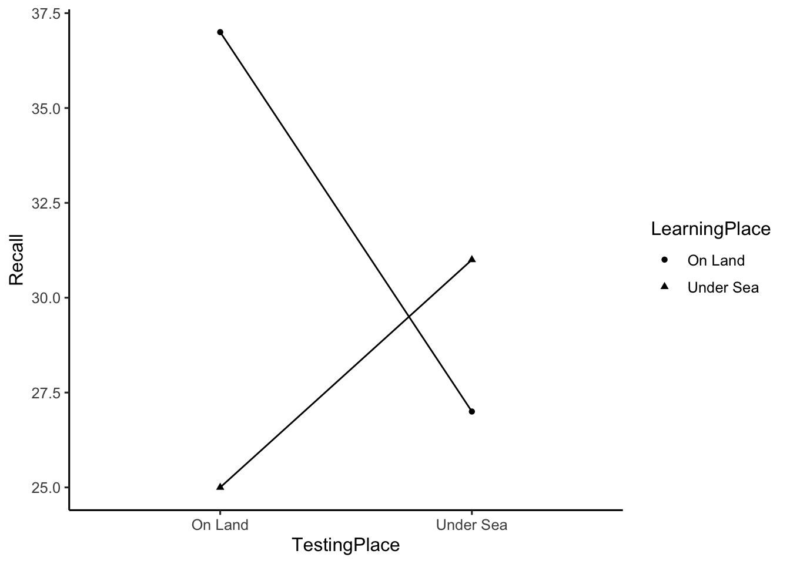

# Repeated Measures ANOVA

## Reading

Chapters 18 and 19 from @abdiExperimentalDesignAnalysis2009. Also see, additional examples and discussion of simple repeated measures in @crumpAnsweringQuestionsData2018, here <https://crumplab.github.io/statistics/repeated-measures-anova.html>.

## Practical 1: How to run a repeated measures ANOVA in R

This practical section contains three textbook examples of conducting repeated measures ANOVAs in R. The first two examples are single factor designs, each involving a single repeated measure. The third example is involves a 2x2 design, where both factors are repeated measures.

All examples use the `aov()` function that we have used for between-subjects designs. The major difference involves specifying the error term appropriately in the formula.

### Single factor Example 1

From example 18.13 in @abdiExperimentalDesignAnalysis2009.


```r
library(tibble)
library(tidyr)
library(dplyr)

e1 <- tribble(~Subject, ~Drug_A, ~Placebo, ~Drug_B,
        "s1", 124, 108, 104,
        "s2", 105, 107, 100,
        "s3",107,90,100,
        "s4",109,89,93,
        "s5",94,105,89,
        "s6",121,71,84) 

# convert to long
e1 <- pivot_longer(e1,
                   cols = !Subject,
                   names_to = "IV",
                   values_to = "Latency")

# Convert IVs to factors
e1 <- e1 %>%
  mutate(Subject = as.factor(Subject),
         IV = as.factor(IV))

# conduct ANOVA, note the addition of the error term in the formula
aov_out <- aov(Latency ~ IV + Error(Subject), data=e1)
summary(aov_out)
#> 
#> Error: Subject
#>           Df Sum Sq Mean Sq F value Pr(>F)
#> Residuals  5    750     150               
#> 
#> Error: Within
#>           Df Sum Sq Mean Sq F value Pr(>F)  
#> IV         2    900     450    3.75 0.0609 .
#> Residuals 10   1200     120                 
#> ---
#> Signif. codes:  0 '***' 0.001 '**' 0.01 '*' 0.05 '.' 0.1 ' ' 1
```

### Formula syntax for repeated measures ANOVA

Now that we have seen an example of conducting a repeated measures ANOVA with `aov()`, let's closely inspect the formula syntax.

Here is the general syntax for a repeated measures ANOVA with one factor. You would replace `DV` with column name for the dependent variable in your `dataframe`; and replace `IV` with the column name for the independent variable in your `dataframe`; and, you would replacee `Subject` with the column name for your subject variable in your `dataframe`.


```r
aov(DV ~ IV + Error(Subject), data = dataframe)
```

Compare it to the syntax for between-subjects ANOVA with one factor, notice the between subjects version does not include the ` + Error(Subject)` component of the formula.


```r
aov(DV ~ IV, data = dataframe)
```

## Single Factor Example 2

From example 18.14 in @abdiExperimentalDesignAnalysis2009.


```r
e2 <- tribble(~Subject, ~r1, ~r2, ~r3, ~r4, ~r5, ~r6,
        "s1",30,18,21,15,18,12,
        "s2",21,23,16,17,13,12,
        "s3",19,21,13,15,13,9,
        "s4",19,19,16,9,11,10,
        "s5",21,16,12,15,9,11,
        "s6",22,17,14,12,10,9,
        "s7",19,20,17,10,13,5,
        "s8",17,18,11,11,9,12
        ) 

# convert to long
e2 <- pivot_longer(e2,cols = !Subject,
                   names_to = "Rank",
                   values_to = "Recall")

# Convert IVs to factors
e2 <- e2 %>%
  mutate(Subject = as.factor(Subject),
         Rank = as.factor(Rank))

# conduct ANOVA, note the addition of the error term in the formula
aov_out <- aov(Recall ~ Rank + Error(Subject), data= e2)
summary(aov_out)
#> 
#> Error: Subject
#>           Df Sum Sq Mean Sq F value Pr(>F)
#> Residuals  7    168      24               
#> 
#> Error: Within
#>           Df Sum Sq Mean Sq F value   Pr(>F)    
#> Rank       5    720     144      24 2.09e-10 ***
#> Residuals 35    210       6                     
#> ---
#> Signif. codes:  0 '***' 0.001 '**' 0.01 '*' 0.05 '.' 0.1 ' ' 1
```

## Two factor repeated measures Example 3

When there are multiple within-subject factors, we need to specify the error terms appropriately. Here is the general syntax for a two factor ANOVA with two repeated measures.


```r
aov(DV ~ IV1*IV2 + Error(Subjects/IV1*IV2), data= dataframe)
```

From example 19.5 in @abdiExperimentalDesignAnalysis2009.


```r
godden_baddeley <- tribble(~Subjects,~LearningPlace,~TestingPlace,~Recall,
        "s1","On Land","On Land",34,
        "s2","On Land","On Land",37,
        "s3","On Land","On Land",27,
        "s4","On Land","On Land",43,
        "s5","On Land","On Land",44,
        "s1","On Land","Under Sea",18,
        "s2","On Land","Under Sea",21,
        "s3","On Land","Under Sea",25,
        "s4","On Land","Under Sea",37,
        "s5","On Land","Under Sea",34,
        "s1","Under Sea","On Land",14,
        "s2","Under Sea","On Land",21,
        "s3","Under Sea","On Land",31,
        "s4","Under Sea","On Land",27,
        "s5","Under Sea","On Land",32,
        "s1","Under Sea","Under Sea",22,
        "s2","Under Sea","Under Sea",25,
        "s3","Under Sea","Under Sea",33,
        "s4","Under Sea","Under Sea",33,
        "s5","Under Sea","Under Sea",42
        )

# convert IVs to factors
godden_baddeley <- godden_baddeley %>%
  mutate(Subjects = as.factor(Subjects),
         LearningPlace = as.factor(LearningPlace),
         TestingPlace = as.factor(TestingPlace))

# run ANOVA
aov_out <- aov(Recall ~ LearningPlace*TestingPlace + Error(Subjects/(LearningPlace*TestingPlace)), godden_baddeley)

# print out ANOVA summary table
summary(aov_out)
#> 
#> Error: Subjects
#>           Df Sum Sq Mean Sq F value Pr(>F)
#> Residuals  4    680     170               
#> 
#> Error: Subjects:LearningPlace
#>               Df Sum Sq Mean Sq F value Pr(>F)
#> LearningPlace  1     80      80       2   0.23
#> Residuals      4    160      40               
#> 
#> Error: Subjects:TestingPlace
#>              Df Sum Sq Mean Sq F value Pr(>F)
#> TestingPlace  1     20      20     2.5  0.189
#> Residuals     4     32       8               
#> 
#> Error: Subjects:LearningPlace:TestingPlace
#>                            Df Sum Sq Mean Sq F value Pr(>F)  
#> LearningPlace:TestingPlace  1    320     320      20 0.0111 *
#> Residuals                   4     64      16                 
#> ---
#> Signif. codes:  0 '***' 0.001 '**' 0.01 '*' 0.05 '.' 0.1 ' ' 1

# generate plot of means
library(ggplot2)

ggplot(godden_baddeley, aes(x=TestingPlace,
                            y=Recall,
                            shape=LearningPlace,
                            group=LearningPlace))+
  geom_point(stat="summary",fun="mean")+
  geom_line(stat="summary",fun="mean")+
  theme_classic(base_size=12)
```



## Concept 1: Sphericity


```r
## example data set to illustrate sphericity
textbook <- tribble(~S, ~a1, ~a2, ~a3, ~a4,
        "s1",76,64,34,26,
        "s2",60,48,46,30,
        "s3",58,34,32,28,
        "s4",46,46,32,28,
        "s5",30,18,36,28
        ) 

## selecting the table of values in each column
textbook[,2:5]
#> # A tibble: 5 × 4
#>      a1    a2    a3    a4
#>   <dbl> <dbl> <dbl> <dbl>
#> 1    76    64    34    26
#> 2    60    48    46    30
#> 3    58    34    32    28
#> 4    46    46    32    28
#> 5    30    18    36    28

## computing the covariation matrix
cov(textbook[,2:5])
#>     a1  a2 a3 a4
#> a1 294 258  8 -8
#> a2 258 294  8 -8
#> a3   8   8 34  6
#> a4  -8  -8  6  2

## ta
colMeans(cov(textbook[,2:5]))
#>  a1  a2  a3  a4 
#> 138 138  14  -2

## sa-s
colMeans(cov(textbook[,2:5])) - mean(cov(textbook[,2:5]))
#>  a1  a2  a3  a4 
#>  66  66 -58 -74

## double-centering

cov_matrix <- cov(textbook[,2:5])
col_mean_matrix <- cov_matrix*0 + colMeans(cov_matrix)
row_mean_matrix <- t(cov_matrix*0 + rowMeans(cov_matrix))
dc_matrix <- cov_matrix - col_mean_matrix -row_mean_matrix + mean(cov_matrix)

## greenhouse-geisser
sum(diag(dc_matrix))^2 / ((dim(dc_matrix)[1]-1)*sum(dc_matrix^2))
#> [1] 0.4459613
```

### Sphericity corrections in R

The `aov()` function does not automatically apply corrections for sphericity as is sometimes common in statistics programs. However, there are other ANOVA functions that do, such as the ANOVA function from the `car` package. One wrinkle here is that this function requires data to be in wide format. Here is an example


```r
textbook <- tribble(~S, ~a1, ~a2, ~a3, ~a4,
        "s1",76,64,34,26,
        "s2",60,48,46,30,
        "s3",58,34,32,28,
        "s4",46,46,32,28,
        "s5",30,18,36,28
        ) 

## ANOVA using car
wide_data <- as.matrix(textbook[1:5,2:5])
aov_model <- lm(wide_data ~1)
rm_factor <- factor(c('a1','a2','a3','a4'))
library(car)
new_anova <- Anova(aov_model, 
                   idata=data.frame(rm_factor),
                   idesign = ~rm_factor,
                   type="III")
summary(new_anova,multivariate=FALSE)
#> 
#> Univariate Type III Repeated-Measures ANOVA Assuming Sphericity
#> 
#>             Sum Sq num Df Error SS den Df  F value    Pr(>F)    
#> (Intercept)  32000      1     1152      4 111.1111 0.0004582 ***
#> rm_factor     1800      3     1344     12   5.3571 0.0142330 *  
#> ---
#> Signif. codes:  0 '***' 0.001 '**' 0.01 '*' 0.05 '.' 0.1 ' ' 1
#> 
#> 
#> Mauchly Tests for Sphericity
#> 
#>           Test statistic p-value
#> rm_factor       0.088557 0.27931
#> 
#> 
#> Greenhouse-Geisser and Huynh-Feldt Corrections
#>  for Departure from Sphericity
#> 
#>            GG eps Pr(>F[GG])  
#> rm_factor 0.44596    0.05999 .
#> ---
#> Signif. codes:  0 '***' 0.001 '**' 0.01 '*' 0.05 '.' 0.1 ' ' 1
#> 
#>              HF eps Pr(>F[HF])
#> rm_factor 0.5871795 0.04114125
```

Note, the adjusted degrees of freedom are not displayed in the above printout. This repeated measures ANOVA yielded F(3,12) = 5.3571, p = .0142330.


```r
pf(q= 5.3571, df1= 3, df2= 12, lower.tail = FALSE)
#> [1] 0.01423341
```

The estimate of epsilon based on Greenhouse Geisser was .44596. Notice, the p-value is different in the printout above (p = .059999). The Greenhouse-Geisser estimate of epsilon is used to modify the degrees of freedom.


```r
GG_df1 = (4-1) * .44596
GG_df2 = (4-1) * (5-1) *.44596

GG_df1
#> [1] 1.33788
GG_df2
#> [1] 5.35152

pf(q= 5.3571, df1= GG_df1, df2= GG_df2, lower.tail = FALSE)
#> [1] 0.05999576
```

For comparison purposes, here is an ANOVA summary using `aov()` that does not include corrections.


```r
# compare to ANOVA using aov
# convert to long
long_data <- pivot_longer(textbook,cols = !S,
                   names_to = "IV",
                   values_to = "DV")

# Convert IVs to factors
long_data <- long_data %>%
  mutate(S = as.factor(S),
         IV = as.factor(IV))

# conduct ANOVA, note the addition of the error term in the formula
aov_out <- aov(DV ~ IV + Error(S), data= long_data)
summary(aov_out)
#> 
#> Error: S
#>           Df Sum Sq Mean Sq F value Pr(>F)
#> Residuals  4   1152     288               
#> 
#> Error: Within
#>           Df Sum Sq Mean Sq F value Pr(>F)  
#> IV         3   1800     600   5.357 0.0142 *
#> Residuals 12   1344     112                 
#> ---
#> Signif. codes:  0 '***' 0.001 '**' 0.01 '*' 0.05 '.' 0.1 ' ' 1
```

## Lab 9 Generalization Assignment

<iframe width="560" height="315" src="https://www.youtube.com/embed/C_FB5dgoSB4" title="YouTube video player" frameborder="0" allow="accelerometer; autoplay; clipboard-write; encrypted-media; gyroscope; picture-in-picture" allowfullscreen></iframe>

### Instructions

Your assignment instructions are the following:

1.  Work inside the new R project for stats II that you created
2.  Create a new R Markdown document called "Lab9.Rmd"
3.  Use Lab9.Rmd to show your work attempting to solve the following generalization problems. Commit your work regularly so that it appears on your Github repository.
4.  **For each problem, make a note about how much of the problem you believe you can solve independently without help**. For example, if you needed to watch the help video and are unable to solve the problem on your own without copying the answers, then your note would be 0. If you are confident you can complete the problem from scratch completely on your own, your note would be 100. It is OK to have all 0s or 100s anything in between.
5.  Submit your github repository link for Lab 9 on blackboard.

### Problems

1. Create an R script that can generate simulated data for the following repeated measures design. (2 points)

  A. The dependent variable is assumed to come from a normal distribution with mean = 0 and standard deviation = 1.

  B. There is one repeated measures factor with 5 levels (Down1, Down2, Control, Up1, Up2). The control group is assumed to have no effect. The Down1 and Down2 levels shift the mean down by 1 and 2 standard deviations, respectively. The Up1 and Up2 levels shift the mean up by 1 and 2 standard deviations, respectively.

  C. There are 6 subjects in the experiment, and they are each measured once in each condition. The 6 subjects are assumed to be different from one another (e.g., they will  have different baseline means in the control condition), but they will all be influenced by the IV in the exact same way (e.g., no interaction).

2. Run a simulation to determine the proportion of experiments that would return a significant result for the above design. Assume that the effect of the levels of the IV are increments of .1 of a standard deviation, rather than increments of 1 as in the above design.

3. Demonstrate that the Godden and Baddeley example data from the textbook (19.5), which used a 2x2 repeated measures design, can be be analyzed with one-sample t-tests to return the same results. Specifically, show the one-sample t-tests for each main effect and the interaction. (2 points)

Bonus Points

These bonus questions are about the sphericity concept, and they will involve modifying the example data from the textbook (same as used in concept sectdion 1). The data is reprinted here for your convenience:


```r
sphericity <- tribble(~S, ~a1, ~a2, ~a3, ~a4,
        "s1",76,64,34,26,
        "s2",60,48,46,30,
        "s3",58,34,32,28,
        "s4",46,46,32,28,
        "s5",30,18,36,28
        ) 
```


4. Create a line plot showing how each of the 5 subjects perform across the levels of the IV. Discuss how the line plot visually shows the sphericity problem in the data (1 point)

5. Modify the above data to remove the sphericity problem. Specifically, ensure that all subjects are different from another (there overall means are different), and that the IV has the same effect for each level and each subject (no interaction). Then, plot the new data and discuss how the graph shows the sphericity problem has been removed. (1 point)

6. Calculate the Greenhouse-Geisser estimate of epsilon for your modified data to demonstrate you have removed the sphericity problem. (1 point)

## References
