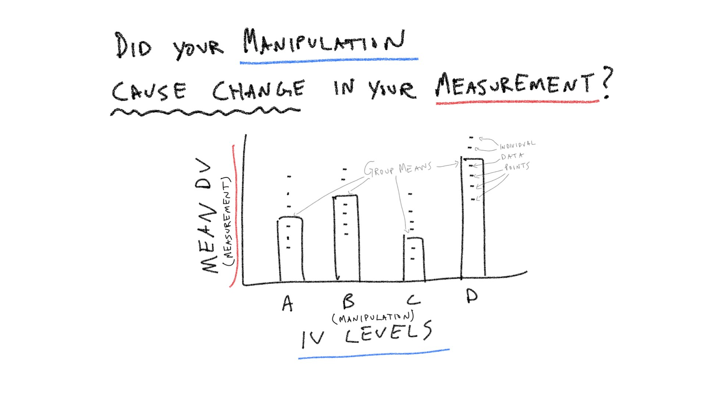
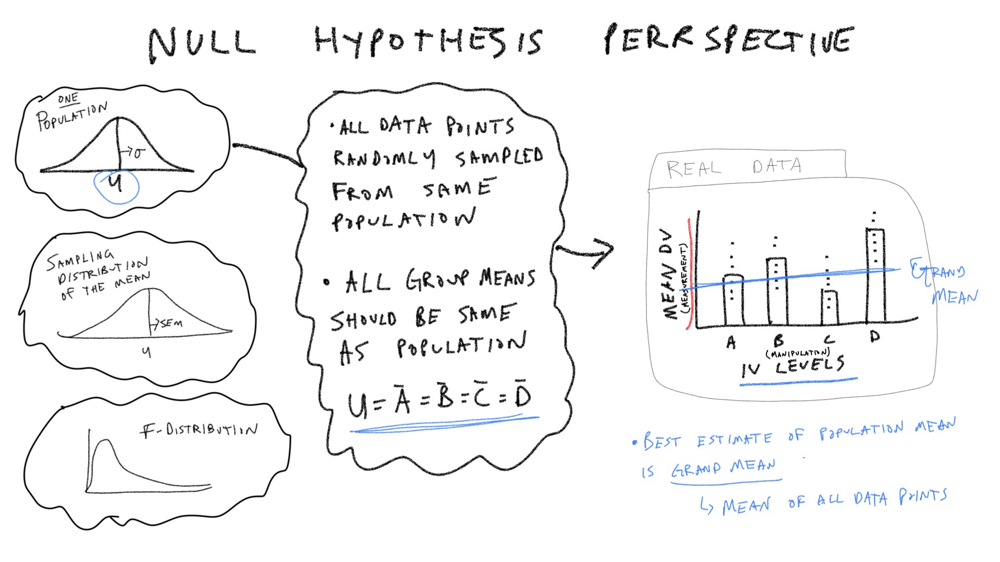
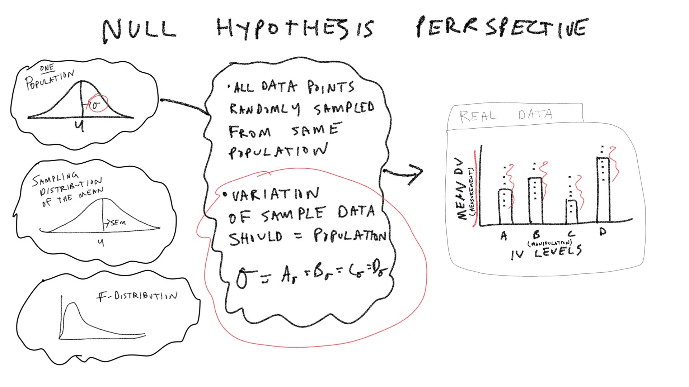
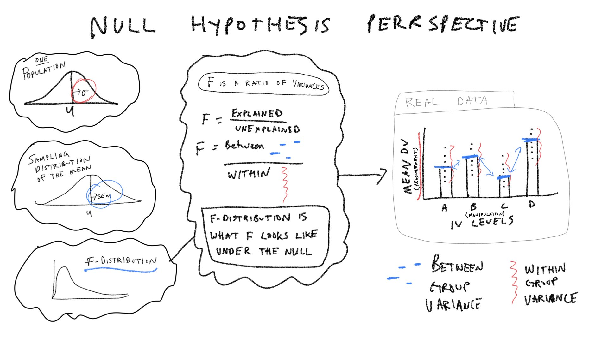

```{r, include = FALSE}
source("global_stuff.R")
```

# ANOVA

## Readings

Chapters 7 and 8 from [@abdiExperimentalDesignAnalysis2009]. You can also check out my chapter on ANOVA [@crumpAnsweringQuestionsData2018] here [https://crumplab.github.io/statistics/anova.html](https://crumplab.github.io/statistics/anova.html).

<iframe width="560" height="315" src="https://www.youtube.com/embed/HPPH3Jgn0nk" frameborder="0" allow="accelerometer; autoplay; clipboard-write; encrypted-media; gyroscope; picture-in-picture" allowfullscreen></iframe>

## Overview

The next three weeks discuss one-factor Analysis of Variance (ANOVA). We can think of ANOVA as an extension of the t-test idea, that can be applied to designs where the independent variable (IV) has more than two levels, or to even more complicated designs involving multiple IVs (possibly with many levels each).

We begin with the one-factor ANOVA for designs with a single independent variable that has two or more levels. As we will see shortly, if we use ANOVA for a design with two levels, the result will be the same as a t-test. However, unlike a t-test, we can also use the ANOVA for designs with more than two levels.

This lab has three major concept sections to help firm up ANOVA concepts, and a practical section on using the `aov` function to compute ANOVAs in R.

Let's consider a few pictures first, and then move onto the lab:

```{r, echo=FALSE}

```

### Grand mean

```{r, echo=FALSE}

```

### Within group variation

```{r, echo=FALSE}

```

### Between group variation

```{r, echo=FALSE}
knitr::include_graphics('imgs/ANOVA/ANOVA.007.jpeg')
```

### F Ratio

```{r, echo=FALSE}

```


<!--
## Concept 1: Manipulations and using means to explain variance

We have been discussing the concept of explaining variance in lab and lecture for several weeks. For example, when we correlate on variable `X`, with another variable `Y`, we can compute the coefficient of determination, $R^2$, that quantifies how much of the variation in Y can be explained by X. More specifically, in the simple linear regression case, we are effectively quantifying how much of the data-points fall on a best-fit line. If all of the data-points in the scatterplot fall on the best-fit line, then we say the line explains all of the variation. If their is residual error, then we say the line explains some proportion of the variance, and there is a leftover part (the residuals), that remains unexplained. With ANOVA, we will be doing something similar; except, instead of trying to explain variation in a dependent variable based on a line, we will be explaining variation in terms of means.

What follows is a series of ideas and R code that could be helpful for understanding general statistical principles underlying the ANOVA logic. If we understand these principles, we should be confident when we use ANOVA because we will understand what it is capable (and not capable) of doing, and we will know how to extend the principles to develop other ANOVA-like tools if we thought that would be useful for our research purposes.

The big question we will ask is, what ought to happen to your dependent variable if your experimental manipulation is effective and truly does cause change in what you are measuring.

### Variation in your dependent variable

First, let's consider variability in our measurements outside of an experiment. As we know, many measurements in psychology are inherently variable. As a result, every time we measure something, `Y`, we know we will collect different values.

If we assume that our measurement is coming from some stable population distribution, then what do we assume will happen when we take measurements, that is, when we take sample data from the population?

We expect the sample data will have some variability too, but that the sample data will generally be distributed like the population distribution it came from. 

For example, let's sample 10 numbers from a normal distribution with (mean = 0, sd =1) and do this twenty times.

The bars show the sample means, and the dots show the individual data points in each sample.

```{r}
library(tibble)
library(ggplot2)

sample_data <- tibble(sample = rep(1:20, each=10),
                      DV = rnorm(20*10,0,1))

ggplot(sample_data, aes(x=sample,y=DV))+
  geom_bar(stat="summary",fun="mean", position="dodge") +
  geom_point(size=1)+
  geom_hline(yintercept = 0)+
  theme_classic()
```

The graph represents taking different measurements from the same population multiple times over. Every time we get a slightly different sample, but as a general rule, the sample mean is close to the population mean (0), and the variability is pretty consistent across samples.

### Manipulation and Variation

Let's now consider what we expect to happen to the variation in our measurement in the context of an experiment. The primary working feature of an experiment is the manipulation, or the independent variable. If an experiment is correctly designed, it should be capable of **causing the measured variable to change in some way**. Our general question now is to consider what would happen to the variation in our measurement when the experimental manipulation works.

#### What ought to happen when the manipulation does not work?

Let's slightly change the graph from above. Let's imagine that the first 10 samples are measures we took from 10 subjects in group 1 of an experiment, and samples 11-20 are measures we took from 10 subjects in group 2 of an experiment. Let's further stipulate that manipulation does not work, and is incapable of causing the measurement to change.

What would we expect the data to look like? Remember of course that the measurement will still have some variability, so we would expect something like the following to happen:

```{r}
sample_data <- tibble(group = rep(c("1","2"),each=10*10),
                      subjects = rep(1:20, each=10),
                      DV = rnorm(20*10,0,1))

ggplot(sample_data, aes(x=subjects,y=DV))+
  geom_bar(stat="summary",fun="mean", position="dodge",
           aes(color=group,
               fill=group)) +
  geom_point(size=1)+
  geom_hline(yintercept = 0)+
  theme_classic()
```

Our question was: what would happen to the variation in our measurement when the experimental manipulation does not work. The answer is that nothing should happen to the variation in our measurement when the manipulation does nothing. Instead, we should expect to measure whatever variation is normally present in our dependent variable. In other words, there really isn't a difference between the first graph we made (20 samples from the same distribution), and this graph. Both involve randomly sampling 10 values from the same distribution, and repeating that process 20 times.

#### What ought to happen when the manipulation DOES work?

Let's get back to he big issue. If an experiment is correctly designed, it should be capable of **causing the measured variable to change in some way**. So, what would happen to the variation in our measurement when the experimental manipulation actually works?

There are three possible answers. The variation in our measure could increase, decrease, or stay the same. So which is it? The answer to this question in part depends on the nature of the causal influence from the manipulation. Let's be a little bit more specific and consider the following question. If the manipulation causes an increase or decrease in the mean of the dependent variable, what will happen to the variability in our measurement?

Before we simulate this in R, let's first establish how much variability there is in the first place. For example, how much variability is there in the dependent variable from our previous example?

We could simply take all of the data points, across all subjects in both groups and compute the variance. 

```{r}
var(sample_data$DV)
```

Now, let's repeat the above experiment, but this time we will simulate the idea that the IV does actually change measurement. For example, let's say the manipulation in group 2 causes scores to raise dramatically by three whole standard deviations relative to group 1.

I accomplish this by changing the mu parameter from 0 to 3 in the `rnorm()` function for the second set of subjects. Notice, I did not change the standard deviation of population distribution, because I am assuming that the manipulation only causes a mean shift.

```{r}
sample_data <- tibble(group = rep(c("1","2"),each=10*10),
                      subjects = rep(1:20, each=10),
                      DV = c(rnorm(10*10,0,1),
                             rnorm(10*10,3,1))
                      )

ggplot(sample_data, aes(x=subjects,y=DV))+
  geom_bar(stat="summary",fun="mean", position="dodge",
           aes(color=group,
               fill=group)) +
  geom_point(size=1)+
  geom_hline(yintercept = 0)+
  theme_classic()
```

So, what has happened to the overall variability in the measurement? If we ignore the grouping variable, notice that now we have dots in more places than we did before. In previous graphs the dots ranged roughly between -2 and +2. Now, taken together they range between -2 and +4. So, **the manipulation caused the variability in the measurement to increase**.

We can confirm that the the total amount of variation has increased by computing the variance of all the scores. The variance has increased almost threefold from before.

```{r}
var(sample_data$DV)
```

I will leave it to you to determine what happens to the total variation if the manipulation caused a mean shift in the negative direction. For example, in the example above, group 2 was programmed to have larger more positive values than group 1. We could have made group 2 receive smaller more negative values than group 1. In general, no matter what direction the change is, if the IV causes changes in the means between the levels, then the presence of the IV should increase the total amount of variation relative control conditions where the IV is not manipulated (but a similar number of groups are measured).

### Sources of Variation

We have demonstrated above two sources of variation. First, we have the pre-existing variation in our dependent variable. Second, we have additional variation caused by the experimental manipulation. In general, we will talk about the pre-existing variation as "unexplained" variation. And, we will talk about the variation caused by the manipulation as "explained" variation. It is explained in the sense that we are saying something about the experimental manipulation was the source of the added variation.

The point of the preceding examples was to focus on the very general idea that total variation in a measurement scenario should change when the measurement conditions involve a causally effective experimental manipulation, compared to a control or causally ineffective manipulation. This a general reason why researchers are interested in "analyzing variances", because changes in variation can be a signature of causal influences that we are attempting to detect with our experiments. 

### Using means to explain variation

Consider the process of using means to explain variance in observed data. Remember, that variances averages of the squared deviations between data points and their mean. 

#### The grand mean

Let's use the experimental data from the last example, and try to explain the variance from the perspective of the grand mean. Here is the data again (resampled because I'm running the code again).

```{r}
sample_data <- tibble(group = rep(c("1","2"),each=10*10),
                      subjects = rep(1:20, each=10),
                      DV = c(rnorm(10*10,0,1),
                             rnorm(10*10,3,1))
                      )

ggplot(sample_data, aes(x=subjects,y=DV))+
  geom_bar(stat="summary",fun="mean", position="dodge",
           aes(color=group,
               fill=group)) +
  geom_point(size=1)+
  geom_hline(yintercept = 0)+
  theme_classic()
```

What is the grand mean? The grand mean is the mean across all of the data ignoring the groups.

```{r}
mean(sample_data$DV)
```

This is the same mean that we use to compute the total variance:

```{r}
var(sample_data$DV)
```

We could add the grand mean as a blue line to the graph:

```{r}
ggplot(sample_data, aes(x=subjects,y=DV))+
  geom_bar(stat="summary",fun="mean", position="dodge",
           aes(color=group,
               fill=group)) +
  geom_point(size=1)+
  geom_hline(yintercept = 0)+
  geom_hline(yintercept = mean(sample_data$DV), color="blue")+
  theme_classic()
```

How well does the blue line explain the location of all of the dots? Well, it is the mean, so it is in the middle of all the dots. If you drew lines between each dot and the blue line, squared them, added them up (Sums of Squares, SS), and then averaged them, you would have the variance. We computed the variance to be about 3. The question we ask in ANOVA is whether our experimental manipulation can help "explain" some of this total variance.

Under the null hypothesis, all of the variance is explained by the grand mean, which represents the mean of the single distribution where the data come from. In other words, the manipulation doesn't do anything, so whatever variance we have is from the "pre-existing" variance.

When the experimental manipulation works, then we assume that some of the total variance we are measuring is actually due to the manipulation. In other words, without the manipulation the variance would have been smaller, but as we have shown the manipulation ought to increase the total variance. The next step is to **partition** the variance into difference sources. Specifically, how much of the total variance was "pre-existing", and how much was caused by the manipulation?

Before we proceed, I'm going to make a small change to the presentation of the data. The previous graphs show individual subject means (bars) and individual subject raw data (dots) for both groups. Let's look at a graph of the group means (two bars, one for each group), where the dots represent individual subject means.

```{r}
library(dplyr)

mean_data <- sample_data %>%
  group_by(group,subjects) %>%
  summarize(mean_dv = mean(DV))

ggplot(mean_data, aes(x=group,y=mean_dv))+
  geom_bar(stat="summary",fun="mean", position="dodge",
           aes(color=group,
               fill=group)) +
  geom_point(size=1)+
  geom_hline(yintercept = 0)+
  geom_hline(yintercept = mean(mean_data$mean_dv), color="blue")+
  theme_classic()
```

The grand mean is the same as before:

```{r}
mean(mean_data$mean_dv)
```

And, the total variance is:

```{r}
var(mean_data$mean_dv)
```

Note, here we are computing the variance in the subject means with respect to the grand mean. Before, we computed the variance in all of the raw data with respect to the grand mean.

Remember, according to the null hypothesis, the grand mean of the sample data is the best estimate of the population mean, and it is the only basis for explaining the variation in the data. Consider the following table.

If the mean_dv column represents the mean scores for each subject. If we pretend that each score is just the sum of two components, the grand_mean plus a deviation (or squared difference between the orignal score and the grand mean), then we can see that from this viewpoint, all of the scores are the same (they are all the grand_mean), and the variance associated with this explanation is the average of the squared error.

```{r}
mean_data <- mean_data%>%
  mutate(grand_mean = mean(mean_data$mean_dv)) %>%
  mutate(squared_error = (mean_dv-grand_mean)^2)
knitr::kable(mean_data)
```
The variance is:

```{r}
var(mean_data$mean_dv)
```

And, the average of the sum of the squared error is the same thing.

```{r}
sum(mean_data$squared_error)/(20-1)
```

#### The means from each level of the IV

Let's consider a different perspective. What if we assume that the IV did cause a difference, such that the means between the groups should be different because of the manipulation. 

One way to approach this issue is to think of each score as being replaced by it's group mean, and then to calculate how much variance is associated with this characterization.

```{r}
group_means <- mean_data %>%
  group_by(group) %>%
  summarize(group_mean = mean(mean_dv))

IV_mean_data <- mean_data %>%
  ungroup() %>%
  mutate(IV_means = rep(group_means$group_mean, each = 10)) %>%
  mutate(IV_squared_error = (IV_means-grand_mean)^2)

knitr::kable(IV_mean_data)
```

If we treat each score as if the only thing we knew about it was the group mean it came from, then we could measure how much variance is associated with this perspective. For example:

```{r}
var(IV_mean_data$IV_means)
```

This is the same as the average of the squared errors between the group means and the grand mean.

```{r}
sum(IV_mean_data$IV_squared_error)/19
```


-->

## Practical 1: By hand ANOVA using R

```{r}
library(tibble)
romeo_juliet <- tibble(subjects = 1:20,
                       Group = rep(c("No Context",
                                 "Context Before",
                                 "Context After",
                                 "Partial Context"), each = 5),
                       Comprehension = c(3,3,2,4,3,
                                         5,9,8,4,9,
                                         2,4,5,4,1,
                                         5,4,3,5,4
                                   )
                          )

romeo_juliet$Group <- factor(romeo_juliet$Group,
                             levels = c("No Context",
                                 "Context Before",
                                 "Context After",
                                 "Partial Context"))

knitr::kable(romeo_juliet)
```

### Grand Mean and total sums of squares

```{r}
library(dplyr)
# get grand mean
grand_mean <- mean(romeo_juliet$Comprehension)

# get squared deviations from grand mean
SS_total_table <- romeo_juliet %>%
  mutate(grand_mean = mean(romeo_juliet$Comprehension)) %>%
  mutate(deviations = Comprehension - grand_mean,
         sq_deviations = (Comprehension - grand_mean)^2)

#sum them
SS_total <- sum(SS_total_table$sq_deviations)
```

### SS Between

```{r}
# get group means
group_means <- romeo_juliet %>%
  group_by(Group) %>%
  summarize(mean_Comprehension = mean(Comprehension),.groups = 'drop')

# get squared deviations between grand mean and group means
SS_between_table <- romeo_juliet %>%
  mutate(grand_mean = mean(romeo_juliet$Comprehension),
         group_means = rep(group_means$mean_Comprehension, each = 5)) %>%
  mutate(deviations = group_means - grand_mean,
         sq_deviations = (group_means - grand_mean)^2)

SS_between <- sum(SS_between_table$sq_deviations)
```

### SS Within

```{r}
# get group means
group_means <- romeo_juliet %>%
  group_by(Group) %>%
  summarize(mean_Comprehension = mean(Comprehension), .groups = 'drop')

# get squared deviations between group means and original data points
SS_within_table <- romeo_juliet %>%
  mutate(group_means = rep(group_means$mean_Comprehension, each = 5)) %>%
  mutate(deviations = group_means - Comprehension,
         sq_deviations = (group_means - Comprehension)^2)

SS_within <- sum(SS_within_table$sq_deviations)
```

Check that SS total = SS Between + SS Within:

```{r}
SS_total

SS_between+SS_within

SS_total == SS_between+SS_within

```

### F is a ratio of variances

```{r}
# Between groups variance
dfb <- 4-1 
MS_Between <- SS_between/dfb

# Within groups variance
dfw <- 20-4
MS_Within <- SS_within/dfw

# compute F, a ratio of variances
F_ratio <- MS_Between/MS_Within
```

### Alternative example using matrix

```{r}
# represent data in a wide-format matrix

matrix_data <- matrix(c(3,3,2,4,3,
                        5,9,8,4,9,
                        2,4,5,4,1,
                        5,4,3,5,4),
                      ncol=4,
                      nrow=5)

colnames(matrix_data) <- c("No Context",
                                 "Context Before",
                                 "Context After",
                                 "Partial Context")

## Sums of Squares

SS_total <- sum( (matrix_data - mean(matrix_data))^2 )
SS_between <- sum( (colMeans(matrix_data) - mean(matrix_data))^2 )*5
SS_within <- sum( (colMeans(matrix_data) - t(matrix_data))^2 )

## Mean squared errors

dfb <- 4-1 
MS_Between <- SS_between/dfb

dfw <- 20-4
MS_Within <- SS_within/dfw

# compute F, a ratio of variances
F_ratio <- MS_Between/MS_Within

```

### Using the built-in `aov`

Note, we go into more detail about aov` in the practical section.

```{r}
romeo_juliet$Comprehension <- sample(romeo_juliet$Comprehension)

anova.out <- aov(Comprehension ~ Group, data = romeo_juliet)
summary(anova.out)
```

## Concept 1: Understanding the pieces of the ANOVA table

Most of the pieces of the ANOVA table (degrees of freedom, Sums of Squares, Mean squared error, and the F-value) are computed directly from the data. Algebraically, the Mean squared errors are the sum squares of divided by their respective degrees of freedoms. And, the F-value is a ratio: the Mean squared error for the group (Between) divided by the mean squared error for the residuals (Within). The p-value does not come from the data, in this case it comes from an F-distribution. This concept section is followed by a section on creating a simulated F-distribution. To prepare us for that concept, we will first focus on the pieces of the ANOVA table, and examine how each piece ought to behave in the context of experimental designs. Specifically, we will ask how each term ought to behave if the Null hypothesis is true as well as if it isn't.

In the textbook "Romeo & Juliet" example, the example data had 4 groups, and 5 observations per condition. The empirical question was whether the group manipulation caused changes in the means. The ANOVA was applied to that data set and a large F-value was found. This F-value was unlikely to be produced by the null-hypothesis, so that hypothesis was rejected. We will continue with this basic example, but examine it from a slightly more abstract perspective. We will ask how each of the terms in the ANOVA for this design out to behave if the Null is true, and if the Null is not true.

### SS Total

If the null is TRUE, then all of the individual subject means in all of the groups, are all assumed to be randomly sampled from the very same normal distribution. For example, this could be one random sample of 20 subject means for the above design. We will use a unit normal distribution throughout.

```{r}
sim_data <- matrix(rnorm(20,0,1),ncol=4,nrow=5)
```

$\text{SS}_\text{Total}$ is the sum of squared deviations between the grand mean (mean of all the data) and each data point. Assuming we are sampling from a unit normal distribution, how should $\text{SS}_\text{Total}$ behave if the Null hypothesis is true?

We can compute $\text{SS}_\text{Total}$ for the simulated data from above.

```{r}
SS_total <- sum( (mean(sim_data) - sim_data)^2 )
SS_total
```

But, that is just what $\text{SS}_\text{Total}$ happens to look like for that one random sample of 20 values from the normal distribution. Under the null, every time we sample 20 values we would expect slightly different values for $\text{SS}_\text{Total}$. Let's generate the sampling distribution of $\text{SS}_\text{Total}$. We would expect $\text{SS}_\text{Total}$ to take on a value from this distribution if the Null is TRUE.

```{r}
SS_total_distribution <- c()
for(i in 1:1000){
sim_data <- matrix(rnorm(20,0,1),ncol=4,nrow=5)
SS_total <- sum( (mean(sim_data) - sim_data)^2 )
SS_total_distribution[i] <- SS_total
}
hist(SS_total_distribution)
mean(SS_total_distribution)
```

What would happen to $\text{SS}_\text{Total}$ is the Null hypothesis is false? There are an infinity of ways that the null hypothesis could be false, but let's simulate one of them to see what could happen to $\text{SS}_\text{Total}$.

Specifically, let's imagine that manipulation works and it cause the first group to have a shifted mean of two standard deviations compared to the other groups. 

```{r}
SS_total_distribution_alt <- c()
for(i in 1:1000){
sim_data <- matrix(rnorm(20,0,1),ncol=4,nrow=5)
sim_data[,1] <- sim_data[,1]+2 #add effect for group 1
SS_total <- sum( (mean(sim_data) - sim_data)^2 )
SS_total_distribution_alt[i] <- SS_total
}
hist(SS_total_distribution_alt)
```

The distribution of $\text{SS}_\text{Total}$ includes a smaller range values when the Null is TRUE, compared to distribution of $\text{SS}_\text{Total}$ for this one alternative scenario. **The big concept here is that a manipulation that causes changes in the means, should increase the overall variance in the data relative to the grand mean**. Thus, $\text{SS}_\text{Total}$ should tend to be larger when the null is false, compared to when it is true.

```{r}
library(ggplot2)
SS_total_data <- data.frame(SS_total = c(SS_total_distribution,
                                         SS_total_distribution_alt),
                            type = rep(c("Null","Alternative"), each=1000))

ggplot(SS_total_data, aes(x=SS_total, group=type, fill=type))+
  geom_histogram(position="dodge")
```

### SS Between

$\text{SS}_\text{Between}$ treats each score as if it was the group mean, and sums the squared deviations between the group mean and grand mean. According to the null, the group means should all be the same (on average), but they will have some variance because of random sampling. Thus, we can simulate a sampling distribution of $\text{SS}_\text{Between}$ that we would expect under the null.

```{r}
SS_between_distribution <- c()
for(i in 1:1000){
  sim_data <- matrix(rnorm(20,0,1),ncol=4,nrow=5)
  SS_between <- sum( (mean(sim_data) - colMeans(sim_data))^2 )*5
  SS_between_distribution[i] <- SS_between
}
```

Let's also create a distribution of $\text{SS}_\text{Between}$ that would happen if our first group had a two standard deviation shift in the mean.

```{r}
SS_between_distribution_alt <- c()
for(i in 1:1000){
  sim_data <- matrix(rnorm(20,0,1),ncol=4,nrow=5)
  sim_data[,1] <- sim_data[,1]+2 #add effect for group 1
  SS_between <- sum( (mean(sim_data) - colMeans(sim_data))^2 )*5
  SS_between_distribution_alt[i] <- SS_between
}
```

It's clear by plotting the distributions together that $\text{SS}_\text{Between}$ will have larger numbers as the variation between the means gets larger.

```{r}
SS_between_data <- data.frame(SS_between = c(SS_between_distribution,
                                         SS_between_distribution_alt),
                            type = rep(c("Null","Alternative"), each=1000))

ggplot(SS_between_data, aes(x=SS_between, group=type, fill=type))+
  geom_histogram(position="dodge")
```


### SS Within

$\text{SS}_\text{Within}$ sums the squared deviations between each score and its group mean. We can simulate a sampling distribution of $\text{SS}_\text{Within}$ that we would expect under the null.

```{r}
SS_Within_distribution <- c()
for(i in 1:1000){
  sim_data <- matrix(rnorm(20,0,1),ncol=4,nrow=5)
  SS_Within <- sum( (colMeans(sim_data) - t(sim_data))^2 )
  SS_Within_distribution[i] <- SS_Within
}
```

Let's also create a distribution of $\text{SS}_\text{Within}$ that would happen if our first group had a two standard deviation shift in the mean.

```{r}
SS_Within_distribution_alt <- c()
for(i in 1:1000){
  sim_data <- matrix(rnorm(20,0,1),ncol=4,nrow=5)
  sim_data[,1] <- sim_data[,1]+2 #add effect for group 1
  SS_Within <- sum( (colMeans(sim_data) - t(sim_data))^2)
  SS_Within_distribution_alt[i] <- SS_Within
}
```

Remember, we have created an alternative distribution by violating the null with a shift in the mean for the first group. We did not assume the manipulation had any effect on the variances. Thus, $\text{SS}_\text{Within}$ should be the same when the null is true or false (for mean shifts).

```{r}
SS_Within_data <- data.frame(SS_Within = c(SS_Within_distribution,
                                         SS_Within_distribution_alt),
                            type = rep(c("Null","Alternative"), each=1000))

ggplot(SS_Within_data, aes(x=SS_Within, group=type, fill=type))+
  geom_histogram(position="dodge")
```

### MS Between

$\text{MS}_\text{Between}$ is a variance, and remember variances are average sums of squares. In our case, we are "estimating" the variance due to the effect of the manipulation, so we divide by the degrees of freedom $\text{SS}_\text{Between}/df_B$.

There are four group means, and we are estimating them with respect to the grand mean, so the number of means free to vary are 4-1 = 3. 

We can plot distributions of $\text{MS}_\text{Between}$ that we would when the null is true, and when it is false (using our alternative example). We can re-use the $\text{SS}_\text{Between}$ distributions and simply divide the values by $df_B$.

```{r}
MS_between_data <- data.frame(MS_between = c(SS_between_distribution/3,
                                         SS_between_distribution_alt/3),
                            type = rep(c("Null","Alternative"), each=1000))

ggplot(MS_between_data, aes(x=MS_between, group=type, fill=type))+
  geom_histogram(position="dodge")
```


### MS Within

$\text{MS}_\text{Within}$ represents average variation within group.  ANOVA assumes manipulations **only** cause shifts in means, and from this perspective, $\text{MS}_\text{Within}$ represents variance that is not due to the manipulation.

We are again "estimating" the variance  so we divide by the degrees of freedom $\text{SS}_\text{Within}/df_W$.

There are 20 subject means, and we are estimating them with respect to the four group means, so the number of means free to vary are 20-4 = 16. 

We can plot distributions of $\text{MS}_\text{Within}$ that we would expect when the null is true, and when it is false (using our alternative example). Again, we can re-use the $\text{SS}_\text{Within}$ distributions and simply divide the values by $df_W$.

```{r}
MS_Within_data <- data.frame(MS_Within = c(SS_Within_distribution/16,
                                         SS_Within_distribution_alt/16),
                            type = rep(c("Null","Alternative"), each=1000))

ggplot(MS_Within_data, aes(x=MS_Within, group=type, fill=type))+
  geom_histogram(position="dodge")
```

### F

The last component of the ANOVA table is $F$, which is a ratio of the variances $\text{MS}_\text{Between} / \text{MS}_\text{Within}$.

Let's re-simulate the F-distribution we would expect under the null.

```{r}
F_distribution <- c()
for(i in 1:1000){
  sim_data <- matrix(rnorm(20,0,1),ncol=4,nrow=5)
  SS_between <- sum( (mean(sim_data) - colMeans(sim_data))^2 )*5
  SS_Within <- sum( (colMeans(sim_data) - t(sim_data))^2 )
  sim_F <- (SS_between/3) / (SS_Within/16)
  F_distribution[i] <- sim_F
}

```

And, re-simulate the F-distribution we would expect for our alternative (that group one has a mean shift of two standard deviations).

```{r}
F_distribution_alt <- c()
for(i in 1:1000){
  sim_data <- matrix(rnorm(20,0,1),ncol=4,nrow=5)
  sim_data[,1] <- sim_data[,1]+2 #add effect for group 1
  SS_between <- sum( (mean(sim_data) - colMeans(sim_data))^2 )*5
  SS_Within <- sum( (colMeans(sim_data) - t(sim_data))^2 )
  sim_F <- (SS_between/3) / (SS_Within/16)
  F_distribution_alt[i] <- sim_F
}
```

And, then plot the F-distributions.

```{r}
F_data <- data.frame(F = c(F_distribution,
                           F_distribution_alt),
                           type = rep(c("Null","Alternative"),
                           each=1000))

ggplot(F_data, aes(x=F, group=type, fill=type))+
  geom_histogram(position="dodge")
```


## Concept 2: Simulating the F-distribution

Where did the p-value come from? We have seen that the `aov` function does all of the work  of computing the degrees of freedom, the sums of squares, the mean squares and the F-value directly from the provided data frame. Remember, that the F-value is essentially a descriptive statistic. 
The summary function shows that this F-value is associated with a fairly small p-value (.00278). The `aov` function looks up the p-value using the F-distribution function.

```{r}
?pf
pf(7.227,3,16, lower.tail = FALSE)

```

However, where did the `F` distribution come from? The `F` distribution is just another **sampling distribution**. It is a hypothetical distribution of F values that would be obtained under the null hypothesis for this situation. We can obtain our own F-distribution using monte-carlo simulation. Let's see if we get clsoe.

```{r}
# replace the example data with random numbers from a unit normal
romeo_juliet$Comprehension <- rnorm(20,0,1)
aov.out <- aov(Comprehension ~ Group, data = romeo_juliet)
simulated_F <- summary(aov.out)[[1]]$`F value`[1]

# do the above a bunch of times
save_F_values <- length(10000)
for(i in 1:10000){
romeo_juliet$Comprehension <- rnorm(20,0,1)
aov.out <- aov(Comprehension ~ Group, data = romeo_juliet)
simulated_F <- summary(aov.out)[[1]]$`F value`[1]
save_F_values[i] <- simulated_F
}

# look at the F distribution
hist(save_F_values)

# get the p-value associated with 7.22
length(save_F_values[save_F_values>7.22])/length(save_F_values)

# do the above 10000 times
save_F_values <- length(10000)
for(i in 1:10000){
romeo_juliet$Comprehension <- rnorm(20,0,1)
aov.out <- aov(Comprehension ~ Group, data = romeo_juliet)
simulated_F <- summary(aov.out)[[1]]$`F value`[1]
save_F_values[i] <- simulated_F
}

# look at the F distribution
hist(save_F_values)

# get the p-value associated with 7.22
length(save_F_values[save_F_values>7.22])/length(save_F_values)
```

## Practical 2: One-way ANOVA with `aov` function

We will use the `aov()` function many times throughout the remainder of this course to perform various ANOVAs. This is a very brief practical section to show you a few bells and whistles useful for conducting ANOVAs in R.

We will continue to use the same example data from the textbook:

```{r}
romeo_juliet <- tibble(subjects = 1:20,
                       Group = rep(c("No Context",
                                 "Context Before",
                                 "Context After",
                                 "Partial Context"), each = 5),
                       Comprehension = c(3,3,2,4,3,
                                         5,9,8,4,9,
                                         2,4,5,4,1,
                                         5,4,3,5,4
                                   )
                          )

romeo_juliet$Group <- factor(romeo_juliet$Group,
                             levels = c("No Context",
                                 "Context Before",
                                 "Context After",
                                 "Partial Context"))
```

### `aov()`

The `aov()` function has two main inputs, the formula (`Comprehension ~ Group`), and the data frame (`data = romeo_juliet`). The dataframe must be organized in long-format.

The column name of the dependent variable (Comprehension) is placed on the left side of the `~`, and the column name of the factor (independent variable) is placed on the right (Group). So the formula `Comprehension ~ Group` can be read as, "analyze the means of Comprehension as a function of the levels of Group".

```{r}
anova.out <- aov(Comprehension ~ Group, data = romeo_juliet)
```

The `aov()` function produces a list object containing the pieces of the ANOVA model. Printing this to the console usually does not give you information you are looking for:

```{r}
anova.out
```

### `summary()`

The ANOVA table can be printed to the console using `summary()`. The `summary()` function takes an `aov()` model as it's input, and returns the ANOVA table as an output.

```{r}
summary(anova.out)
```

You could also write this as:

```{r}
summary(aov(Comprehension ~ Group, data = romeo_juliet))
```

### `model.tables()`

Another helpful function is `model.table()`, which extracts the means of each level in the analysis (from the `aov()` object), and prints them to the console.

```{r}
model.tables(anova.out)
```

### Extracting model terms

In practice, you might use `aov()`, `summary()`, and `model.tables()` to quickly print out an ANOVA and look at it. For example, let's I wanted to run an ANOVA on the example data and look at it in R, I could do this:

```{r}
anova.out <- aov(Comprehension ~ Group, data = romeo_juliet)
summary(anova.out)
model.tables(anova.out)
```
Great, but what if I wanted to access specific values in the ANOV table. You can extract these values by finding the correct indices into the list objects generated by `aov()` and `summary()`.

```{r}
my_summary <- summary(anova.out)
my_summary[[1]]$Df
my_summary[[1]]$`Sum Sq`
my_summary[[1]]$`Mean Sq`
my_summary[[1]]$`F value`
my_summary[[1]]$`Pr(>F)`
```

You could use the above strategy to help you insert specific values into your R markdown document.

### Reporting with `papaja`

The `papaja` package has many useful functions that allow you to extract pieces of the ANOVA that you want to report in a document, such as in a results section. 

Check out all of the reporting options you have by using `apa_print()`, and inputting an ANOVA object.

```{r}
library(papaja)

papaja::apa_print(anova.out)

papaja::apa_print(anova.out)$full_result$Group
```
To give an example, current APA style for reporting an F-test is something like the following, F(dfb, dfb) = F-value, MSE = MS_within, p = p-value, and maybe a partial-eta squared value. All of this information is available in `papaja::apa_print(anova.out)$full_result$Group`, and if you insert it as an inline chunk, you get this `r papaja::apa_print(anova.out)$full_result$Group`.

You can also created tables that are formatted to APA style. In this case I print out the ANOVA table to the document in slightly nicer way than the console print out.

```{r}
papaja::apa_table(apa_print(anova.out)$table)
```


## Lab 4 Generalization Assignment

<iframe width="560" height="315" src="https://www.youtube.com/embed/Y04e14wWh78" frameborder="0" allow="accelerometer; autoplay; clipboard-write; encrypted-media; gyroscope; picture-in-picture" allowfullscreen></iframe>


### Instructions

Your assignment instructions are the following:

1.  Work inside the new R project for stats II that you created
2.  Create a new R Markdown document called "Lab4.Rmd"
3.  Use Lab4.Rmd to show your work attempting to solve the following generalization problems. Commit your work regularly so that it appears on your Github repository.
4.  **For each problem, make a note about how much of the problem you believe you can solve independently without help**. For example, if you needed to watch the help video and are unable to solve the problem on your own without copying the answers, then your note would be 0. If you are confident you can complete the problem from scratch completely on your own, your note would be 100. It is OK to have all 0s or 100s anything in between.
5.  Submit your github repository link for Lab 4 on blackboard.

### Problems

1. Consider the following example data for a between-subjects experiment with two groups, A and B:

```{r}

example_data <- tibble(Group = rep(c("A","B"), each = 5),
                       DV = c(2,4,3,5,4,7,6,5,6,7))
```

Use R to conduct a t.test and ANOVA on this data. Then use R to prove that the results of both analyses are the same. For example, prove that the p-values are the same, and prove that the F-value and T-value are related. (3 points)

2. Look at the lab on ANOVA that I wrote for our undergraduate statistics OER lab manual <https://crumplab.github.io/statisticsLab/lab-8-one-way-anova.html>. That lab shows an example of obtaining data from a published paper in psych science where a one-factor ANOVA was used as a part of the analysis. Load the data, conduct the ANOVA, report a ggplot of the means, and use papaja to help you write a short results section reporting the ANOVA result. (3 points).


